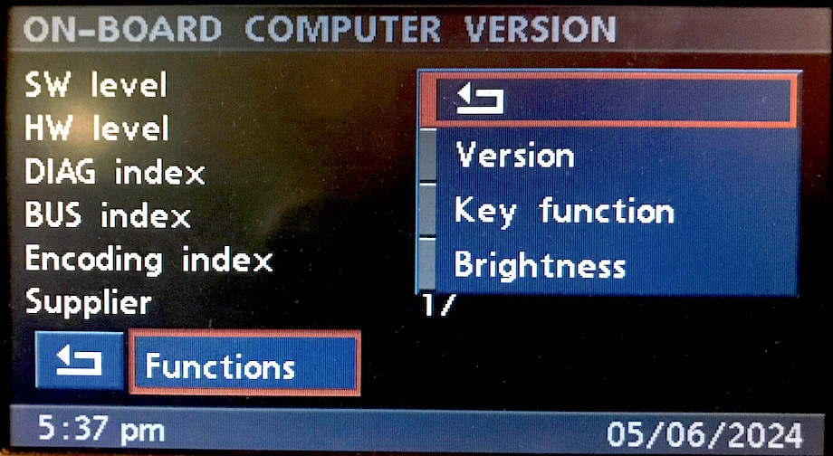
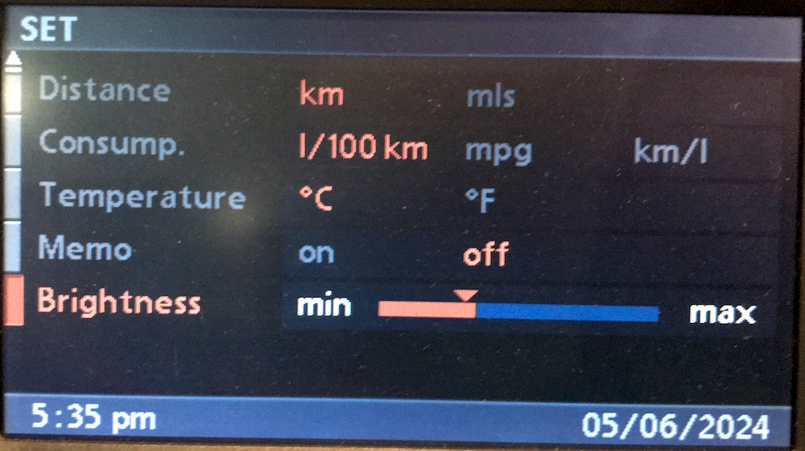
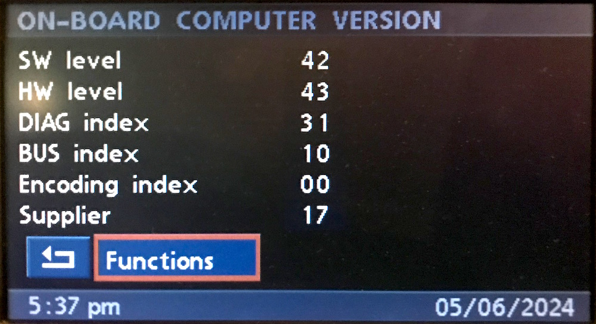
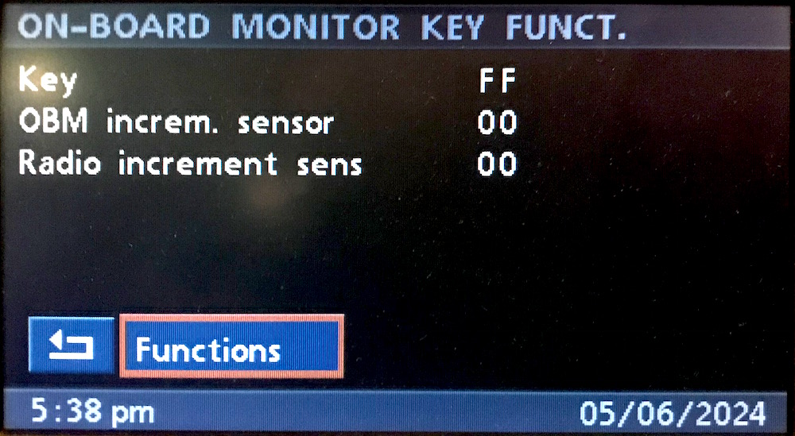
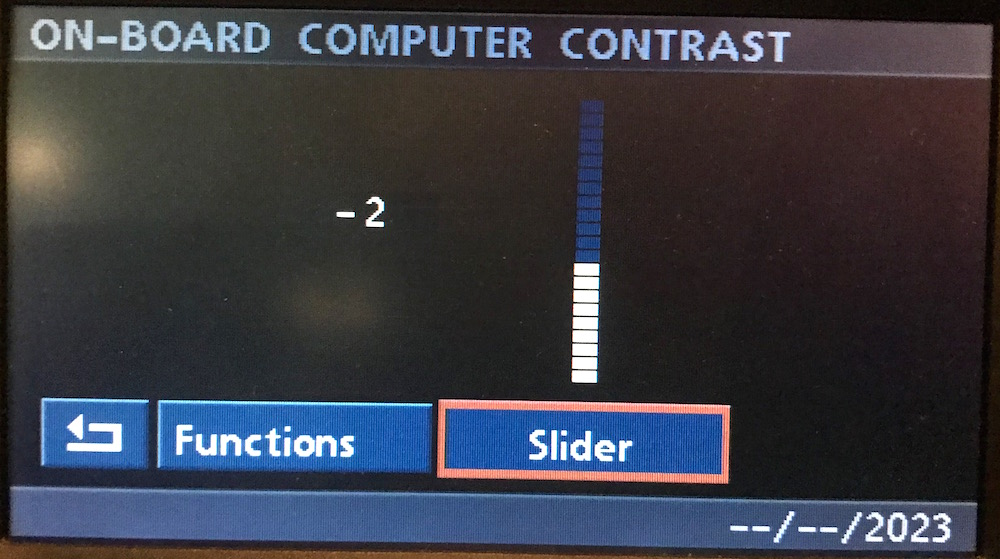

# `0x06` BMBT Service Mode Reply

BMBT `0xf0` → GT `0x3b`

*This is only applicable to vehicles equipped with BMBT.*

This command is seemingly to support the service mode functions of the BMBT (`0xf0`).

The message exchange format appears to mirror that of the D-Bus. i.e. the replies are 'stateful', thus the meaning of the reply must be inferred from the request.

### Related Commands

- `0x05` [BMBT Service Mode Request](../gt/05.md)
- `0x4f` [BMBT Monitor Control](4f.md)

### Example Frames

    F0 04 3B 06 00 C9
    F0 04 3B 06 18 D1
    F0 04 3B 06 3C F5
    F0 04 3B 06 FF 36
    F0 06 3B 06 FF 0D FE C7
    F0 13 3B 06 86 91 33 87 43 00 31 10 22 01 17 42 00 00 00 00 69

## Parameters

The message length will vary depending on use case.

Note: the meaning of the data is inferred from the preceding request (`0x05`). See Use Cases for detailed parameter mapping.

Parameter|Index|Length|Type
:--------|:----|:------|:------
**Data** |`0`  |`-1`   |Various

## Use Cases

### Settings

#### Brightness (`>=3-1/..`)

When the user (first) opens the 'Set' menu, the GT will (lazily) request the current brightness value from the BMBT.

    3B 05 F0 05 40 01 8A    # Request brightness
    F0 04 3B 06 18 D1       # Reply brightness

The brightness value is used to set the current brightness value on the slider UI.

The MK4 uses following brightness steps:

    F0 04 3B 06 FF 36     # "Min"
    F0 04 3B 06 EC 25
    F0 04 3B 05 E0 CS
    F0 04 3B 05 D4 CS
    F0 04 3B 05 C8 CS
    F0 04 3B 05 BC CS
    F0 04 3B 06 B0 79
    F0 04 3B 05 A4 CS
    F0 04 3B 06 98 51
    F0 04 3B 06 8C 45
    F0 04 3B 06 80 49
    F0 04 3B 06 0C C5
    F0 04 3B 06 18 D1
    F0 04 3B 06 24 ED
    F0 04 3B 05 3C CS
    F0 04 3B 06 3C F5
    F0 04 3B 05 48 CS
    F0 04 3B 05 54 CS
    F0 04 3B 06 60 A9
    F0 04 3B 06 6C A5
    F0 04 3B 06 7F B6   # "Max"

### Service Mode: On-board Computer

#### Version

Version reply appears similar (if not identical?) to a diagnostic ident.

Property                   |Index|Length|Type|INPA Property
:--------------------------|:----|:-----|:---|:------
*BMW Part Number*          |`0`  |`4`   |BCD |BMW Part Number
**HW level**               |`4`  |`1`   |BCD |Hardware Number
**Encoding index**         |`5`  |`1`   |BCD |Coding Index
**DIAG index**             |`6`  |`1`   |BCD |Diagnostic Index
**BUS index**              |`7`  |`1`   |BCD |Bus Index
*Date of Manufacture*      |`8`  |`2`   |BCD |Date of Manufacture
**Supplier**               |`10` |`1`   |BCD |Supplier
**SW Level**               |`11` |`1`   |BCD |Software No.
*TBC*                      |`12` |`4`   |--  |TBC

##### Example

    # GT requests BMBT version data
    3B 04 F0 05 00 CA
    
    # BMBT replies with version (ident) data
    F0 13 3B 06 86 91 33 87 43 00 31 10 22 01 17 42 00 00 00 00 69

Property|BMW Part No. |HW No.|CI  |DI  |BI  |Month/Year|Sup.|SW No.
--------|-------------|------|--- |----|----|----------|----|------
**Data**|`86 91 33 87`|`43`  |`00`|`31`|`10`|`22 01`   |`17`|`42`  

#### Key Function

Parameter                  |Index|Length|Type
:--------------------------|:----|:-----|:---
**Key**                    |`0`  |`1`   |Map
**OBM increm. sensor**     |`1`  |`1`   |Integer
**Radio increment sens**   |`2`  |`1`   |Integer

All values are sent each time, irrespective of which property is being updated.

    # GT requests BMBT start key function diagnostic
    3B 05 F0 05 0B 01 C1
    
    # BMBT replies with function initial values
    F0 06 3B 06 FF 00 00 34

The key function ends after a timeout period, at which point the functions menu is displayed again. This is accompanied by the following message:

    F0 04 3B 06 00 C9   # BMBT Key function timeout

##### "Key"

    # Key
    # Note: no 'hold' or 'release' states
    # Note: different button IDs to button commands
    
    KEY_NONE        = 0xFF  # Default value when no button is pressed
    KEY_INFO_LEFT   = 0x01
    KEY_INFO_RIGHT  = 0x02
    KEY_DISC_1      = 0x03
    KEY_DISC_4      = 0x04
    KEY_DISC_2      = 0x05
    KEY_DISC_5      = 0x06
    KEY_DISC_3      = 0x07
    KEY_DISC_6      = 0x08
    KEY_FM          = 0x09
    KEY_AM          = 0x10
    KEY_MODE        = 0x11
    KEY_OVERLAY     = 0x12
    KEY_DIAL_VOL    = 0x13
    KEY_EJECT       = 0x14
    KEY_TEL         = 0x16
    KEY_TAPE_SWITCH = 0x17
    KEY_AUX         = 0x18
    KEY_TONE        = 0x19
    KEY_SELECT      = 0x20
    KEY_BACK        = 0x21
    KEY_FORWARD     = 0x22
    KEY_MENU_LEFT   = 0x23
    KEY_MENU_RIGHT  = 0x24
    KEY_DIAL_NAV    = 0x25

##### "OBM increm. sensor"

    # OBM increm. sensor (Navigation Dial)
    
    # Value just increases/decreases with a right/left turn of the dial.
    # Turning the dial quickly will cause the value to jump.

##### "Radio increment sens"

    # Radio increment sens (Volume Dial)
    
    # As per navigation dial test.

#### Brightness ("Contrast")

    
    # GT requests BMBT current 'contrast' value
    # Note: if value has already been loaded via Set menu.. then there's no request!
    3B 05 F0 05 40 01 8A    
    
    # BMBT replies with current 'constast' value which is displayed via UI
    3B 06 F0 05 41 01 98 10  # Example: -2
