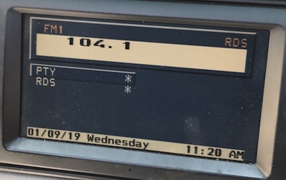

# `0x47` BMBT "Soft" Buttons 

BMBT `0xf0` → Broadcast `0xbf`

In order to reduce the number of BMBT variants, the widescreen BMBT eliminated equipment dependent dedicated buttons, i.e. *TRAFFIC*, *RDS*.

Features that previously had a dedicated button were now controlled via a menu which was accessed by the new *INFO* button.

### Related Commands

- `0x48` [BMBT Buttons](bmbt/48.md)
- `0x49` [BMBT Navigation Dial](bmbt/49.md)

### Example Frames

    F0 05 FF 47 00 38 75
    F0 05 FF 47 00 B8 F5

## Parameters

Fixed length. 1-byte bit field.

    BUTTON  = 0b0011_1111
    STATE   = 0b1100_0000

### Button `0b0011_1111`

    BUTTON_SELECT  = 0b0000_1111
    BUTTON_INFO    = 0b0011_1000

### State `0b1100_0000`

    STATE_PRESS       = 0b0000_0000
    STATE_HOLD        = 0b0100_0000
    STATE_RELEASE     = 0b1000_0000

## Use Cases

### Info

> The "INFO" button reduces the number of variants. Traffic information can be called up using the "INFO" button. The country-specific functions will be activated or deactivated depending on the country variant set.  
> *-- BMW Service Training*

The *INFO* button will open a new menu and list any supported features such as RDS, and TP. Upon selecting a feature, the GT will emulate a button press from the legacy BMBT. i.e. Selecting "RDS" from the Info menu would send `0x48` with the button ID for RDS `0x22`.

    # Info "Soft" Button
    F0 05 FF 47 00 38 75    # Press
    F0 05 FF 47 00 78 35    # Hold
    F0 05 FF 47 00 B8 F5    # Release

### Select

The *SELECT* button is no longer sent via `0x48`. (No variance in behaviour compared to legacy BMBT?)

    # Select "Soft" Button
    F0 05 FF 47 00 0F 42    # Press
    F0 05 FF 47 00 4F 02    # Hold
    F0 05 FF 47 00 8F C2    # Release