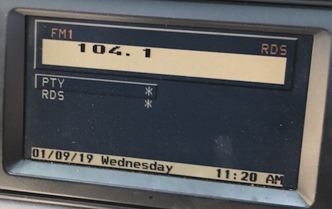

# Controls: BMBT

## Buttons `0x48`

One byte bit field.

Bit|7-6|5-0
:---|:---|:---|
Use|Button State|Button ID

    # Button ID
    PRESET_1    = 0b0001_0001
    PRESET_2    = 0b0000_0001
    PRESET_3    = 0b0001_0010
    PRESET_4    = 0b0000_0010
    PRESET_5    = 0b0001_0011
    PRESET_6    = 0b0000_0011
    FM          = 0b0011_0001
    AM          = 0b0010_0001
    MODE_PREV   = 0b0010_0011
    OVERLAY     = 0b0011_0000
    POWER       = 0b0000_0110 # Volume dial button

    TAPE_EJECT  = 0b0010_0100
    TELEPHONE   = 0b0000_1000
    TAPE_SIDE   = 0b0001_0100
    AUX_HEAT    = 0b0000_0111 # "Clock"
    TONE        = 0b0000_0100
    PREV        = 0b0001_0000
    NEXT        = 0b0000_0000
    MENU        = 0b0011_0100
    CONFIRM     = 0b0000_0101 # Navigation dial button

    # Note: only on legacy BMBT
    MODE_NEXT   = 0b0011_0011
    SELECT      = 0b0010_0000
    TP          = 0b0011_0010 # DOLBY C
    RDS         = 0b0010_0010 # DOLBY B

    # Button State
    PRESS       = 0b0000_0000
    HOLD        = 0b0100_0000
    RELEASE     = 0b1000_0000

#### Left Panel
        
    # LEFT PANEL
    # Note: Press, Hold, Release events respectively.
    
    # Preset 1
    F0 04 68 48 11 C5
    F0 04 68 48 51 85
    F0 04 68 48 91 45
    
    # Preset 2
    F0 04 68 48 01 D5
    F0 04 68 48 41 95
    F0 04 68 48 81 55
    
    # Preset 3
    F0 04 68 48 12 C6
    F0 04 68 48 52 86
    F0 04 68 48 92 46
    
    # Preset 4
    F0 04 68 48 02 D6
    F0 04 68 48 42 96
    F0 04 68 48 82 56
    
    # Preset 5
    F0 04 68 48 13 C7
    F0 04 68 48 53 87
    F0 04 68 48 93 47
    
    # Preset 6
    F0 04 68 48 03 D7
    F0 04 68 48 43 97
    F0 04 68 48 83 57
    
    # FM
    F0 04 68 48 31 E5
    F0 04 68 48 71 A5
    F0 04 68 48 B1 65
    
    # AM
    F0 04 68 48 21 F5
    F0 04 68 48 61 B5
    F0 04 68 48 A1 75
    
    # Mode (Mode Prev. on 4:3 BMBT)
    F0 04 68 48 23 F7
    F0 04 68 48 63 B7
    F0 04 68 48 A3 77
    
    # Mode Next (4:3 BMBT)
    F0 04 68 48 33 E7
    F0 04 68 48 73 A7
    F0 04 68 48 B3 67
    
    # Overlay
    F0 04 68 48 30 E4
    F0 04 68 48 70 A4
    F0 04 68 48 B0 64
    
    # Power (Vol. dial button)
    F0 04 68 48 06 D2
    F0 04 68 48 46 92
    F0 04 68 48 86 52
  
#### Right Panel

    # RIGHT PANEL
    # Note: Press, Hold, Release events respectively.
    
    # Tape Eject
    F0 04 68 48 24 F0
    F0 04 68 48 64 B0
    F0 04 68 48 A4 70
    
    # Telephone
    F0 04 FF 48 08 4B
    F0 04 FF 48 48 0B
    F0 04 FF 48 88 CB
    
    # Tape Side
    F0 04 68 48 14 C0
    F0 04 68 48 54 80
    F0 04 68 48 94 40
    
    # Aux. Heat
    F0 04 FF 48 07 44
    F0 04 FF 48 47 04
    F0 04 FF 48 87 C4
    
    # Tone
    F0 04 68 48 04 D0
    F0 04 68 48 44 90
    F0 04 68 48 84 50
    
    # Select
    F0 04 68 48 20 F4
    F0 04 68 48 60 B4
    F0 04 68 48 A0 74
    
    # Previous
    F0 04 68 48 10 C4
    F0 04 68 48 50 84
    F0 04 68 48 90 44
    
    # Next
    F0 04 68 48 00 D4
    F0 04 68 48 40 94
    F0 04 68 48 80 54
    
    # RDS/Dolby B (4:3 BMBT)
    F0 04 68 48 22 F6
    F0 04 68 48 62 B6
    F0 04 68 48 A2 76
    
    # TP/Dolby C (4:3 BMBT)
    F0 04 68 48 32 E6
    F0 04 68 48 72 A6
    F0 04 68 48 B2 66
    
    # Menu
    F0 04 FF 48 34 77
    F0 04 FF 48 74 37
    F0 04 FF 48 B4 F7
    
    # Confirm (Navi. dial button)
    F0 04 3B 48 05 82
    F0 04 3B 48 45 C2
    F0 04 3B 48 85 02

## "Soft" Buttons `0x47`

One byte bit field.

Bit|7-6|5-0
---|---|---|
Use|Button State|Button ID

    # Button ID
    SELECT  = 0b0000_1111
    INFO    = 0b0011_1000

    # Button State
    PRESS       = 0b0000_0000
    HOLD        = 0b0100_0000
    RELEASE     = 0b1000_0000

### Info `0b0011_1000`

BMW Service Training:
> The "INFO" button reduces the number of variants. Traffic information can be called up using the "INFO" button. The country-specific functions will be activated or deactivated depending on the country variant set.

The Info button will open a new menu and list any supported features such as RDS, and TP. Upon selecting a feature, the GT will emulate a button press from the legacy BMBT. i.e. Selecting "RDS" from the Info menu would send `0x48` with the button ID for RDS `0x22`.

    # Info "Soft" Button
    F0 05 FF 47 00 38 75
    F0 05 FF 47 00 78 35
    F0 05 FF 47 00 B8 F5

### Select `0b0000_1111`

The Select button is no longer sent via `0x48`. (No variance in behaviour compared to legacy BMBT?)

    # Select    
    F0 05 FF 47 00 0F 42
    F0 05 FF 47 00 4F 02
    F0 05 FF 47 00 8F C2

## Volume Dial `0x32`

One byte bit field.

Bit|7-4|3-1|0
---|---|---|---
Use|Steps|--|Direction

    # Steps (variable)
    MIN     = 0b0001_0000
    MAX     = 0b1111_0000

    # Direction
    DOWN    = 0b0000_0000
    UP      = 0b0001_0000

#### Radio Volume (Default)

    # Volume Down
    F0 04 68 32 10 BE   # 1 step
    F0 04 68 32 20 8E   # 2 steps
    F0 04 68 32 30 9E   # 3 steps
    F0 04 68 32 40 EE   # 4 steps and so on...

    # Volume Up
    F0 04 68 32 11 BF   # 1 step
    F0 04 68 32 21 8F   # 2 steps
    F0 04 68 32 31 9F   # 3 steps
    F0 04 68 32 41 EF   # 4 steps and so on...

#### Telephone Volume (active call on handsfree)

In order for BMBT to send volume commands to Telephone `0xc8`, [telephone status](../telephone/status.md) must have "active" and "handsfree" bits set.

    # Volume Down
    F0 04 C8 32 10 1E   # 1 step etc..

    # Volume Up
    F0 04 C8 32 11 1F   # 1 step etc..

## Navigation Dial `0x49`

One byte bit field. Reversed fields as compared to volume control `0x32`, but otherwise the same in operation.

Always sent to GT `0x3b`.

Bit|7|6-4|3-0
---|---|---|---
Use|Direction|--| Steps

    # Direction
    LEFT    = 0b0000_0000
    RIGHT   = 0b1000_0000

    # Steps (variable)
    MIN     = 0b0000_0001
    MAX     = 0b0000_1111

    # Left
    F0 04 3B 49 01 87   # 1 step
    F0 04 3B 49 02 84   # 2 steps etc...

    # Right
    F0 04 3B 49 81 07   # 1 step
    F0 04 3B 49 82 04   # 2 steps etc...
