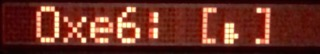
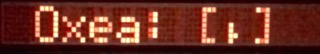
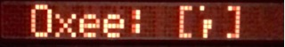
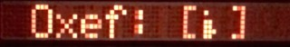
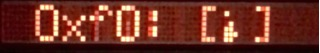
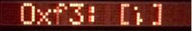
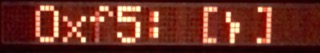
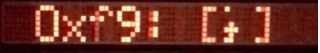
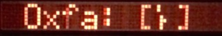

# Characters

## MID/IKE

Hex  |MID
:----|:----
0x0|
0x1|
0x2|
0x3|
0x4|
0x5|
0x6|
0x7|
0x8|
0x9|
0xa|
0xb|
0xc|
0xd|
0xe|
0xf|
0x10|
0x11|
0x12|
0x13|
0x14|
0x15|
0x16|
0x17|
0x18|
0x19|
0x1a|
0x1b|
0x1c|
0x1d|
0x1e|
0x1f|
0x20|
0x21|
0x22|
0x23|
0x24|
0x25|
0x26|
0x27|
0x28|
0x29|
0x2a|
0x2b|
0x2c|
0x2d|
0x2e|
0x2f|
0x30|
0x31|
0x32|
0x33|
0x34|
0x35|
0x36|
0x37|
0x38|
0x39|
0x3a|
0x3b|
0x3c|
0x3d|
0x3e|
0x3f|
0x40|
0x41|
0x42|
0x43|
0x44|
0x45|
0x46|
0x47|
0x48|
0x49|
0x4a|
0x4b|
0x4c|
0x4d|
0x4e|
0x4f|
0x50|
0x51|
0x52|
0x53|
0x54|
0x55|
0x56|
0x57|
0x58|
0x59|
0x5a|
0x5b|
0x5c|
0x5d|
0x5e|
0x5f|
0x60|
0x61|
0x62|
0x63|
0x64|
0x65|
0x66|
0x67|
0x68|
0x69|
0x6a|
0x6b|
0x6c|
0x6d|
0x6e|
0x6f|
0x70|
0x71|
0x72|
0x73|
0x74|
0x75|
0x76|
0x77|
0x78|
0x79|
0x7a|
0x7b|
0x7c|
0x7d|
0x7e|
0x7f|
0x80|
0x81|
0x82|
0x83|
0x84|
0x85|
0x86|
0x87|
0x88|
0x89|
0x8a|
0x8b|
0x8c|
0x8d|
0x8e|
0x8f|
0x90|
0x91|
0x92|
0x93|
0x94|
0x95|
0x96|
0x97|
0x98|
0x99|
0x9a|
0x9b|
0x9c|
0x9d|
0x9e|
0x9f|
0xa0|
0xa1|
0xa2|
0xa3|
0xa4|
0xa5|
0xa6|
0xa7|
0xa8|
0xa9|
0xaa|
0xab|
0xac|
0xad|
0xae|
0xaf|
0xb0|
0xb1|
0xb2|
0xb3|
0xb4|
0xb5|
0xb6|
0xb7|
0xb8|
0xb9|
0xba|
0xbb|
0xbc|
0xbd|
0xbe|
0xbf|
0xc0|
0xc1|
0xc2|
0xc3|
0xc4|
0xc5|
0xc6|
0xc7|
0xc8|
0xc9|
0xca|
0xcb|
0xcc|
0xcd|
0xce|
0xcf|
0xd0|
0xd1|
0xd2|
0xd3|
0xd4|
0xd5|
0xd6|
0xd7|
0xd8|
0xd9|
0xda|
0xdb|
0xdc|
0xdd|
0xde|
0xdf|
0xe0|
0xe1|
0xe2|
0xe3|
0xe4|
0xe5|
0xe6|
0xe7|
0xe8|
0xe9|
0xea|
0xeb|
0xec|
0xed|
0xee|
0xef|
0xf0|
0xf1|
0xf2|
0xf3|
0xf4|
0xf5|
0xf6|
0xf7|
0xf8|
0xf9|
0xfa|
0xfb|
0xfc|
0xfd|
0xfe|
0xff|
