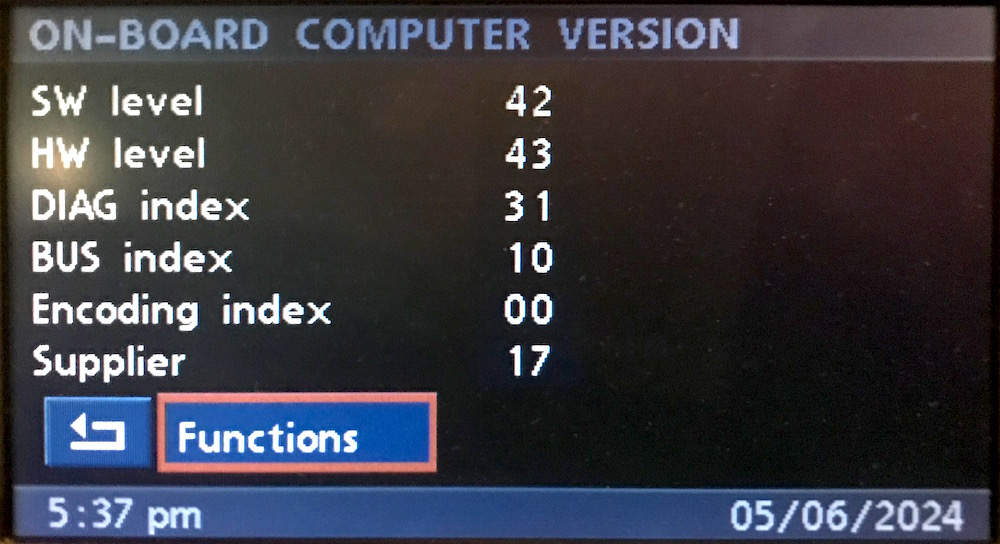

# `0x05` BMBT Service Mode Request

GT `0x3b` → BMBT `0xf0` 

*This is only applicable to vehicles equipped with BMBT.*

This command is seemingly to support the service mode functions of the BMBT.

Note: independent of automatic brighness adjustment when instrument backlighting (58G) is activated.

### Related

- `0x06` [BMBT Brightness](06.md)
- `0x4f` [BMBT Monitor Control](../bmbt/4f.md)

### Examples
    
    3B 04 ED 05 00 D7
    3B 04 F0 05 00 CA
    3B 05 F0 05 0B 01 C1
    3B 05 F0 05 40 01 8A
    3B 06 F0 05 41 01 6C E4
    3B 06 F0 05 42 01 D4 5F

## Parameters

The message length will vary depending on use case.

Parameter|Index|Length|Type
:-------|:----|:-----|:---
**Target?**|`0`|`1`|Bitfield
**Property?**|`1`|`1`|Various

**TODO: ENCODING?**

The MK4 uses following brightness steps:

    
    # AM
    
    0  = FF
    1  = EC
    2  = E0
    3  = D4
    4  = C8
    5  = BC
    6  = B0
    7  = A4
    8  = 98
    9  = 8C
    10 = 80
    11 = 0C
    12 = 18
    13 = 24
    14 = 30
    15 = 3C
    16 = 48
    17 = 54
    18 = 60
    19 = 6C
    20 = 7F

## Use Cases

### Settings

#### Brightness (`>=3-1/..`)

Brightness control via the 'Set' menu.

Brightness was originally only adjustment via service mode, and not made available via 'Set' until a later build of the updated UI.

When the user (first) opens the 'Set' menu, the GT will (lazily) request the current brightness value from the BMBT, which the GT then displays accordingly.

    3B 05 F0 05 40 01 8A    # Request brightness
    F0 04 3B 06 18 D1       # Reply brightness

As the user adjusts the brightness level (via 0x31):
    
    # Note: both commands are send with each adjustment.
    3B 06 F0 05 41 01 6C E4
    3B 06 F0 05 42 01 6C E7
    
    # 0x41 appears to represent the BMBT.
    # 0x42 may represent the RCM, or E85/6 flip-up display.

### Service Mode: On-board Computer

#### Version

    # "Version" => "ON-BOARD COMPUTER VERSION"
    
    that's firs display with SW HW etc
    
    3b .. f0 05 00
    f0 .. 3b 06 86 91 33 87 43 00 31 10 22 01 17 42 00 00 00 00

#### Key Function

    # "Key function" => "ON-BOARD MONITOR KEY FUNCT."
    
    3b .. f0 05 0B 01 ..
    f0 .. 3b 06 FF 00 00 ..
    
    all values are sent each time
    first byte is "Key"
    second byte is "OBM increm. sensor" (nav dial)
    third byte is "radio increment sens" (volume dial)
    
    # Key
    # no "hold" event
    KEY_INFO_LEFT   = 0x01
    KEY_INFO_RIGHT  = 0x02
    KEY_DISC_1      = 0x03
    KEY_DISC_4      = 0x04
    KEY_DISC_2      = 0x05
    KEY_DISC_5      = 0x06
    KEY_DISC_3      = 0x07
    KEY_DISC_6      = 0x08
    KEY_FM          = 0x09
    KEY_AM          = 0x10
    KEY_MODE        = 0x11
    KEY_OVERLAY     = 0x12
    DIAL_VOL        = 0x13
    KEY_EJECT       = 0x14
    KEY_TEL         = 0x16
    KEY_TAPE_SWITCH = 0x17
    KEY_AUX         = 0x18
    KEY_TONE        = 0x19
    KEY_SELECT      = 0x20
    KEY_BACK        = 0x21
    KEY_FORWARD     = 0x22
    KEY_MENU_LEFT   = 0x23
    KEY_MENU_RIGHT  = 0x24
    DIAL_NAV        = 0x25
    KEY_NULL        = 0xff
    
    # key function timeout
    # after which return/functions menu returns
    f0 .. 3b 06 00

#### Brightness ("Contrast")

    # "Brightness" => "ON-BOARD COMPUTER CONTRAST"
    if value already been loaded via Set menu.. then there's no request!
    
    when you exit slider.. it will then send both 0x41 and 0x42
    3b .. f0 05 41 01 24
    3b .. f0 05 42 01 24