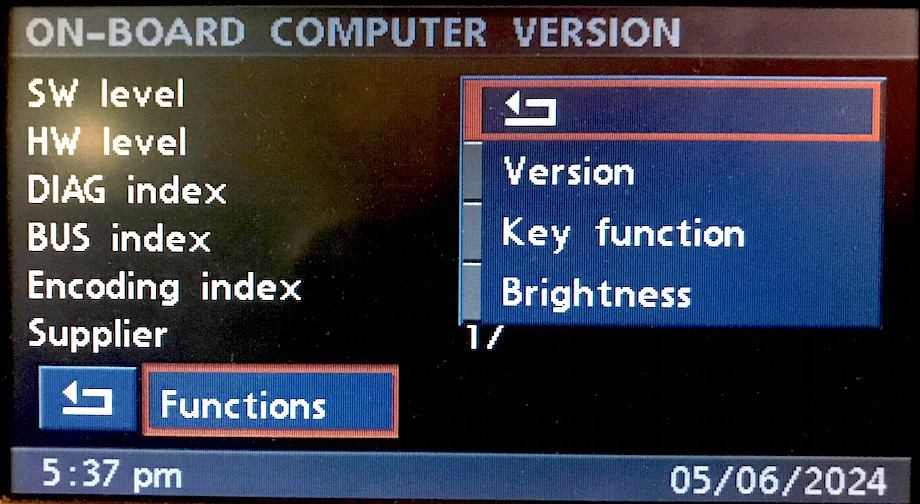
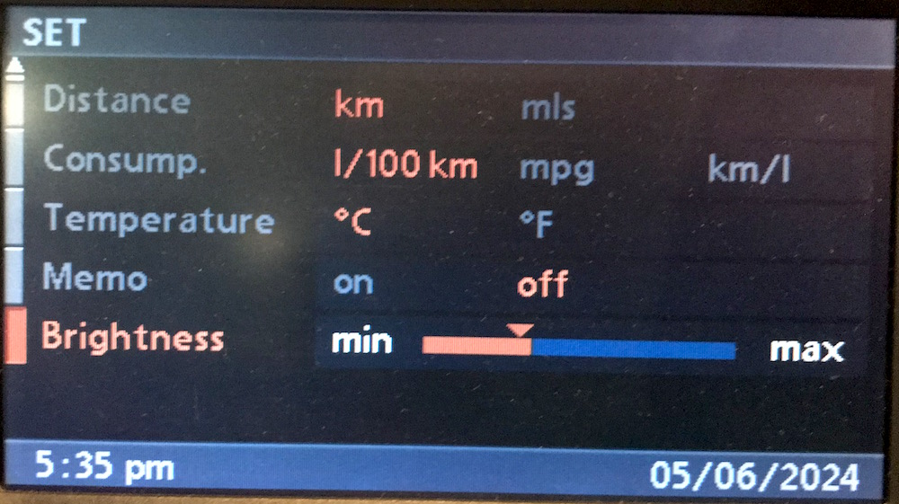

# `0x05` BMBT Service Mode Request

GT `0x3b` → BMBT `0xf0` 

*This is only applicable to vehicles equipped with BMBT.*

This command is seemingly to support the service mode functions of the BMBT.

The message exchange format appears to mirror that of the D-Bus.

Note: independent of automatic brighness adjustment when instrument backlighting (58G) is activated.

### Related

- `0x06` [BMBT Service Mode Reply](../bmbt/06.md)
- `0x4f` [BMBT Monitor Control](../bmbt/4f.md)

### Examples
    
    3B 04 ED 05 00 D7
    3B 04 F0 05 00 CA
    3B 05 F0 05 0B 01 C1
    3B 05 F0 05 40 01 8A
    3B 06 F0 05 41 01 6C E4
    3B 06 F0 05 42 01 D4 5F

## Parameters

The message length will vary depending on use case.

Parameter|Index|Length|Type
:-------|:----|:-----|:---
**Property ID**|`0`|`1`|Bitfield?
**Data**|`1`|`-1`|Various

### Property ID

ID|Property
:--|-------
`0x00`|Ident Request
`0x0b`|Key Function Request
`0x40`|Brightness Request
`0x41`|Brightness Set (BMBT?)
`0x42`|Brightness Set (E85/6 Flip-Up/RCM?)

## Use Cases

### Settings

#### Brightness (`>=3-1/..`)

Brightness control via the 'Set' menu.

Brightness was originally only adjustable via service mode, and not made available via 'Set' until a later build of the updated UI. As such, the use case effectively mirrors brightness adjustment via service mode.

When the user (first) opens the 'Set' menu, the GT will (lazily) request the current brightness value from the BMBT.

    3B 05 F0 05 40 01 8A    # Request brightness
    F0 04 3B 06 18 D1       # Reply brightness

The GT then sets the Brightness level as per the value returned via `0x06`.

As the user adjusts the brightness level (via `0x31`):
    
    # Note: both commands are send with each adjustment.
    3B 06 F0 05 41 01 6C E4     # 0x41 appears to represent the BMBT.
    3B 06 F0 05 42 01 6C E7     # 0x42 may represent the RCM, or E85/6 flip-up display.

The MK4 uses following brightness steps:
    
    # Note: same encoding as via Service Mode
    3B 06 F0 05 41 01 FF 77  # "Min"
    3B 06 F0 05 41 01 EC 64
    3B 06 F0 05 41 01 E0 68
    3B 06 F0 05 41 01 D4 5C
    3B 06 F0 05 41 01 C8 40
    3B 06 F0 05 41 01 BC 34
    3B 06 F0 05 41 01 B0 38
    3B 06 F0 05 41 01 A4 2C
    3B 06 F0 05 41 01 98 10
    3B 06 F0 05 41 01 8C 04
    3B 06 F0 05 41 01 80 08
    3B 06 F0 05 41 01 0C 84
    3B 06 F0 05 41 01 18 90
    3B 06 F0 05 41 01 24 AC
    3B 06 F0 05 41 01 30 B8
    3B 06 F0 05 41 01 3C B4
    3B 06 F0 05 41 01 48 C0
    3B 06 F0 05 41 01 54 DC
    3B 06 F0 05 41 01 60 E8
    3B 06 F0 05 41 01 6C E4
    3B 06 F0 05 41 01 7F F7  # "Max"

### Service Mode: On-board Computer

BMBT service mode offers the following functions:

- Version
- Key function
- Brightness

#### Version

    # "Version" => "ON-BOARD COMPUTER VERSION"
    3B 04 ED 05 00 D7

#### Key Function

    # "Key function" => "ON-BOARD MONITOR KEY FUNCT."
    3B 05 F0 05 0B 01 C1

#### Brightness ("Contrast")

    # "Brightness" => "ON-BOARD COMPUTER CONTRAST"
    3B 05 F0 05 40 01 8A

Note: if the brightness value already been lazily loaded via Set menu, then the GT will not send above the request.

As the user changes the brightness level via the slider:

    # Note: same encoding as via 'Set'
    3B 06 F0 05 41 01 FF 77  # -10
    3B 06 F0 05 41 01 EC 64  # -9
    3B 06 F0 05 41 01 E0 68  # -8
    3B 06 F0 05 41 01 D4 5C  # -7
    3B 06 F0 05 41 01 C8 40  # -6
    3B 06 F0 05 41 01 BC 34  # -5
    3B 06 F0 05 41 01 B0 38  # -4
    3B 06 F0 05 41 01 A4 2C  # -3
    3B 06 F0 05 41 01 98 10  # -2
    3B 06 F0 05 41 01 8C 04  # -1
    
    3B 06 F0 05 41 01 80 08  # 0
    
    3B 06 F0 05 41 01 0C 84  # +1
    3B 06 F0 05 41 01 18 90  # +2
    3B 06 F0 05 41 01 24 AC  # +3
    3B 06 F0 05 41 01 30 B8  # +4
    3B 06 F0 05 41 01 3C B4  # +5
    3B 06 F0 05 41 01 48 C0  # +6
    3B 06 F0 05 41 01 54 DC  # +7
    3B 06 F0 05 41 01 60 E8  # +8
    3B 06 F0 05 41 01 6C E4  # +9
    3B 06 F0 05 41 01 7F F7  # +10

Note: quick adjustment via the dial will 'jump' brightness levels.

When the user exits the slider, the GT will then send both `0x41` and `0x42`, presumably setting the multiple displays to a uniform brightness level.

    3B 06 F0 05 41 01 24 AC # BMBT?
    3B 06 F0 05 42 01 24 AF # E85/6 Flip-Up or RCM?