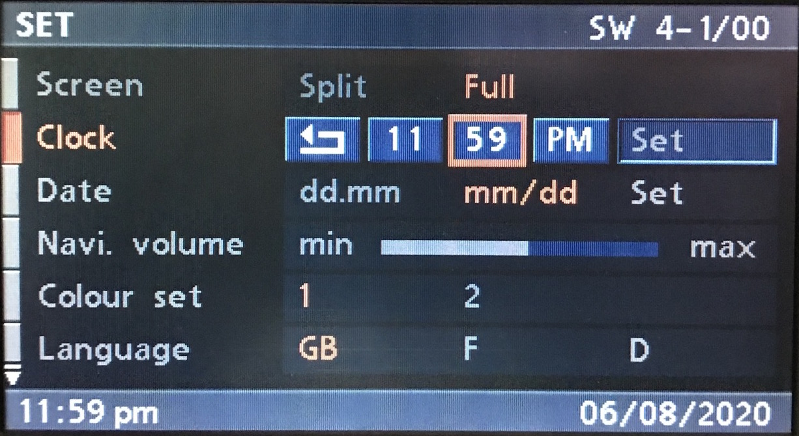
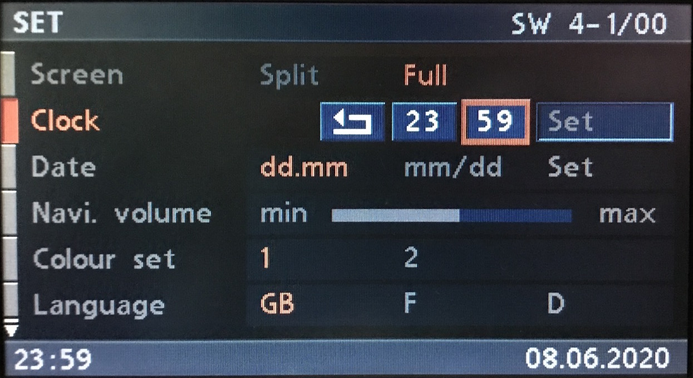
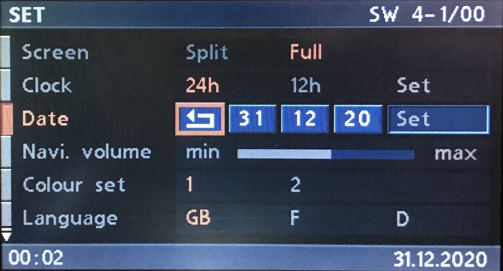
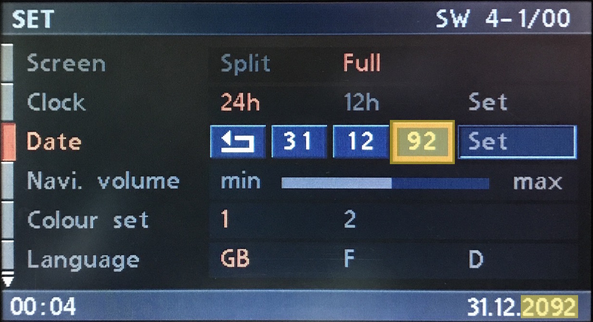
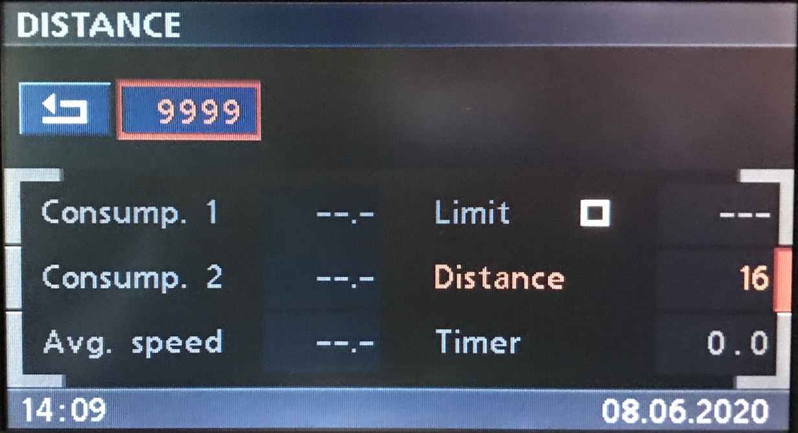
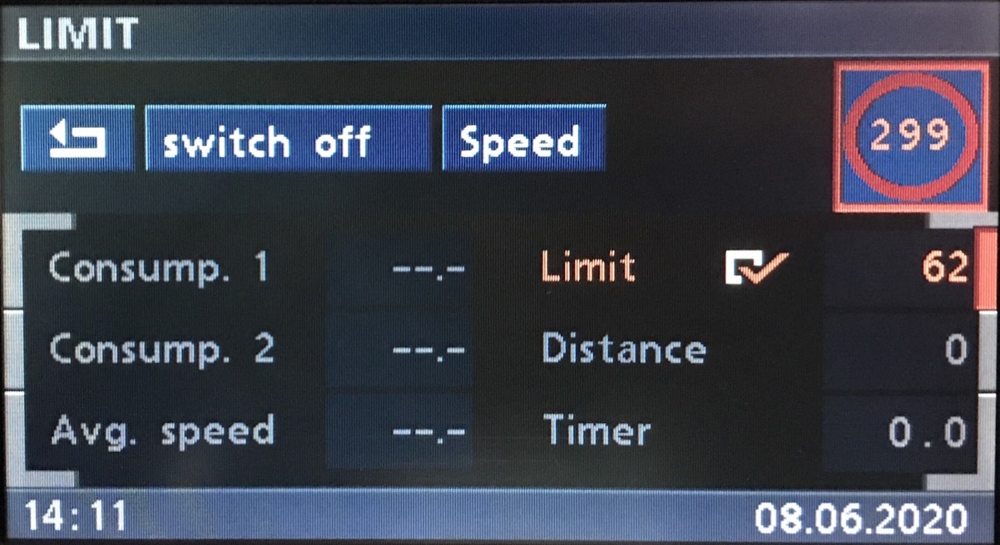
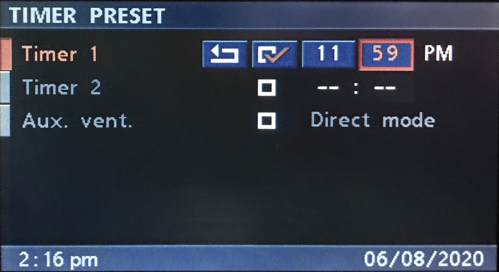
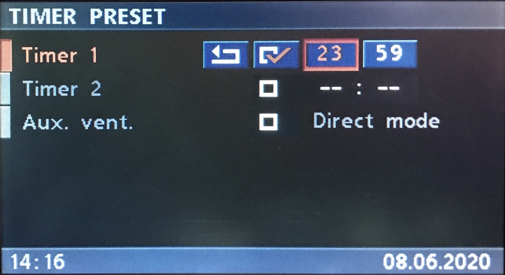
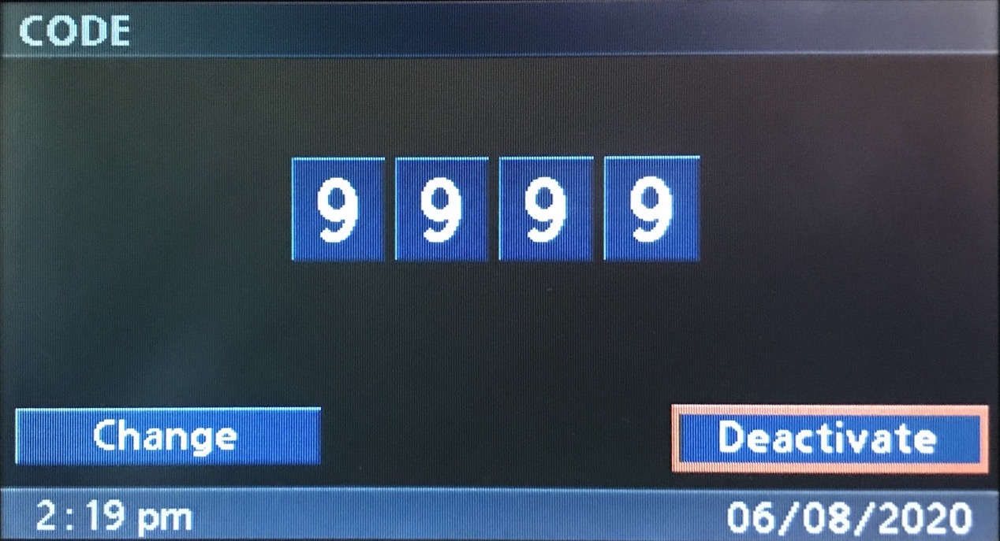

# `0x40` OBC Input

GT `0x3b` → Cluster `0x80`

This is only applicable to vehicles equipped with BMBT. 

## Examples

    3B 07 80 40 01 8A 2B 2D 71
    3B 07 80 40 02 19 03 14 F0
    3B 06 80 40 07 00 00 FA
    3B 06 80 40 09 00 14 E0
    3B 06 80 40 0D 27 0F D8
    3B 06 80 40 0F 8B 00 79
    3B 06 80 40 10 02 36 D9

## Parameters

The message length will vary depending on *Property ID*.

Parameter|Index|Length|Type
:-------|:----|:-----|:---
**Property ID**|`0`|`1`|Bitfield
**Data**|`1`|`-1`|Various

### Property ID

ID|Property
:--|-------
`0x01`|Time
`0x02`|Date
`0x07`|Distance
`0x09`|Limit
`0x0d`|Code
`0x0f`|Aux. Timer 1
`0x10`|Aux. Timer 2

### Data

The length and type will vary depending on the given *Property ID*.

## Use Cases

### Settings

#### Time

Data|Index|Length|Type
:---|:----|:-----|:---
**Hour**|`1`|`1`|Integer
**Minute**|`2`|`1`|Integer

The input will reflect the vehicle's time format, i.e. **12h** or **24h**.

##### 12h Format

    
    # Time (12h) Examples
    
    # AM
    3B 06 80 40 01 0C 00 F0     # 12:00am
    3B 06 80 40 01 0C 3B CB     # 12:59am
    3B 06 80 40 01 01 00 FD     # 01:00am
    3B 06 80 40 01 02 00 FE     # 02:00am
    3B 06 80 40 01 03 00 FF     # 03:00am
    # [...]
    3B 06 80 40 01 0A 00 F6     # 10:00am
    3B 06 80 40 01 0B 00 F7     # 11:00am
    
    # PM
    # Note: Hour MSB set to 1 (0x80)
    3B 06 80 40 01 8C 00 70     # 12:00pm
    3B 06 80 40 01 8C 37 47     # 12:55pm
    3B 06 80 40 01 81 00 7D     # 01:00pm
    3B 06 80 40 01 82 00 7E     # 02:00pm
    3B 06 80 40 01 83 00 7F     # 03:00pm
    # [...]
    3B 06 80 40 01 8B 3B 4C     # 11:59pm

##### 24h Format

    # Time (24h) Examples
    
    3B 06 80 40 01 00 00 FC     # 00:00
    3B 06 80 40 01 00 3B C7     # 00:59
    3B 06 80 40 01 01 00 FD     # 01:00
    3B 06 80 40 01 02 00 FE     # 02:00
    3B 06 80 40 01 03 00 FF     # 03:00
    # [...]
    3B 06 80 40 01 0A 00 F6     # 10:00
    3B 06 80 40 01 0B 00 F7     # 11:00
    3B 06 80 40 01 0C 00 F0     # 12:00
    
    3B 06 80 40 01 0D 00 F1     # 13:00
    3B 06 80 40 01 0E 00 F2     # 14:00
    3B 06 80 40 01 0F 00 F3     # 15:00
    3B 06 80 40 01 10 00 EC     # 16:00
    3B 06 80 40 01 11 3B D6     # 17:59
    3B 06 80 40 01 12 3B D5     # 18:59
    3B 06 80 40 01 13 00 EF     # 19:00
    3B 06 80 40 01 14 3A D2     # 20:58
    3B 06 80 40 01 15 00 E9     # 21:00
    3B 06 80 40 01 16 00 EA     # 22:00
    3B 06 80 40 01 17 3B D0     # 23:59

#### Date

Data|Index|Length|Type
:---|:----|:-----|:---
**Day**|`1`|`1`|Integer
**Month**|`2`|`1`|Integer
**Year**|`3`|`1`|Integer

The input is not affected by the date format, i.e. **dd.mm** or **mm/dd**.

    # Date Examples
    
    3B 07 80 40 02 01 01 14 EA      # 01/01/2020
    3B 07 80 40 02 1F 01 14 F4      # 31/01/2020
    3B 07 80 40 02 01 0C 14 E7      # 01/12/2020
    3B 07 80 40 02 1F 0C 00 ED      # 31/12/2020

##### Year Limitation

The only trick is specifying *Year* as the input is limited to *YY*, e.g. *15* represents *2015*.

This begs the question, with an input of *25*, is that *1925*, or *2025*?

Fortunately we need not worry about this for many decades as the navigation OS software (`4-1/00`) defaults to years *1993 to 2092*.

Input|Year
:----|:----
`00..92`|`2000..2092`
`93..99`|`1993..1999`

    
    # Date: Centry Roll Over Example
    
    3B 07 80 40 02 1E 0A 61 8B      # 30/10/1997
    3B 07 80 40 02 1F 0C 62 8F      # 31/12/1998
    3B 07 80 40 02 1F 0C 63 8E      # 31/12/1999
    
    3B 07 80 40 02 01 01 00 FE      # 01/01/2000
    3B 07 80 40 02 01 01 01 FF      # 01/01/2001
    3B 07 80 40 02 01 01 02 FC      # 01/01/2002

---

### On-board Computer (OBC)

#### Distance

Data|Index|Length|Type
:---|:----|:-----|:---
**Distance**|`1`|`2`|Integer (16-bit)

Input is in whichever distance format is in use, i.e. KMS or MLS. The upper limit for KMS and MLS is `9999` and `5999` respectively.

    # OBC: Distance Examples

    3B 06 80 40 07 00 00 FA     # Distance: 0 (disable)
    3B 06 80 40 07 00 0A F0     # Distance: 10
    3B 06 80 40 07 00 10 EA     # Distance: 16
    3B 06 80 40 07 17 6F 82     # Distance: 5999 (MLS upper limit)
    3B 06 80 40 07 27 0F D2     # Distance: 9999 (KMS upper limit)

#### Limit

Input unit will reflect the vehicle's configured distance unit, e.g. KM/H (KMS), or MPH (MLS).

Data|Index|Length|Type
:---|:----|:-----|:---
**Limit**|`1`|`2`|Integer (16-bit)

    # OBC: Limit Examples
    
    3B 06 80 40 09 00 07 F3     # Limit: 7
    3B 06 80 40 09 00 20 D4     # Limit: 32
    3B 06 80 40 09 00 64 90     # Limit: 100
    3B 06 80 40 09 00 BA 4E     # Limit: 186 (MPH upper limit)
    3B 06 80 40 09 01 2B DE     # Limit: 299 (KMH upper limit)

---

### Independent Ventilation and Heating

#### Aux Timer 1

Data|Index|Length|Type
:---|:----|:-----|:---
**Hour**|`1`|`1`|Integer (8-bit)
**Minute**|`2`|`1`|Integer (8-bit)

Like *Time*, input format is based on user configuration.

##### 12h Format

    
    # Aux Timer 1 (24h) Examples
    # See Time (12h) for additional examples
    
    3B 06 80 40 0F 0C 00 FE     # 12:00am
    3B 06 80 40 0F 01 00 F3     # 01:00am
    # [...]
    3B 06 80 40 0F 0B 00 F9     # 11:00am
    
    3B 06 80 40 0F 8C 00 7E     # 12:00pm
    3B 06 80 40 0F 81 00 73     # 01:00pm
    # [...]
    3B 06 80 40 0F 8B 00 79     # 11:00pm
    3B 06 80 40 0F 8B 3B 42     # 11:59pm

##### 24h Format

    
    # Aux Timer 1 (24h) Example
    # See Time (24h) for additional examples
    
    3B 06 80 40 0F 00 00 F2     # 00:00
    3B 06 80 40 0F 00 3B C9     # 00:59
    # [...]
    3B 06 80 40 0F 17 3B DE     # 23:59

#### Aux Timer 2

See above. Substitude *Property ID* `0x0f` (Aux. Timer 1) for `0x10` (Aux. Timer 2).

---

### Code

Data|Index|Length|Type
:---|:----|:-----|:---
**Code**|`1`|`2`|Integer (16-bit)

The command is sent when *Deactivate* is selected. If the correct code is entered, the cluster will disable code.
    
    # Code Examples
    
    3B 06 80 40 0D 00 00 F0     # Code: 0000
    3B 06 80 40 0D 00 7B 8B     # Code: 0123
    3B 06 80 40 0D 00 FF 0F     # Code: 0255
    3B 06 80 40 0D 27 00 D7     # Code: 9984
    3B 06 80 40 0D 27 0F D8     # Code: 9999