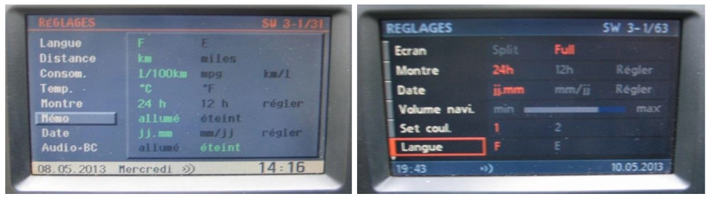

# `0x45` Set Radio UI

## Examples

    ...
    ...
    ...

## Properties

Fixed length. One byte bitfield.

    HIDE_RADIO          = 0b0000_0001
    FLAG_AUDIO_OBC      = 0b0000_0010
    
    FLAG_NEW_UI         = 0b0001_0000
    FLAG_NEW_UI_HIDE    = 0b1000_0000
    
### "Foreground" `0b0000_0000`

GT requesting radio resume at ignition? *(Explained in Use Cases)*

### "Hide" `0b0000_0001`

- MENU button

### Audio+OBC `0b0000_0010`

    ...

### New UI `0b0001_0000`

This bit is set when the GT is running navigation system software with the updated UI.

This is only applicable to the MK3 from version 40 onwards (`3-1/40`), and MK4 which was shipped with updated UI.

### New UI (On Hide) `0b1000_0000`

    ...

## Use Cases

### Resume at KL-R

- the GT requesting the radio draw the radio UI at KL-R if the radio was on at ignition off.

### Main Menu

A MENU press does not get sent to radio, but is broadcast, and instead handled by the GT, which will in turn, message the Radio relinquish (as presumably the radio does not listen for global button )

    gt  rad 45 91 (1001 0001) Info? [ON] Main Menu [ON]
    rad gt  46 01 (0000 0001) Main Menu [ON]
    

### Audio OBC (Legacy UI)

The Audio and Onboard Computer (OBC) display "Audio+OBC" is a feature of the original UI, and allowed OBC data to be displayed alongside radio information.

While this feature was removed from the updated UI (MK3 3-1/40+, MK4), all radio variants, including next generation (NG) radios will support it.

Note: this is really only relevant to BM24, BM54 as there is no contention in the absence of menus.

_Audio+OBC: The MK1 GT, and BM53 with the Audio+OBC feature enabled._
<!---->
<!--_Audio+OBC: A video module GT, and BM53 with the Audio+OBC feature enabled._-->

The bit is set/unset when "Audio+OBC" is enabled/disabled via the "Set" menu. It prevents (_or possibly makes menus a timeout?_) the radio from rendering any menus, thus the OBC remains in the foreground.

_Audio+OBC: Audio+OBC settings..._
<!---->
<!--_Audio+OBC: Audio+OBC settings..._-->

### Updated UI

- Presumably due to split screen which had different fields.
- There's no way of determining if split is enabled, well, short of coding?