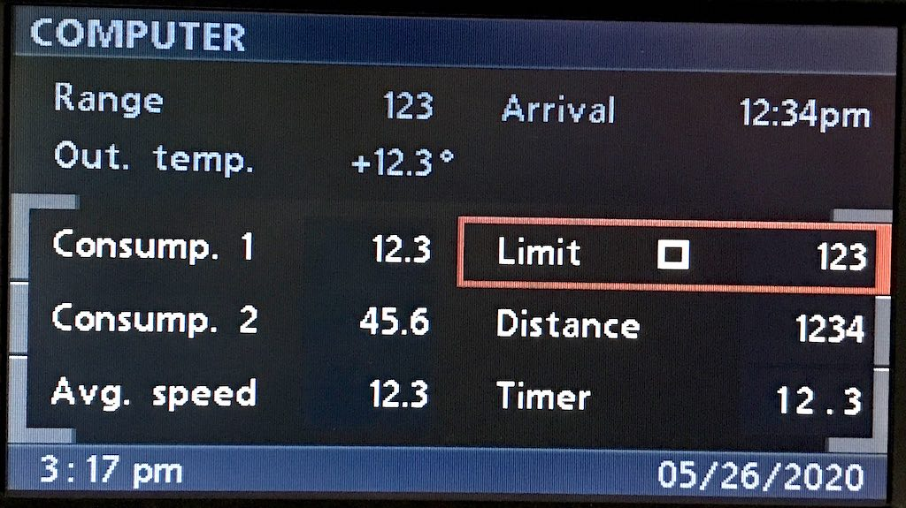
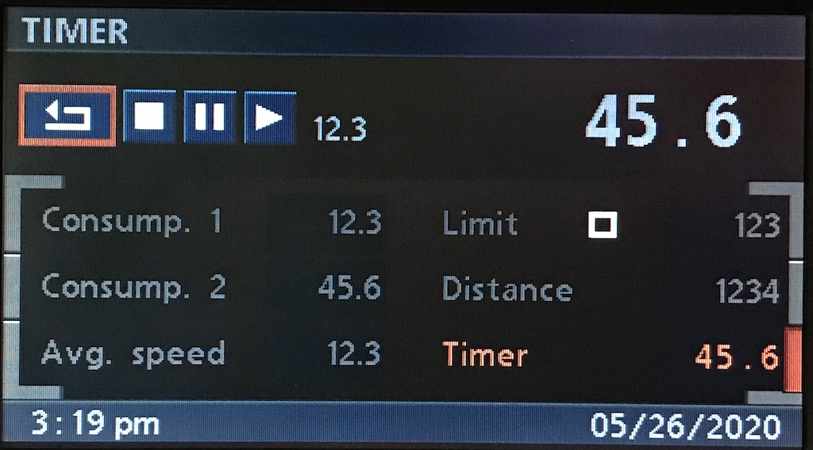
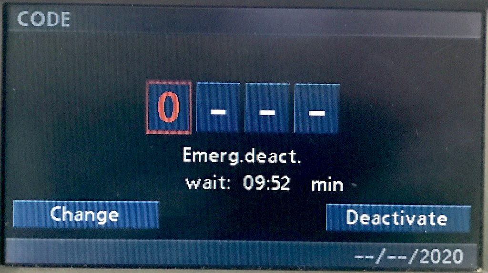

# `0x24` OBC Text

Cluster `0x80` → Displays (Multicast) `0xe7`

Unlike the radio or telephone which sends display data at the time it's required, the cluster will send display data at regular intervals irrespective of what is being displayed.

Essentially, radio and telephone displays are "lazily loaded", and the cluster displays are "eager loaded".

## Examples

    80 0A E7 24 03 00 2B 32 34 2E 35 7C
    80 0F E7 24 05 30 36 66 36 24 79 58 67 6C 2D 54 68
    80 0C E7 24 06 00 2D 2D 2D 20 4B 4D 20 62
    80 0D E7 24 09 00 2D 2D 2D 20 4D 50 48 20 3F
    80 0E E7 24 0A 00 20 30 2E 37 20 4B 4D 2F 48 0F
    80 0C E7 24 0F 00 31 30 3A 31 30 20 20 7A

## Properties

The message length will vary depending on the property ID.

Property|Index|Length|Type
:-------|:----|:-----|:---
**Property [ID]**|`0`|`1`|Bitfield
**Unknown**|`1`|`1`|_Default `00`_
**String**|`2`|`-1`|String

### Property ID

ID|Property
:--|-------
`0x01`|Time
`0x02`|Date
`0x03`|Temperature
`0x04`|Consump. 1
`0x05`|Consump. 2
`0x06`|Range
`0x07`|Distance
`0x08`|Arrival
`0x09`|Limit
`0x0a`|Avg. Speed
`0x0e`|Timer
`0x0f`|Aux. Timer 1
`0x10`|Aux. Timer 2
`0x16`|Code: Emergency Deactivation
`0x1a`|Timer: Lap

### Unknown

Seemingly always `0x00`.

### String

- ASCII encoding. 
- The length is determined by the property.
- The unit/format of the property will be as per `0x15`, i.e. 24H vs. 12H etc.
- GT will parse some strings (presumably to generate a native object), thus the string format is restricted.

## Use Cases

### Date & Time
   

    # Time (0x01)
    # Note: GT will parse the string
    80 0C E7 24 01 00 20 33 3A 34 33 50 4D 7D   # " 3:43PM"

    # Date (0x02)
    80 0F E7 24 02 00 30 35 2F 32 35 2F 32 30 32 30 4C  # "05/25/2020"

### On-board Computer (OBC)

    # Temperature (0x03)
    80 0A [3B] 24 03 00 2B 31 32 2E 33 [A3]                 # "+12.3"

    # Consump. 1 (0x04)
    80 0F [3B] 24 04 00 31 32 2E 33 20 4C 2F 31 30 30 F8    # "12.3 L/100"
    
    # Consump. 2 (0x05)
    80 0F [3B] 24 05 00 34 35 2E 36 20 4C 2F 31 30 30 FE    # "45.6 L/100"
    
    # Range (0x06)
    80 0C 3B 24 06 00 31 32 33 20 4B 4D 20 A3               # "123 KM "
    
    # Distance (0x07)
    80 0D 3B 24 07 00 31 32 33 34 20 4B 4D 20 97            # "1234 KM "
    
    # Arrival (0x08)
    80 0C 3B 24 08 00 31 32 3A 33 34 50 4D B8               # "12:34PM"
    
    # Limit (0x09)
    80 0D E7 24 09 00 31 32 33 20 4B 4D 2F 48 36            # "123 KM/H"
    
    # Avg. Speed (0x0a)
    80 0E [3B] 24 0A 00 31 32 2E 33 20 4B 4D 2F 48 C4       # "12.3 KM/H"

#### OBC: Timer

    
    # Timer (0x0e)
    80 0F 3B 24 0E 00 34 35 2E 36 20 20 53 45 43 20 F2  # "45.6  SEC "

    # Timer: Lap (0x1a)
    80 0F 3B 24 1A 00 31 32 2E 33 20 20 53 45 43 20 E1  # "12.3  SEC "
    
After one minute has elapsed, the format will change to `"1:00  MIN"`.

### Independent Ventilation and Heating

    # Aux. Timer 1 (0x0f)
    80 0C E7 24 0F 00 20 31 3A 32 33 41 4D 66   # " 1:23AM"

    # Aux. Timer 2 (0x10)
    80 0C E7 24 10 00 20 34 3A 35 36 50 4D 6F   # " 4:56PM"

### Code

    
    # Code: Emergency Deactivation
    80 0A E7 24 16 00 30 39 3A 35 32 6B     # "09:52"