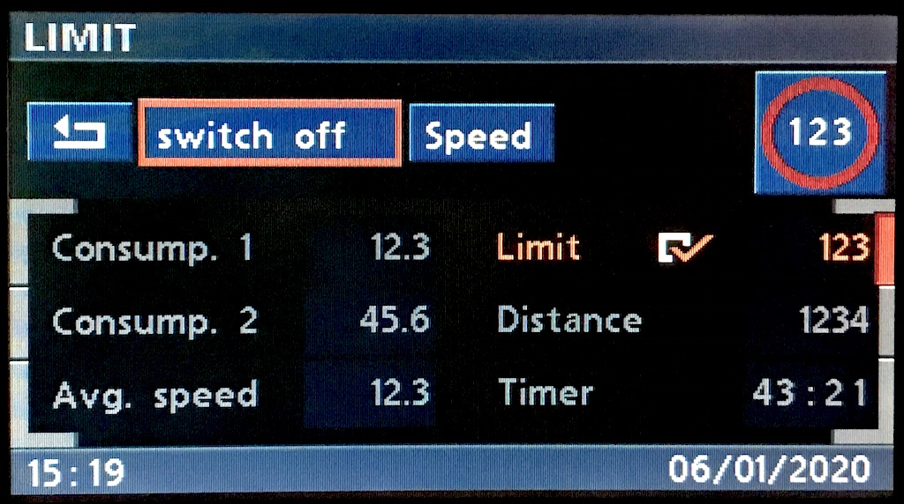
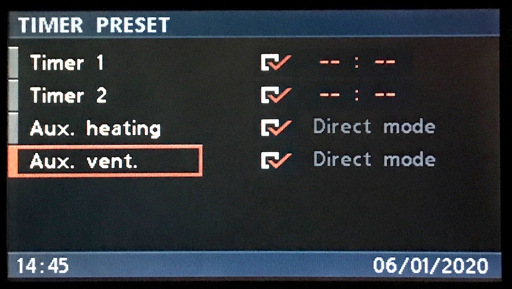
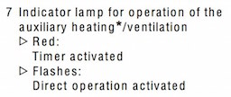

# `0x2a` OBC Status

Cluster `0x80` → Displays `0xe7`.

This command reports the status of various functions controlled by the cluster, predominately for the purposes of controlling visual indicators (icons, LEDs etc).

## Examples

    80 05 E7 2A 00 00 48
    80 05 E7 2A 00 08 40
    80 05 E7 2A 02 00 4A
    80 05 E7 2A 08 00 40
    80 05 E7 2A 20 00 68

## Properties

Fixed length. Two byte bitfield.

    # Byte 1
    MEMO            = 0b0010_0000 << 8  # 0x20
    TIMER           = 0b0000_1000 << 8  # 0x08
    LIMIT           = 0b0000_0010 << 8  # 0x02
    
    # Byte 2
    CODE            = 0b0100_0000 << 0  # 0x40
    AUX_HEATING     = 0b0010_0000 << 0  # 0x20
    AUX_TIMER_2     = 0b0001_0000 << 0  # 0x10
    AUX_VENTILATION = 0b0000_1000 << 0  # 0x08
    AUX_TIMER_1     = 0b0000_0100 << 0  # 0x04

## Use Cases

### Settings

#### Memo `0b0010_0000 << 8`

    MEMO_ON     = 1
    MEMO_OFF    = 0
    
    80 05 E7 2A 20 00 68    # Memo: On

When memo is on `1`, an icon will be displayed in the navigation status bar as pictured above. The *Memo* option in Set[tings] will be set to *on*.

---

### On-board Computer (OBC)

#### Timer `0b0000_1000 << 8`

    TIMER_RUNNING   = 1
    TIMER_STOPPED   = 0
    
    80 05 E7 2A 08 00 40    # Timer: On

#### Limit `0b0000_0010 << 8`

    LIMIT_ENABLED   = 1
    LIMIT_DISABLED  = 0
    
    80 05 E7 2A 02 00 4A    # Limit: On

---

### Independent Ventilation and Heating

In addition to the UI, an indicator lamp on BMBT is activated, as discussed in the owner's manual.

> 

#### Aux. Timer 1 `0b0000_0100 << 0`

    AUX_TIMER_1_ON  = 1
    AUX_TIMER_1_OFF = 0
    
    80 05 E7 2A 00 04 4C    # Aux. Timer 1: Enabled
    
#### Aux. Timer 2 `0b0001_0000 << 0`

    AUX_TIMER_2_ON  = 1
    AUX_TIMER_2_OFF = 0
    
    80 05 E7 2A 00 10 58    # Aux. Timer 2: Enabled
    
#### Aux. Heating `0b0010_0000 << 0`

    AUX_HEATING_ON  = 1
    AUX_HEATING_OFF = 0
    
    80 05 E7 2A 00 20 68    # Aux. Heating: On

#### Aux. Ventilation `0b0000_1000 << 0`

    AUX_VENTILATION_ON  = 1
    AUX_VENTILATION_OFF = 0
    
    80 05 E7 2A 00 08 40    # Aux. Ventilation: On
 
 ---
 
### Code `0b0100_0000 << 0`

    CODE_LOCKED     = 1
    CODE_UNLOCKED   = 0
    
    80 05 E7 2A 00 40 08    # Code: Locked

This is the crux of the code function. When enabled `1`, the nav. is effectively "locked" with only the option to input a code.

When the correct code is entered, this is disabled `0`, thus "unlocking" the nav.
