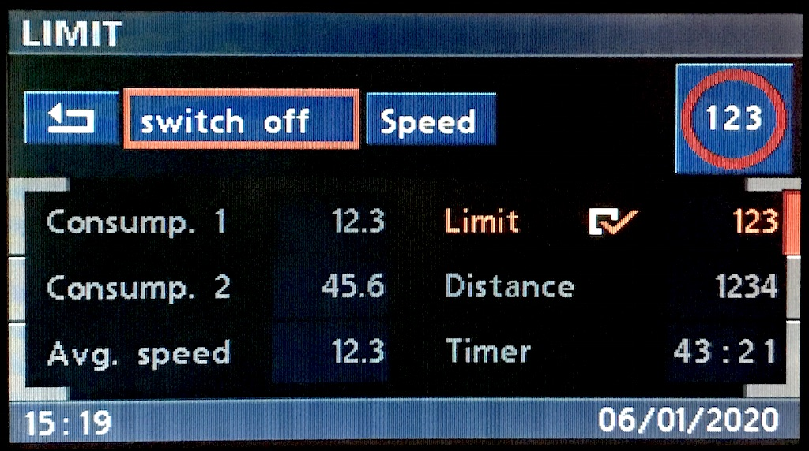
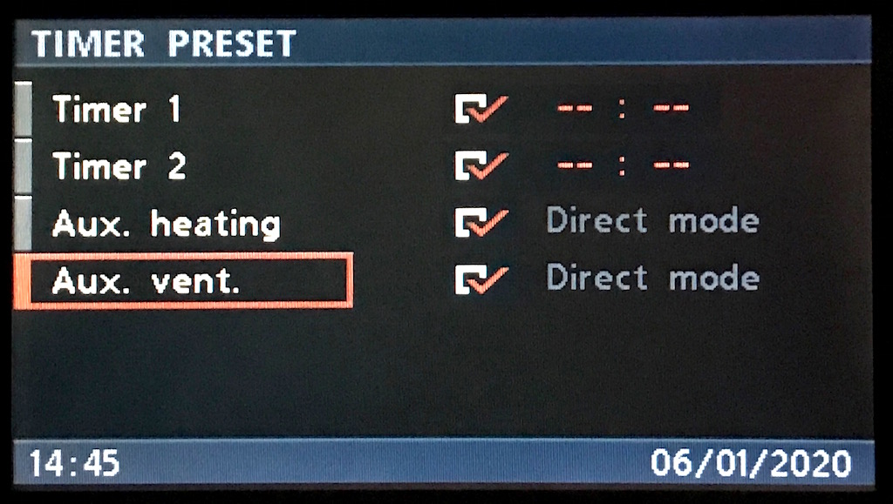
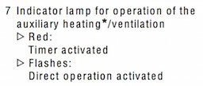
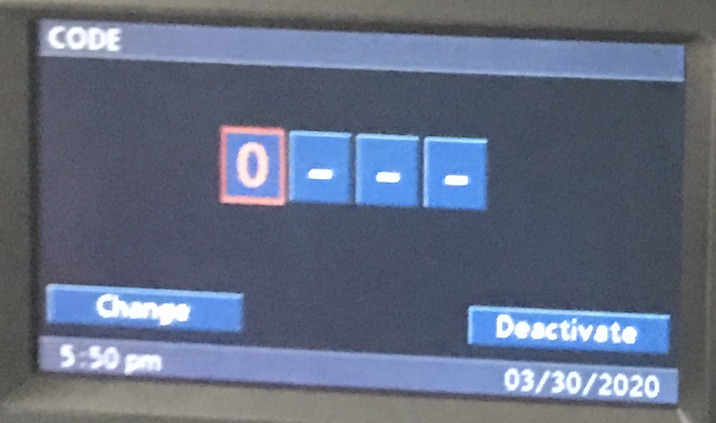

# `0x2a` OBC Status

Cluster `0x80` → Displays `0xe7`.

This command reports the status of various functions controlled by the cluster.

## Examples

    80 05 E7 2A 00 00 48
    80 05 E7 2A 00 08 40
    80 05 E7 2A 02 00 4A
    80 05 E7 2A 08 00 40
    80 05 E7 2A 20 00 68

## Properties

Fixed length. Two byte bitfield.

Byte 1 contains one single-bit field followed by three two-bit state fields. The known states are `0` for inactive and `1` for active. The use of states `2` and `3`, and the function of bit 0, are not yet identified.

    # Byte 1
    LIMIT           = 0b0000_0010
    LIMIT_WARNING   = 0b0000_0100
    TIMER           = 0b0000_1000
    MEMO            = 0b0010_0000
    
    # Byte 2
    CODE            = 0b0100_0000
    AUX_HEATING     = 0b0010_0000
    AUX_TIMER_2     = 0b0001_0000
    AUX_VENTILATION = 0b0000_1000
    AUX_TIMER_1     = 0b0000_0100

## Use Cases

### Settings

#### Memo `0b0010_0000 << 8`

    MEMO_OFF    = 0
    MEMO_ON     = 1
    
    80 05 E7 2A 20 00 68    # Memo: On

When memo is on `1`, an icon will be displayed in the navigation status bar as pictured above. The *Memo* option in Settings will be set to *on*.

---

### On-board Computer (OBC)

#### Timer `0b0000_1000 << 8`

    TIMER_STOPPED   = 0
    TIMER_RUNNING   = 1
    
    80 05 E7 2A 08 00 40    # Timer: On

#### Limit `0b0000_0010 << 8`

    LIMIT_DISABLED  = 0
    LIMIT_ENABLED   = 1
    
    80 05 E7 2A 02 00 4A    # Limit: On

#### Limit Warning `0b0000_0100 << 8`

    LIMIT_WARNING  = 0
    LIMIT_WARNING   = 1
    
    80 05 E7 2A 06 00 4E    # Limit: On, Warning: On
---

### Independent Ventilation and Heating

In addition to the UI, an indicator lamp on BMBT is activated, as discussed in the owner's manual.

> 

#### Aux. Timer 1 `0b0000_0100 << 0`

    AUX_TIMER_1_ON  = 1
    AUX_TIMER_1_OFF = 0
    
    80 05 E7 2A 00 04 4C    # Aux. Timer 1: Enabled
    
#### Aux. Timer 2 `0b0001_0000 << 0`

    AUX_TIMER_2_ON  = 1
    AUX_TIMER_2_OFF = 0
    
    80 05 E7 2A 00 10 58    # Aux. Timer 2: Enabled
    
#### Aux. Heating `0b0010_0000 << 0`

    AUX_HEATING_ON  = 1
    AUX_HEATING_OFF = 0
    
    80 05 E7 2A 00 20 68    # Aux. Heating: On

#### Aux. Ventilation `0b0000_1000 << 0`

    AUX_VENTILATION_ON  = 1
    AUX_VENTILATION_OFF = 0
    
    80 05 E7 2A 00 08 40    # Aux. Ventilation: On
 
 ---
 
### Code `0b0100_0000 << 0`

    CODE_LOCKED     = 1
    CODE_UNLOCKED   = 0
    
    80 05 E7 2A 00 40 08    # Code: Locked

This is the crux of the code function. When enabled `1`, the nav. is effectively "locked" with only the option to input a code.

When the correct code is entered, this is disabled `0`, thus "unlocking" the nav.
