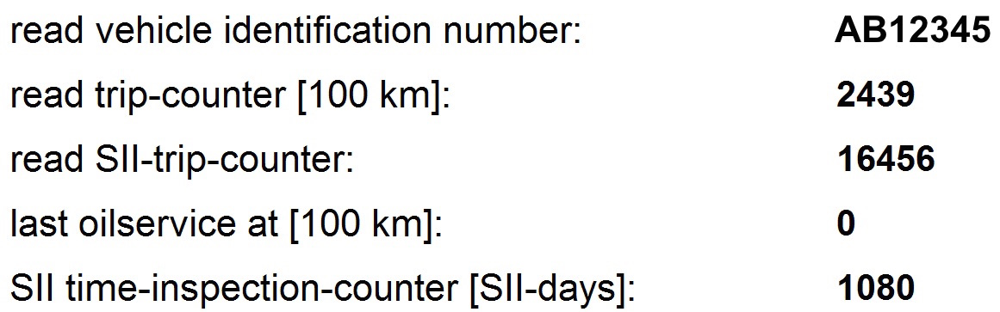

# `0x54` Redundant Data

The LCM will send this command in response to a *Redundant Data Request `0x53`* from the cluster.

The LCM response contains exactly 13 data bytes. Reviewing the LCM coding via INPA provides a good overview of the stored data and its structure:

> 

### Properties

| Property                    | Index | Length | Note |
|:----------------------------|:------|:-------|:-----|
| **VIN**                     | `0`   | `5`    | Seven-character VIN suffix in the packed format described below. |
| **Mileage**                 | `5`   | `2`    | Big-endian trip counter in units of 100 km. |
| **SII Trip Counter**        | `7`   | `2`    | Big-endian 16-bit SII counter; transferred as one opaque counter value. |
| **Last Oil Service At**     | `9`   | `2`    | Big-endian value in units of 100 km. |
| **Time Inspection Counter** | `11`  | `2`    | Big-endian counter in SII days. |

The `SII Trip Counter` is one 16-bit field. It should not be split into a separate type byte and consumed-fuel byte.

#### Example
    
    # Frame
    D0 10 80 54 41 42 12 34 50 09 86 40 46 00 00 04 03 EF

| Property | VIN              | Mileage | SII Trip | Last Oil Service | Time    |
|----------|------------------|---------|----------|------------------|---------|
| **Data** | `41 42 12 34 50` | `09 86` | `40 46`  | `00 00`          | `04 03` |

## VIN

The VIN follows a standard format of:

 1. two character prefix, e.g. `"AB"`
 2. five digit suffix, e.g. `"12345"`

Each character is in ASCII encoding, thus one byte in size.

The five digits are base 10, and 4 bits in size. Thus each byte represents two digits. The lowest four bits in the last byte are discarded.

#### Example: `"AB12345"`

| Data    | `0x41` | `0x42` | `0x12` | `0x34` | `0x50` |
|:--------|:-------|:-------|:-------|:-------|:-------|
| **VIN** | `"A"`  | `"B"`  | `"12"` | `"34"` | `"5"`  |

#### Example: `"XY98765"`

| Data    | `0x58` | `0x59` | `0x98` | `0x76` | `0x50` |
|:--------|:-------|:-------|:-------|:-------|:-------|
| **VIN** | `"X"`  | `"Y"`  | `"98"` | `"76"` | `"5"`  |

## Mileage Indicator
The mileage figure stored by the LCM is only to the nearest 100km of actual mileage. As discussed in BMW training:
> The LCM mileage data [...] is updated every 60 miles (100 km)

The mileage is a big-endian 16 bit (2 byte) integer.

Take care when working with streams to shift the leading byte! i.e. `[0x20, 0x30] => 0x2030`.

#### Examples

| Byte 1 | Byte 2 | 16 bit integer | Value  | Mileage      |
|:-------|:-------|:---------------|:-------|:-------------|
| `0x09` | `0x86` | `0x0986`       | `2438` | *243,800 km* |
| `0x08` | `0xde` | `0x08de`       | `2270` | *227,000 km* |

## SII Trip Counter

The SII trip counter is a big-endian 16 bit (2 byte) field. INPA exposes the complete value as *"read SII-trip-counter"*.

LCM does not split or reinterpret these two bytes on the I-Bus path. They are transferred and replicated as one 16-bit SII counter; any internal SII arithmetic is outside the wire-format definition.

#### Example

| Byte 1 | Byte 2 | 16 bit integer | Value   |
|:-------|:-------|:---------------|:--------|
| `0x40` | `0x46` | `0x4046`       | `16454` |

## Last Oil Service

INPA exposes this field as *"last oilservice at [100 km]"*.

It is a big-endian 16 bit (2 byte) value in units of 100 km.

## Time Inspection Counter

INPA exposes this field as *"SII time-inspection-counter [SII-days]"*.

It is a big-endian 16 bit (2 byte) day counter.

#### Examples

| Byte 1 | Byte 2 | 16 bit integer | Value  | Time         |
|:-------|:-------|:---------------|:-------|:-------------|
| `0x05` | `0xee` | `0x05ee`       | `1518` | *1,518 days* |
