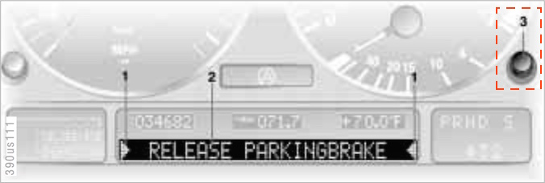
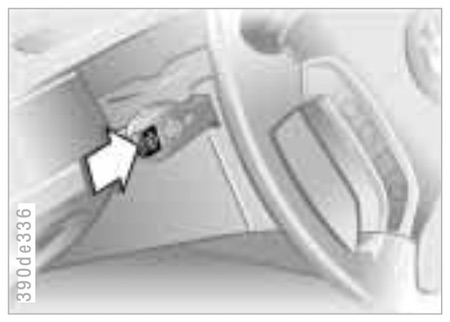

# `0x57` Cluster Buttons

Cluster `0x80` → Broadcast `0xff`

### Related Commands

- `0x3b` [MFL Buttons](../mfl/3b.md)
- `0x48` [BMBT Buttons](../bmbt/48.md)

### Example Frames

    80 04 FF 57 01 2D
    80 04 FF 57 41 6D
    80 04 FF 57 02 2E

## Parameters

Fixed length. 1-byte bitfield.

    STATE   = 0b0100_0000
    BUTTON  = 0b0000_0011

### State `0b0100_0000`

Unlike the BMBT or MFL buttons, the cluster buttons do not have a 'hold' event.

    STATE_PRESS     = 0
    STATE_RELEASE   = 1

### Button `0b0000_0011`

    BUTTON_CHECK    = 0b01  # CHECK button on high clusters
    BUTTON_STALK    = 0b10  # 'BC' button on stalk

There's only two buttons based on my testing to date.

## Use Cases

### Check Control

This is only applicable to vehicles equipped with the high cluster (IKE/IKI).

The CHECK button is used to control the check control messages on the high cluster's alphanumeric display.

The check control messages themselves are generated by another module. The module responsible for the messages will vary by production year, hence why the message is broadcast rather than being addressed to a specific module.

    80 04 FF 57 01 2D   # CHECK button press
    80 04 FF 57 41 6D   # CHECK button release

### OBC Remote Control

> [...] you can call up information from the on-board computer using the button in the turn signal lever.

While the functionality activated by this button will vary depending on cluster type, the behaviour of the button itself remains the same.

    80 04 FF 57 02 2E   # BC remote press