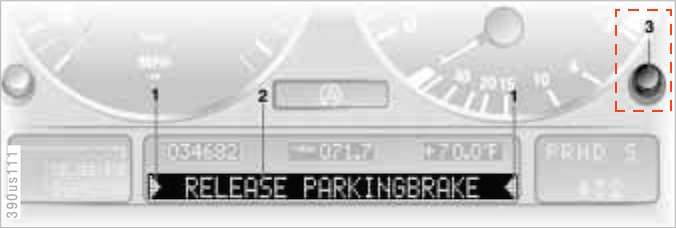
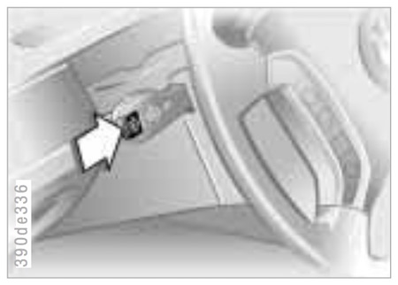

# `0x57` Cluster Buttons

Cluster `0x80` → Global Broadcast `0xff`

### Related Commands

- `0x3b` [MFL Buttons](../mfl/3b.md)
- `0x48` [BMBT Buttons](../bmbt/48.md)

### Example Frames

    80 04 FF 57 01 2D
    80 04 FF 57 41 6D
    80 04 FF 57 02 2E

## Parameters

Fixed length. 1-byte event field.

    CHECK_PRESS     = 0x01
    CHECK_RELEASE   = 0x41
    BC_PRESS        = 0x02

## Use Cases

### Check Control

This is only applicable to vehicles equipped with the high cluster (IKE/IKI).

The CHECK button is used to control the Check Control messages on the high cluster's alphanumeric display.

The Check Control messages themselves are generated by another module. The module responsible for the messages will vary by production year, hence why the button event is broadcast rather than being addressed to a specific module.

    80 04 FF 57 01 2D   # CHECK button press
    80 04 FF 57 41 6D   # CHECK button release

The LCM uses CHECK press according to its current Check Control state:

- with a currently selected message in its first message class, the current warning is selected again rather than advancing the recall list;
- with recallable active warnings, CHECK press advances through the stored warning list and prepares the next eligible message for recall;
- with no active warning, CHECK press selects the built-in `CHECK CONTROL OK` message.

CHECK release is ignored for the normal active-warning recall paths. In the no-warning path it follows the same control action used to remove the temporary `CHECK CONTROL OK` state again.

### OBC Remote Control

> [...] you can call up information from the on-board computer using the button in the turn signal lever.

While the functionality activated by this button will vary depending on cluster type, the behaviour of the button itself remains the same.

    80 04 FF 57 02 2E   # BC remote press

The LCM receives the BC press as a third event. In the normal recall/idle Check Control states it clears the current Check Control output so the cluster can return to its other display content.
