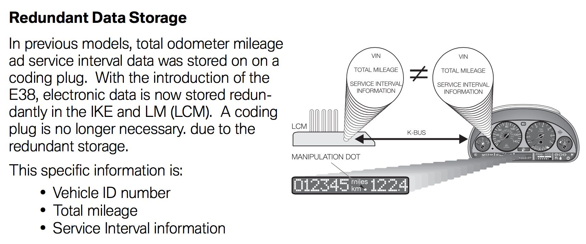
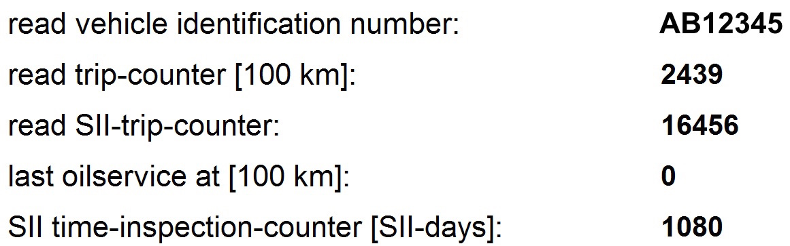

# `0x53` Redundant Data Request

> 

The cluster will request the redundant data from the LCM at ignition (KL-15), as discussed in BMW training documentation:

> This data is compared each time KL15 is switched on. If the data check reveals a mismatch, the manipulation DOT is illuminated.

The command has no arguments (that I'm aware of), so the frame should always be:
    
    80 03 D0 53 00  # Redundant Data Request 0x53

--

# `0x54` Redundant Data

The LCM will send this command in response to a *Redundant Data Request `0x53`* from the cluster.

Reviewing the LCM coding via INPA provides a good overview of the stored data, and it's structure:

> 

### Properties

Property|Index\*|Length|Note
:---|:---|:---|:---
**VIN**|`0`|`5`|
**Mileage**|`5`|`2`|
**TBC**|`7`|`1`|First byte of *"read SII-trip-counter"*. To date always a value of `0x40`; possibly a bit field to represent type of service?
**Fuel**|`8`|`1`|Second byte of *"read SII-trip-counter"*. By reviewing IKE coding in INPA, it's evident this is the consumed fuel quantity.
**Oil**|`9`|`2`| No examples of this being used, but based on INPA this is presumably *"last oilservice at".* |
**Time**|`11`|`2`|

#### Example
    
    # Frame
    D0 10 80 54 41 42 12 34 50 09 86 40 46 00 00 04 03 EF

Property|VIN|Mileage|TBC|Fuel|Oil|Time|
:---|:---|:---|:---|:---|:---|:---|:---|:---|:---
**Data**|`41 42 12 34 50`|`09 86`|`40`|`46`|`00 00`|`04 03`

## VIN

The VIN follows a standard format of:

 1. two character prefix, e.g. `"AB"`
 2. five digit suffix, e.g. `"12345"`

Each character is in ASCII encoding, thus one byte in size.

The five digits are base 10, and 4 bits in size. Thus each byte represents two digits. The lowest four bits in the last byte are discarded.

#### Example: `"AB12345"`

Data|`0x41`|`0x42`|`0x12`|`0x34`|`0x50`
:---|:---|:---|:---|:---|:---
**VIN**|`"A"`|`"B"`|`"12"`|`"34"`| `"5"`

#### Example: `"XY98765"`

Data|`0x58`|`0x59`|`0x98`|`0x76`|`0x50`
:---|:---|:---|:---|:---|:---
**VIN**|`"X"`|`"Y"`|`"98"`|`"76"`| `"5"`

## Mileage Indicator
The mileage figure stored by the LCM is only to the nearest 100km of actual mileage. As discussed in BMW training:
> The LCM mileage data [...] is updated every 60 miles (100 km)

The mileage is as a 16 bit (2 byte) integer.

Take care when working with streams to shift the leading byte! i.e. `[0x20, 0x30] => 0x2030`.

#### Examples

Byte 1|Byte 2|16 bit integer|Value|Mileage
:---|:---|:---|:---|:---
`0x09`|`0x86`|`0x0986`|`2430`| *243,800 km* 
`0x08`|`0xde`|`0x08de`|`2270`| *227,000 km*

## Consumed Fuel Quantity

To the nearest 10 litres.

8 bit (1 byte) integer.

#### Examples

Byte|8 bit integer|Value|Fuel
:---|:---|:---|:---
`0x46`|`0x46`|`70`| *700 litres*

## Time Inspection Counter

Day intervals.

16 bit (2 byte) integer.

#### Examples

Byte 1|Byte 2|16 bit integer|Value|Time
:---|:---|:---|:---|:---
`0x05`|`0xee`|`0x05ee`|`1518`| *1,518 days* 

--

# `0x55` Replicate Data

The cluster will update the LCM when **any** property interval rolls over.

Examples of *fuel*, and *day* being updated within the same mileage interval.

    # Fuel Update
    80 0B D0 55 09 83 40 40 00 00 02 74 F2    # 243,500km, 640 litres, 628 days
    80 0B D0 55 09 83 40 41 00 00 02 74 F3    # 243,500km, 650 litres, 628 days
    
    # Day Update
    80 0B D0 55 09 84 40 42 00 00 02 CD 4E    # 243,600km, 660 litres, 717 days
    80 0B D0 55 09 84 40 42 00 00 02 CE 4D    # 243,600km, 660 litres, 718 days

### Properties

The data sent by the cluster has the same structure as that returned by the LCM. The only difference is the absence of the VIN.

Property|Index\*|Length
:---|:---|:---|:---
**Mileage**|`0`|`2`|
**TBC**|`2`|`1`
**Fuel**|`3`|`1`|
**Oil**|`4`|`2`|
**Time**|`6`|`2`|