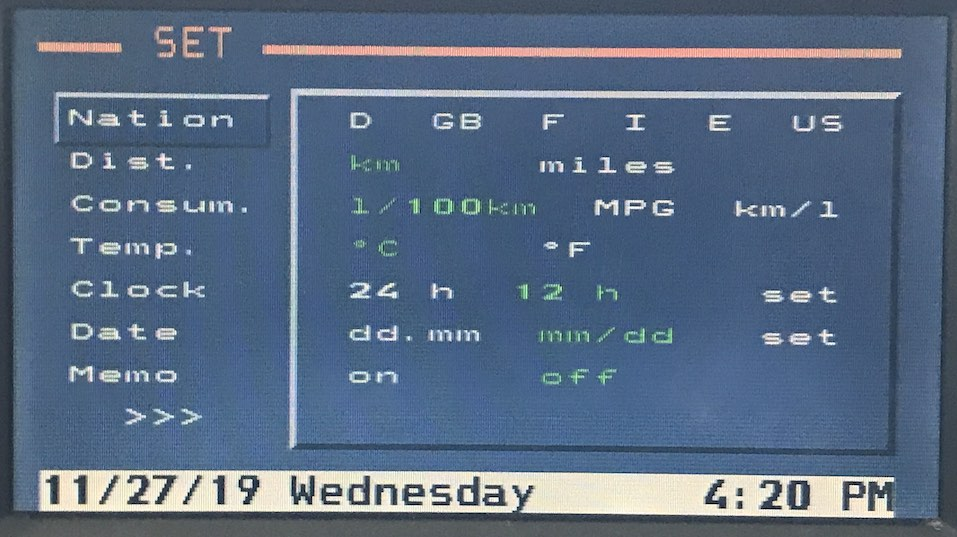

# `0x15` Language & Region

This command is analogous to language and region settings found in desktop operating systems. 

Various modules depend on this configuration in order to correctly interpret data (e.g. temperature, speed) which is transmitted between modules.

There are also a number of flags for vehicle coding which alter behaviour of some modules.

*Note: this is predominately applicable to E38, E39, and E53 clusters. The E46 cluster, although visually similar, is- at least in respect to coding, a less complex unit.*

## Overview

### User Configuration

There are five configurable language/region settings available.

Setting|1|2|3|4|5|6|7|8|9
:---|:---|:---|:---|:---|:---|:---|:---|:---|:---
**Language**|DE|GB|US|IT|ES|JP|FR|CA|GOLF
**Distance**|km|miles|||||||
**Consumption**|l/100km|MPG|km/l||||||
**Temperature**|℃|℉|||||||
**Clock**|24h|12h|||||||
_Date_*|dd.mm|mm/dd|||||||

_* Date is a virtual setting; selecting *12h* will default to *mm.dd*. Similarly, selecting *dd/mm* will default to *24h*._

While there is a global setting for each unit/format, properties are configured individually. For example, selecting 24 hour time affects the *clock*, *navigation arrival time*, and *aux. timers*, each of which needs to be configured for 24 hour time.

When a unit/format is selected, the GT will set the bits for _all_ applicable properties. This relationship between settings and properties is outlined in the below table:

Property|Clock|Distance|Temp.|Consump.
:---|:---|:---|:----|:----
Time|✅|||
Arrival Time|✅|||
Aux. Timer 1|✅|||
Aux. Timer 2|✅|||
Avg. Speed||✅||
Speed Limit||✅||
Distance||✅||
Range||✅||
Temperature|||✅|
Consumption 1||||✅
Consumption 2||||✅

### Vehicle Configuration

There are also a number of flags for vehicle equipment, and configuration which are derived from the cluster coding.

- OBC resume at ignition
- OBC speed correction
- Memo type
- Aux. heating equipped
- Aux. ventilation equipped
- Aux. heating/ventilation controller type
- Motor type
- Radio Controlled Clock (RCC) time

## Examples

    # Cluster broadcasting settings
    80 07 BF 15 08 85 E0 42 02
    80 07 BF 15 01 85 60 42 8B
    80 07 BF 15 08 85 E0 42 02
    
    # GT updating settings
    3B 07 80 15 01 85 60 42 0F
    3B 07 80 15 01 04 00 42 EE

## Properties

4 byte bit field. Fixed length.
    
    # Byte 1
    
    LANGUAGE              = 0b0000_1111 << 24
    CLUSTER_TYPE          = 0b1111_0000 << 24
    
    # Byte 2
    
    FORMAT_TIME           = 0b0000_0001 << 16
    UNIT_TEMPERATURE      = 0b0000_0010 << 16
    OBC_RESUME_AT_KLR     = 0b0000_0100 << 16
    OBC_SPEED_CORRECTION  = 0b0000_1000 << 16
    UNIT_AVG_SPEED        = 0b0001_0000 << 16
    UNIT_LIMIT            = 0b0010_0000 << 16
    UNIT_DISTANCE         = 0b0100_0000 << 16
    FORMAT_ARRIVAL        = 0b1000_0000 << 16
    
    # Byte 3

    UNIT_CONSUMP_1        = 0b0000_0011 << 8
    UNIT_CONSUMP_2        = 0b0000_1100 << 8
    UNIT_RANGE            = 0b0001_0000 << 8
    FORMAT_AUX_TIMER_1    = 0b0010_0000 << 8
    FORMAT_AUX_TIMER_2    = 0b0100_0000 << 8
    MEMO_TYPE             = 0b1000_0000 << 8

    # Byte 4

    AUX_HEATING           = 0b0000_0001 << 0
    AUX_VENTILATION       = 0b0000_0010 << 0
    UNALLOCATED           = 0b0000_0100 << 0    # Unallocated
    MOTOR_TYPE            = 0b0000_1000 << 0
    RCC_TIME              = 0b0001_0000 << 0  
    UNALLOCATED           = 0b0010_0000 << 0    # Unallocated
    EQUIPPED_AUX_CONTROL  = 0b0100_0000 << 0
    UNALLOCATED           = 0b1000_0000 << 0    # Unallocated

---

### Language `0b0000_1111 << 24`

    LANG_DE             = 0b000_0000
    LANG_EN_GB          = 0b000_0001
    LANG_EN_US          = 0b000_0010
    LANG_IT             = 0b000_0011
    LANG_ES             = 0b000_0100
    LANG_JP             = 0b000_0101
    LANG_FR             = 0b000_0110
    LANG_EN_CA          = 0b000_0111
    LANG_GOLF           = 0b000_1000
    
`GOLF 0x08`: I'm not quite sure of meaning. It was the factory delivered language for Australian 2001 E39, and 2005 E53 and NCSDummy translation for "GOLF" is "persian gulf states"?

### Cluster Type `0b1111_0000 << 24`

    CLUSTER_HIGH    = 0b0000_0000   # E38 standard, E39/E53 option
    CLUSTER_LOW     = 0b0000_0011   # E39/E53 standard
    
    CLUSTER_E46_A   = 0b0100_0000   # Variant A?
    CLUSTER_E46_B   = 0b0110_0000   # Variant B?
    CLUSTER_E46_C   = 0b1111_0000   # Variant C?
    
    CLUSTER_E85     = 0b1010_0000   # E85 Z4, E83 X3

This may affect the behaiour of radio, and telephone, neither of which is coded for a specific type of cluster, but will make use of high cluster (IKE/IKI) character display if available.

LCM is coded for high/low cluster, and doesn't appear to be affected by this setting. 

---

### Format: Time `0b0000_0001 << 16`

    TIME_24H            = 0b0000_0000   # 17:30
    TIME_12H            = 0b0000_0001   # 5:30pm

### Unit: Temperature `0b0000_0010 << 16`

    TEMP_CELSIUS        = 0b0000_0000   # +18.0
    TEMP_FAHRENHEIT     = 0b0000_0010   # + 64

### OBC Resume at KL-R `0b0000_0100 << 16`

    OBC_RESUME_FALSE      = 0b0000_0000
    OBC_RESUME_TRUE       = 0b0000_0100
    
Recall the last displayed remote control function.

### OBC Speed Correction `0b0000_1000 << 16`

    OBC_SPEED_CORRECTION_FALSE  = 0b0000_0000
    OBC_SPEED_CORRECTION_TRUE   = 0b0000_1000

### Unit: Average Speed `0b0001_0000 << 16`

    AVG_SPEED_KMPH      = 0b0000_0000   # 100 KM/H
    AVG_SPEED_MPH       = 0b0001_0000   # 62 MPH

### Unit: Speed Limit `0b0010_0000 << 16`
    
    LIMIT_KMPH          = 0b0000_0000   # 100 KM/H
    LIMIT_MPH           = 0b0010_0000   # 62 MPH
    
### Unit: Distance `0b0100_0000 << 16`

    DISTANCE_KM         = 0b0000_0000   # 100 KM
    DISTANCE_MILES      = 0b0100_0000   # 62 MLS

### Format: Arrival Time `0b1000_0000 << 16`
    
    ARRIVAL_24H         = 0b0000_0000   # 17:30
    ARRIVAL_12H         = 0b1000_0000   # 5:30pm

---

### Unit: Consumption 1 `0b0000_0011 << 8`

    CONSUMP_1_L_100     = 0b0000_0000   # 39.5 L/100
    CONSUMP_1_MPG_UK    = 0b0000_0001   # 7.1 MPG
    CONSUMP_1_MPG_US    = 0b0000_0010   # 7.1 MPG
    CONSUMP_1_KM_L      = 0b0000_0011   # 2.5 KM/L

### Unit: Consumption 2 `0b0000_1100 << 8`
    
    CONSUMP_2_L_100     = 0b0000_0000   # 39.5 L/100
    CONSUMP_2_MPG_UK    = 0b0000_0100   # 7.1 MPG
    CONSUMP_2_MPG_US    = 0b0000_1000   # 7.1 MPG
    CONSUMP_2_KM_L      = 0b0000_1100   # 2.5 KM/L
    
### Unit: Range `0b0001_0000 << 8`
    
    RANGE_KM            = 0b0000_0000   # 100 KM
    RANGE_MILES         = 0b0001_0000   # 62 MLS

### Format: Aux. Timer 1 `0b0010_0000 << 8`
    
    TIMER_1_24H         = 0b0000_0000   # 17:30
    TIMER_1_12H         = 0b0010_0000   # 5:30pm
    
### Format: Aux. Timer 2 `0b0100_0000 << 8`
    
    TIMER_2_24H         = 0b0000_0000   # 17:30
    TIMER_2_12H         = 0b0100_0000   # 5:30pm
    
### Memo Type `0b1000_0000 << 8`

    MEMO_IKE            = 0b0000_0000   # Hourly gong
    MEMO_LCM            = 0b1000_0000   # Hourly gong with trip duration
    
If enabled, LCM is responsible for memo, which is generated via check control message.

---

### Aux. Heating `0b0000_0001 << 0`

    AUX_HEAT_FALSE      = 0b0000_0000
    AUX_HEAT_TRUE       = 0b0000_0001
    
Aux. heating option available via GT if enabled.

### Aux. Ventilation `0b0000_0010 << 0`

    AUX_VENT_FALSE      = 0b0000_0000
    AUX_VENT_TRUE       = 0b0000_0010
    
Aux. ventilation option available via GT if enabled.
    
### Motor Type `0b0000_1000 << 0`

    MOTOR_GASOLINE      = 0b0000_0000
    MOTOR_DIESEL        = 0b0000_1000
   
### Radio Controlled Clock (RCC) Time `0b0001_0000  << 0`

    RCC_TIME_FALSE      = 0b0000_0000
    RCC_TIME_TRUE       = 0b0001_0000

RCC was E38 option. RDS specification allows for clock time (CT).

The navigation computer will broadcast GPS Time (`0x1f`) by default, and enabling GPS time in IKE coding does not affect this command, so presumably the RCC module will only broadcast time if this is set?

### Aux. Controller Type `0b0100_0000 << 0`

    BMBT_PRE_PU96       = 0b0000_0000
    BMBT_POST_PU96      = 0b0100_0000   # Also applies to MID

---
    
# `0x14` Language & Region Request

    30 03 80 14 A7  # Check Control Module
    3B 03 80 14 AC  # GT
    68 03 80 14 FF  # Radio
    C8 03 80 14 5F  # Telephone