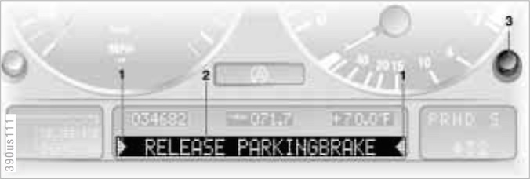

# `0x1a` Check Control Message

CCM `0x30` → Cluster (High) `0x80`

This command generates check control messages on the high cluster (i.e. IKE or IKI). This is purely a display command; the check control logic is handled by the CCM.

As long as a check control message is displayed, other devices will not be able to write to the display, i.e. radio, or telephone via `0x23` or `0x24`.

### Related Commands

- `0x1b` Check Control Priority
- `0x50` Check Control Status Request
- `0x51` Check Control Status
- `0x52` Check Control Message Relay
- `0x57` "Check" Button

### Example Frames
    
    30 19 80 1A 30 00 20 20 20 20 20 20 20 20 20 20 20 20 20 20 20 20 20 20 20 20 83
    30 05 80 1A 30 01 9E
    30 05 80 1A 35 00 9A
    30 19 80 1A 36 03 20 20 57 41 53 48 45 52 20 46 4C 55 49 44 20 4C 4F 57 20 20 9A
    30 19 80 1A 37 07 53 54 4F 50 21 45 4E 47 49 4E 45 20 4F 49 4C 50 52 45 53 53 99

## Parameters

Property|Index|Length|Type
:-------|:----|:-----|:---
Display |`0`  |`1`   |Bitfield
Options |`1`  |`1`   |Bitfield
String  |`2`  |`20`  |String

### Display
        
    DISPLAY_OFF         = 0b0011_0000   # Message cleared. Display off.
    DISPLAY_RECALL      = 0b0011_0101   # Recalling messages via "Check" button.
    DISPLAY_PERSIST     = 0b0011_0110   # Message cleared, chevrons remain.
    DISPLAY_ALERT       = 0b0011_0111   # New messages.

Testing suggests there are a multiple parameters in this bitfield, however they're not readily discernible. The three least significant bits `0b0000_0111` seem to control the character display.

*TODO: is 0x35/0x36 what allows other devices to write despite CCM being active?*
NO!  
0x30 is what allows writes  
`30 LEN 80 1a 30 01 "" CS`  
display will remain on despite similar to:  
`30 LEN 80 1a 30 00 "" CS`

### Options

    GONG    = 0b0001_1100
    CHEVRON = 0b0000_0011

#### Gong `0b0001_1100`
    
    GONG_NONE             = 0b000
    GONG_HIGH_SINGLE      = 0b001
    GONG_HIGH_CONTINUOUS  = 0b010
    GONG_HIGH_DOUBLE      = 0b011
    GONG_LOW_SINGLE       = 0b100

#### Chevron `0b0000_0011`

    CHEVRON_OFF           = 0b00
    CHEVRON_ON            = 0b01
    CHEVRON_BLINK         = 0b11

### String

Unlike writing to the character display with `0x23`, there's no flag to clear the cluster's character buffer before writing to it. This necessitates overwriting the entire display with each successive write. As such, the string parameter will always be 20 characters long.

## Use Cases

### Check Control: Alert

    "SELFLEVEL SUSP.INACT"
    30 19 80 1A 37 01 53 45 4C 46 4C 45 56 45 4C 20 53 55 53 50 2E 49 4E 41 43 54 95
    30 19 80 1A 37 03 53 45 4C 46 4C 45 56 45 4C 20 53 55 53 50 2E 49 4E 41 43 54 97
    30 19 80 1A 37 05 53 45 4C 46 4C 45 56 45 4C 20 53 55 53 50 2E 49 4E 41 43 54 91

> Messages concerning system faults are differentiated based on two priorities:

> **Priority 1**

> These defects are immediately indicated by a gong and a flashing
warning symbol (1). Simultaneous defects will be displayed
consecutively. These status reports remain in the display until the
defects are corrected. It is not possible to delete them by pressing
the CHECK button (3).

> - RELEASE PARKINGBRAKE
- STOP! ENGINE OILPRESS
- COOLANT TEMPERATURE
- SPEED LIMIT
- CHECK BRAKE FLUID
- FLAT TIRE
- LOAD LEVEL INACTIVE

> **Priority 2**

> These displays appear for 20 seconds when the ignition key is turned
to position 2. The warning symbols remain after the message
disappears. You can display the messages again by pressing the CHECK
button (3).

> - TRUNKLID OPEN
- DOOR OPEN
- FASTEN SEAT BELTS*
- WASHER FLUID LOW
- CHECK ENGINE OIL LEV
- CHECK COOLANT LEVEL
- CHECK LOWBEAM LAMPS
- CHECK HIGHBEAM LAMP
- CHECK BRAKE LAMPS
- CHECK SIDE LAMPS
- CHECK REAR LAMPS
- CHECK FRONT FOGLAMPS
- CHECK LICPLATE LAMP
- CHECK BACK UP LAMPS
- TRANS. FAILSAFE PROG
- CHECK BRAKE LININGS
- ENGINE FAILSAFE PROG
- OUTSIDE TEMP. +207 (–56)
- TIRE PRESSURE SET*
- CHECK TIRE PRESSURE*
- TIRE CHECK INACTIVE*

> **Displays after completion of trip**

> All of the malfunctions registered during
the trip appear consecutively when the key is turned to Position 0.

> One of the following displays may appear:

> - CHECK ENGINE OIL LEV
- LIGHTS ON
- KEY IN IGNITION LOCK

> Display appears when you open the driver's door after parking the vehicle. A supplementary gong is also heard.

> Status reports remain available for a period of approx. three minutes after the display goes out and the key is removed from the ignition. Press the CHECK button. If there were multiple reports, press the CHECK button re- peatedly to view them all in sequence.

### Check Control: Recall

> **To check the Check Control**

> Press the CHECK button (3) with the
ignition key in position 2:
CHECK CONTROL OK appears in the display.
No malfunctions are present in the monitored systems.