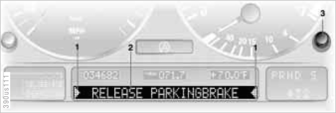

# `0x1a` Check Control Message

CCM `0x30` → Cluster `0x80`

This command generates Check Control text and acoustic/warning-symbol commands on the high cluster. Check Control logic is handled by the CCM, the cluster renders the resulting message.

Check Control messages take priority over other character-display users, e.g. radio presets or telephone contacts.

### Related Commands

- `0x1b` [IKE Text Status](1b.md)
- `0x50` [Check Control Status Request](50.md)
- `0x51` [Check Control Status](51.md)
- `0x52` [Check Control Message Relay](52.md)
- `0x57` [Cluster Buttons](../ike/57.md)

## Formats

### Control only

Fixed length. 2 bytes.

| Property | Index | Length | Type     |
|:---------|:------|:-------|:---------|
| Display  | `0`   | `1`    | Bitfield |
| Options  | `1`   | `1`    | Bitfield |

Example:

    30 05 80 1A 11 00 BE

This form contains no String field. It is used for display/status control such as the immediate-clear command above.

### Control & Text

Fixed length. 22 bytes.

| Property | Index | Length | Type     |
|:---------|:------|:-------|:---------|
| Display  | `0`   | `1`    | Bitfield |
| Options  | `1`   | `1`    | Bitfield |
| String   | `2`   | `20`   | String   |

The CCM/LCM implementation renders internal Check Control strings into exactly 20 characters. Text relayed through `0x52` is likewise copied as a 20-character body.

### Example Frames

    30 05 80 1A 11 00 BE
    30 19 80 1A 30 00 20 20 20 20 20 20 20 20 20 20 20 20 20 20 20 20 20 20 20 20 83
    30 05 80 1A 30 01 9E
    30 19 80 1A 35 01 43 48 45 43 4B 20 46 52 4F 4E 54 20 46 4F 47 4C 41 4D 50 53 8D
    30 19 80 1A 36 03 20 20 57 41 53 48 45 52 20 46 4C 55 49 44 20 4C 4F 57 20 20 9A
    30 19 80 1A 37 07 53 54 4F 50 21 45 4E 47 49 4E 45 20 4F 49 4C 50 52 45 53 53 99

## Display

The normal text-display family uses a fixed `0x30` base, an optional relay qualifier, and a three-bit action field:

    BASE               = 0b0011_0000
    RELAY_QUALIFIER    = 0b0000_1000
    ACTION             = 0b0000_0111

### Action `0b0000_0111`

    ACTION_CLEAR       = 0b000  # Display byte 0x30
    ACTION_RECALL      = 0b101  # Display byte 0x35
    ACTION_PERSIST     = 0b110  # Display byte 0x36
    ACTION_ALERT       = 0b111  # Display byte 0x37

#### Display Clear `0x30`

With no String field, the character message is cleared immediately. \
A full 20-space String may instead be used when Check Control needs to retain ownership of the display while showing no visible text.

#### Display Recall `0x35`

Used when recalling stored warnings via the cluster CHECK button.

#### Display Persist `0x36`

Used when a warning must remain displayed.

#### Display Alert `0x37`

Used when presenting a new alert.

## Options

    ACOUSTIC_CLASS = 0b0011_1100
    CHEVRON        = 0b0000_0011

### Acoustic Class `0b0011_1100`

Built-in LCM Check Control messages use classes `0..4`:

    CLASS_NONE             = 0
    CLASS_HIGH_SINGLE      = 1
    CLASS_HIGH_CONTINUOUS  = 2
    CLASS_HIGH_DOUBLE      = 3
    CLASS_LOW_SINGLE       = 4

### Chevron Characters `0b0000_0011`

    CHEVRON_OFF    = 0b00
    CHEVRON_ON     = 0b01
    CHEVRON_BLINK  = 0b11

## String

Only present in the full form and is then exactly 20 characters long.

Internal Check Control strings are rendered into a space-padded 20-character buffer. A relayed `0x52` message copies its 20 text bytes directly into the same output path.

A 20-character blank string can therefore be used when the display must remain reserved for Check Control while no visible message is shown. 

## Use Cases

### Check Control

> Messages concerning system faults are differentiated based on two priorities:

#### Priority 1

> These defects are immediately indicated by a gong and a flashing warning symbol (1). Simultaneous defects will be displayed consecutively. These status reports remain in the display until the defects are corrected. It is not possible to delete them by pressing the CHECK button (3).

Priority 1 examples:

> - RELEASE PARKINGBRAKE
> - STOP! ENGINE OILPRESS
> - COOLANT TEMPERATURE
> - CHECK BRAKE FLUID
> - LOAD LEVEL INACTIVE

##### Example

    # Warning: Priority 1
    # Display: Persist
    # Gong: None (may be set depending on other warnings and coding)
    # Chevron: Blink
    # Warning: "SELFLEVEL SUSP.INACT"
    30 19 80 1A 36 03 53 45 4C 46 4C 45 56 45 4C 20 53 55 53 50 2E 49 4E 41 43 54 96

#### Priority 2

> These displays appear for 20 seconds when the ignition key is turned to position 2. The warning symbols remain after the message disappears. You can display the messages again by pressing the CHECK
button (3).

Priority 2 examples:

> - CHECK ENGINE OIL LEV
> - CHECK COOLANT LEVEL
> - CHECK BRAKE LAMPS
> - CHECK BRAKE LININGS
> - ENGINE FAILSAFE PROG
> - WASHER FLUID LOW
> - OUTSIDE TEMP. +207 (–56)
> - DOOR OPEN

##### Example

    # Warning: Priority 2
    # Display: Alert
    # Gong: High Single
    # Chevron: On
    # Warning: "CHECK COOLANT LEVEL "
    30 19 80 1A 37 05 43 48 45 43 4B 20 43 4F 4F 4C 41 4E 54 20 4C 45 56 45 4C 20 E5

    # Clear: Priority 2
    # Display: Cleared (but remains on)
    # Gong: None
    # Chevron: On
    # Warning: none
    30 05 80 1A 30 01 9E

#### Recall

> To check the Check Control. Press the CHECK button (3) with the ignition key in position 2: CHECK CONTROL OK appears in the display. No malfunctions are present in the monitored systems.

Recall only applies to messages with priority 2 and below. This is because priority 1 messages persist, and will automatically return when recalling has been completed.

##### Example

    # Note: 0x57 is the CHECK button press (01), and release (41).
    
    # Recall "CHECK FRONT FOGLAMPS"
    80 04 FF 57 01 2D
    30 19 80 1A 35 01 43 48 45 43 4B 20 46 52 4F 4E 54 20 46 4F 47 4C 41 4D 50 53 8D
    80 04 FF 57 41 6D
    
    # Recall "CHECK BRAKE LININGS "    
    80 04 FF 57 01 2D
    30 19 80 1A 35 01 43 48 45 43 4B 20 42 52 41 4B 45 20 4C 49 4E 49 4E 47 53 20 E6
    80 04 FF 57 41 6D
    
    # Recall "CHECK COOLANT LEVEL "
    80 04 FF 57 01 2D
    30 19 80 1A 35 01 43 48 45 43 4B 20 43 4F 4F 4C 41 4E 54 20 4C 45 56 45 4C 20 E3
    80 04 FF 57 41 6D 
    
    # Display cleared, but remains on.
    # Blank string prevents other modules writing to display.
    80 04 FF 57 01 2D
    30 19 80 1A 36 01 20 20 20 20 20 20 20 20 20 20 20 20 20 20 20 20 20 20 20 20 84
    80 04 FF 57 41 6D
    
    # Priority 1 automatically returns, at which point it will persist.
    # "SELFLEVEL SUSP.INACT"
    30 19 80 1A 36 03 53 45 4C 46 4C 45 56 45 4C 20 53 55 53 50 2E 49 4E 41 43 54 96

# Character Set

## 0x00 - 0x13 / #0 - #19

## 0x14 - 0x27 / #20 - #39

## 0x28 - 0x3b / #40 - #59

## 0x3c - 0x4f / #60 - #79

## 0x50 - 0x63 / #80 - #99

## 0x64 - 0x77 / #100 - #119

## 0x78 - 0x8b / #120 - #139

## 0x8c - 0x9f / #140 - #159

## 0xa0 - 0xb3 / #160 - #179

## 0xb4 - 0xc7 / #180 - #199

## 0xc8 - 0xdb / #200 - #219

## 0xdc - 0xef / #220 - #239

## 0xf0 - 0xff / #240 - #255

