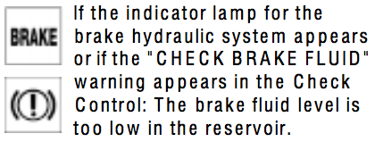

# `0x51` Check Control Status

CCM `0x30` → Broadcast `0xbf`

*Only applies to low cluster (KOMBI)?*

CCM (E39, E38) reports certain sensors to IKE, such as Washer Fluid Low, Brake Fluid Low etc. Later models, like the E46 have all these sensors connected directly to the IKE.

#### Examples

    30 04 BF 51 01 DB
	30 04 BF 51 02 D8

### Related Commands

- `0x1a` [Check Control Message](1a.md)
- `0x1b` Check Control Priority
- `0x50` Check Control Status Request
- `0x52` Check Control Message Relay

Not really relevant...

- `0x5b` [Cluster Indicators](5b.md)
- `0x74` Key Status
- `0x7a` Door/Lid Status

## Parameters

Fixed length. 1-byte bitfield for `LCM_III` (and I'd guess earlier variants).

    BRAKE_FLUID_LOW     = 0b0000_0001
    FASTEN_SEATBELT     = 0b0000_0010
    KEY_IN_IGNITION     = 0b0000_0100
    UNKNOWN             = 0b0000_1000

    WASHER_FLUID_LOW    = 0b0001_0000
    UNKNOWN             = 0b0010_0000
    OIL_LEVEL           = 0b0100_0000
    UNKNOWN             = 0b1000_0000

## Use Cases

    # REMOVE
	30 04 BF 51 01 DB   # Turn on Brake Fluid low indicator (Red exclamation sign)
	30 04 BF 51 02 D8   # Turn on Fasten Seatbelt indicator
	30 04 BF 51 04 DE   # Key in ignition Cluster will play chime when door opens
	30 04 BF 51 10 CA   # Turn on Washer Fluid Low indicator
	30 04 BF 51 40 FA   # Turn on Oil level indicator (when engine is running)

### Indicator and warning lamps

> Many of the systems of your BMW monitor themselves automatically, both during engine starts and while you are driving. Indicator and warning lamps that are identified by "●" are tested for proper functioning whenever the ignition key is turned. They each light up once for different periods of time.

#### Brake Fluid

	30 04 BF 51 01 DB   # Turn on Brake Fluid low indicator (Red exclamation sign)

#### Fasten Seatbelt

	30 04 BF 51 02 D8   # Turn on Fasten Seatbelt indicator

### Check Control (Low/KOMBI)

> The following alerts or status messages are displayed symbolically from ignition key position 2 and up until the defects are corrected:

The following warning lamps/symbols are dependent on this command.

> 2\. Add washer fluid (goes out after approx. 1 minute)

The following warning signal sound is dependent on this command.

> When you open the door after stopping, a warning signal sounds without a visual indicator for:

> - KEY IN IGNITION LOCK.

#### Washer Fluid

	30 04 BF 51 10 CA   # Turn on Washer Fluid Low indicator

#### Key In Ignition

	30 04 BF 51 04 DE   # Cluster will play chime when door opens
