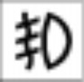
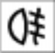
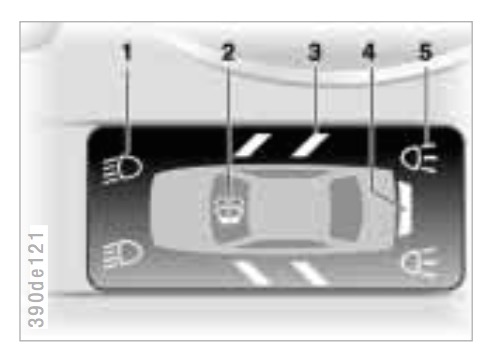

# `0x5b` Cluster Indicators

LM `0xd0` → Broadcast `0xbf`

Activation of lighting related indicator lamps in the instrument cluster.

Additionally, activation of check control indicators lamps on low cluster (KOMBI), and check control messages (via discrete Check Control Module) on early E38s with high clusters (IKE).

### Related

- `0x5a` [Cluster Indicators Request](5a.md)
- `0x7a` [Door/Lid Status](../zke/7a.md)

### Examples
    
    # LCM_III
    D0 07 BF 5B 00 89 00 00 BA
    D0 07 BF 5B 01 C9 02 02 FB
    D0 07 BF 5B 80 20 00 00 93
    D0 07 BF 5B 00 8D 00 00 BE
    D0 07 BF 5B 00 00 00 00 33

    # LCM_IV
    D0 08 BF 5B 1B 00 00 40 00 67
    D0 08 BF 5B 00 00 00 00 00 3C
    D0 08 BF 5B 40 00 04 00 00 78
    D0 08 BF 5B 01 00 00 00 01 3C
    D0 08 BF 5B 03 00 00 00 01 3E

## Parameters

Fixed length, 4-byte bitfield for `LCM_III` (and I'd guess earlier variants).

    # Byte 1 (MSB)
    
    TURN_RAPID        = 0b1000_0000
    TURN_RIGHT        = 0b0100_0000
    TURN_LEFT         = 0b0010_0000
    FOG_REAR          = 0b0001_0000
    
    FOG_FRONT         = 0b0000_1000
    BEAM_HIGH         = 0b0000_0100
    BEAM_LOW          = 0b0000_0010
    PARKING           = 0b0000_0001
    
    # Byte 2
    
    CCM_LIC_PLATE     = 0b1000_0000
    CCM_TURN_RIGHT    = 0b0100_0000
    CCM_TURN_LEFT     = 0b0010_0000
    CCM_FOG_REAR      = 0b0001_0000
    
    CCM_FOG_FRONT     = 0b0000_1000
    CCM_HIGH_BEAM     = 0b0000_0100
    CCM_LOW_BEAM      = 0b0000_0010
    CCM_PARKING       = 0b0000_0001
    
    # Byte 3
        
    CCM_REVERSE       = 0b0010_0000
    
    INDICATORS        = 0b0000_0100
    CCM_BRAKE         = 0b0000_0010
    
    # Byte 4 (LSB)
    
    FOG_REAR_SWITCH   = 0b0100_0000
    KOMBI_LOW_LEFT    = 0b0010_0000
    KOMBI_LOW_RIGHT   = 0b0001_0000

    KOMBI_BRAKE_LEFT  = 0b0000_0010
    KOMBI_BRAKE_RIGHT = 0b0000_0001
    
    # Pending...
    # CCM_TAIL
    # CCM_TRAILER
    # KOMBI_BRAKE_CENTRE

`LCM_IV` and `LSZ_2` added a fifth byte.

    # Byte 5
    
    UNKNOWN           = 0b0000_0001

### Turn Rapid `0b1000_0000 << 24`

> If one of the turn signal indicator lamps - not one of the auxiliary signal lamps - is defective, the flashing frequency is doubled.

### Turn Right `0b0100_0000 << 24`

Right turn signal indicator.

### Turn Left `0b0010_0000 << 24`

Left turn signal indicator.

### Fog Rear `0b0001_0000 << 24`

Front fog light indicator.

### Fog Front `0b0000_1000 << 24`

Rear fog light indicator.

### Beam Low `0b0000_0010 << 24`

Low beam lights on.

An input for "Lights On" check control warning. This will not activate the warning directly; it's subject to `0x7a` Door/Lid Status.

> "LIGHTS ON" warning  
> In ignition key position 0, a buzzer sounds for a few seconds after the driver's door is opened if the headlamps have not been switched off.

### Parking `0b0000_0001 << 24`

Parking lights on.

Presumably related to the "Lights On" warning. Likely only applicable to European vehicles which are equipped with standing parking lights.

---

### IKE CCM Lic Plate `0b1000_0000 << 16`

Set if any licence plate bulbs fail.

### IKE CCM Turn Right `0b0100_0000 << 16`

Set if right turn signal indicator bulb has failed. Doesn't apply to auxiliary turn signal.

### IKE CCM Turn Left `0b0010_0000 << 16`

Set if left right signal indicator bulb has failed. Doesn't apply to auxiliary turn signal.

### IKE CCM Fog Rear `0b0001_0000 << 16`

Set if any rear fog lamp bulbs have failed.

### IKE CCM Fog Front `0b0000_1000 << 16`

Set if either front fog lamp bulbs has failed.

### IKE CCM High Beam `0b0000_0100 << 16`

Set if either high beam bulbs has failed.

### IKE CCM Low Beam `0b0000_0010 << 16`

Set if either low beam bulbs has failed.

### IKE CCM Parking `0b0000_0001 << 16`

Set if either front parking bulbs has failed. I believe this only applies to front lamps.

---

### IKE CCM Reverse `0b0010_0000 << 8`

Set when either reverse bulbs have failed.

### Indicators `0b0000_0100 << 8`

Set when either turn signal indicator bit is set.

It's not required to activate the turn signal indicator. It's position in the bitfield suggests it's related to CCM, but I'm not sure...

### IKE CCM Brake `0b0000_0010 << 8`

Set when any brake bulbs have failed.

---

### Fog Rear Switch `0b0100_0000`

Set when fogs switched to rear only. I'm not sure what purpose it serves.

### KOMBI CCM Low Beam Left `0b0010_0000`

Set if left low beam bulb has failed.

### KOMBI CCM Low Beam Right `0b0001_0000`

Set if right low beam bulb has failed.

### KOMBI CCM Brake Left `0b0000_0010`

Set if left brake bulb has failed.

### KOMBI CCM Brake Right `0b0000_0001`

Set if right brake bulb has failed.

---

### Unknown `0b0000_0001`

Only observed values are `0x00` or `0x01`. Presumably related to a function introduced in later LM variants.

## Use Cases

### Cluster Indicators

> The indicator lamps for **left turn signal indicator**, **right turn signal indicator**, **rear fog light**, **fog light** and **high beam** located in the instrument cluster are activated via the I-Bus/K-bus.

### Check Control (High/IKE) [E38 up to 09/95]

Early E38s had a discrete Check Control Module (CCM) which required input from the Light Module (LM) in order to generate lamp related check control messages. 

This use case became redundant with the introduction of the Light Check Module (LCM) which integrated the CCM. However, the LCM still reports the lamp faults, presumably for backwards compatibility.

> Following messages are preprocessed by the light module and transferred to the check-control module by way of telegram.
>
> - Check brake light  
> - Check high beam  
> - Check low beam  
> - Check parking light  
> - Check tail lights *[rear lamps/side marker lamps]*  
> - Check front fog light  
> - Check rear fog light  
> - Check licence plate light  
> - Check reversing light  
> - Check trailer light
> - Check lights on *[subject to ZKE status]*

### Check Control (Low/KOMBI)

> On vehicles with the basic system, information is indicated not in the form of text messages but rather by warning lamps and symbols in the LC display field for check control messages in the instrument cluster.

The following warning lamps/symbols are dependent on this command.

> 1\. Check low beam headlights  
> 5\. Check rear light or brake light. A defective third (centre) brake light is indicated by the upper symbol.

