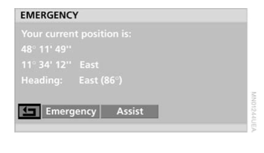

# `0xa2` Telematics Coordinates

Nav. `0x7f` → Telephone `0xc8`

The relevance of coordinates to telephone is in the role of telematics.

**I missed someting about EAST/WEST or NORTH/SOUTH**

    https://en.wikipedia.org/wiki/ISO_6709
    50°03′46.461″S 125°48′26.533″E 978.90m
    DDD° MM' SS.S"
    
    
    00 37 49 56 01 01 45 00 44 80 00
    37°49′56.01″S 145°00′44.8″E
    37 51 21 41 01 45 02 29 70 00 46
    37°51′21.41″S 145°02′20.7″E

## Examples

    ...

## Parameters

Parameter|Index|Length|Note
:---|:---|:---|:---
Signal|`0`|`1`|
Latitude|`1`|`5`|
Longitude|`6`|`5`|
Vertical|`11`|`2`|
NA|`13`|`1`|
Time|`14`|`3`|

#### Parameter Mapping Example

    # Telematics Coordinates frame
    7F 14 C8 A2 01 00 37 51 21 41 01 45 02 29 70 00 46 00 00 02 12 4F

Parameter|Data
:---|:---
Signal|`01`|
Latitude|`00 37 51 21 41`|
Longitude|`01 45 02 29 70`|
Vertical|`00 46`|
NA|`00`|
Time|`00 02 12`

### Signal

    SIGNAL_FALSE    = 0x00
    SIGNAL_TRUE     = 0x01

### Latitude

Latitude|Index|Length|Type
:---|:---|:---|:---
Degrees|`1`|`2`|Packed BCD
Minutes|`3`|`1`|Packed BCD
Seconds|`4`|`1`|Packed BCD
Fractional Sec.|`5`|`1`|Packed BCD

### Longitude

Longitude|Index|Length|Type
:---|:---|:---|:---
Degrees|`6`|`2`|Packed BCD
Minutes|`8`|`1`|Packed BCD
Seconds|`9`|`1`|Packed BCD
Fractional Sec.|`10`|`1`|Packed BCD

### Vertical (Altitude?)

Vertical|Index|Length|Note
:---|:---|:---|:---
Vertical|`11`|`2`|Packed BCD

### Time

Like `0x1f` GPS Time, this is UTC.

- this message is not sent at the top of the minute, thus seconds will not be limited to `:00` like GPS-T
- and sent at 30 second intervals, i.e. `:15`, and `:45`

Property|Index|Length|Type
:---|:---|:---|:---
**Hour**|`14`|`1`|
**Minute**|`15`|`1`|
**Second**|`16`|`1`|

## Use Cases

### BMW Assist: Emergency Call


> In addition, the TCU accompanies both emergency calls with an SMS text message providing the location coordinates of the vehicle to the service provider.

> The following data are transmitted in the SMS:
- **Location of vehicle**
- Vehicle identification number
- Telephone number (from mobile phone)
- Licence number, colour, model (if specified)

### BMW Assist: Roadside Assistance

> A breakdown call is sent by selecting the menu point BMW roadside assistance service, i.e. data are sent to the BMW roadside assistance service together with the **current location** and vehicle profile.