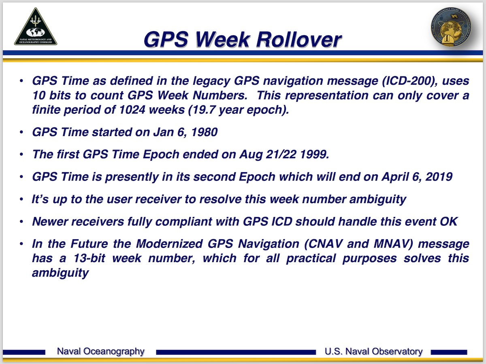

# `0x1f` GPS Time

## Properties

Property|Index|Length|Note
:---|:---|:---|:---
**Unknown**|`0`|`1`|To date always `0x40`?
**Hour**|`1`|`1`|
**Minute**|`2`|`1`|
**Day**|`3`|`1`|
***Second\****|`4`|`1`|Seemingly always `0x00`. Given command is sent at top of the minute, possibly seconds?!
**Month**|`5`|`1`|
**Year**|`6`|`2`|

## GPS Week Number Rollover

As of 7 April 2019, the navigation computer (MK2+) will report what appears to be the incorrect date.

***service mode image***

This is a result of the [GPS week number rollover](https).

***From the U.S. Naval. Observatory report:***
> 

.

> The GPS date is expressed as a week number and a seconds-into-week number.

The week number represents the number of weeks since the GPS epoch on 6 January 1980. It is stored as a 10 bit integer, allowing for a week number of 0 to 1023 (`2^10`), thus every 1024 weeks, or ~19.7 years the week number will rollover.

In summary, the epochs are as follows:

Epoch|Start|End
:---|:---|:---
**1**|`1980-01-06`|`1999-08-21`
**2**|`1999-08-22`|`2019-04-06`
**3**|`2019-04-07`|`.`

Presumably a navi. OS software update was released in 1999 to handle the epoch 1/2 rollover event. However, in the absence of an update to handle the epoch 2/3 rollover, the navigation computer will no longer report the correct date.

### Epoch Offset

The aforementioned "week number ambiguity" can be handled by applying the same logic that would otherwise be the responsibility of a GPS receiver.

As of `V30` or `4-1/00`, navigation computers should be configured for epoch 2. As such, the reported date can simply be offset by 1 epoch, or 1024 weeks.

In the case of ruby, the base unit for time is seconds, so to get a period of 1024 weeks, we calculate the number of seconds in one week, and multiply it by 1024.

    epoch_size      = 2**10             # 2^10
    week_seconds    = 60 * 60 * 24 * 7  # 604800 seconds

    epoch = epoch_size * week_seconds   # 619315200 seconds
    
    # 1024 weeks = 619315200 seconds
    
    # Reported time: 2000-01-01
    gpst = Time.new("2000-01-01 00:00")
    corrected_gpst = gpst + epoch
