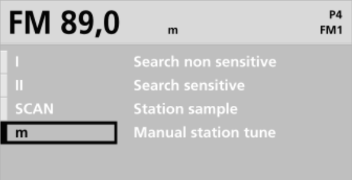
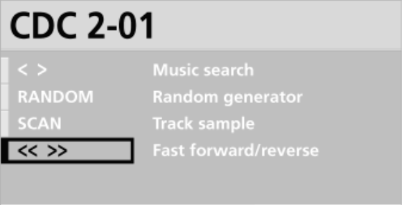
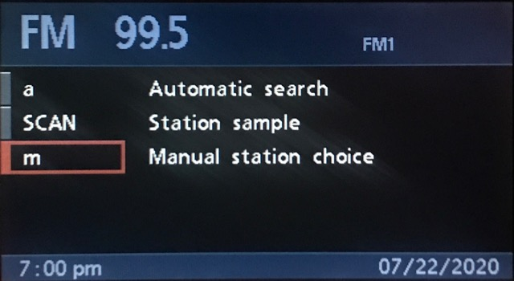
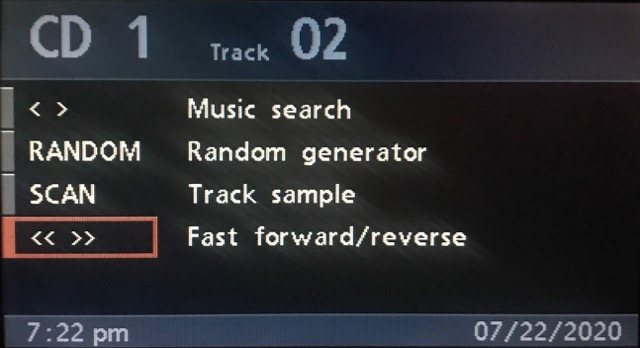
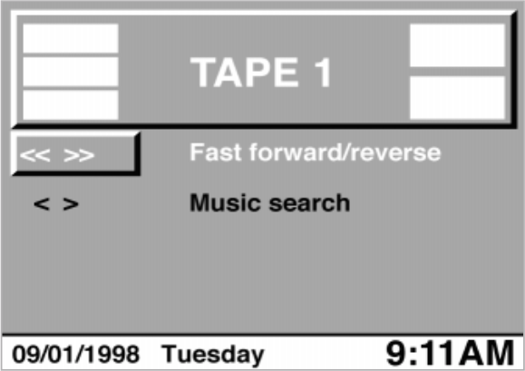
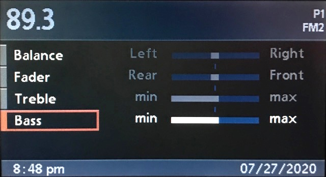
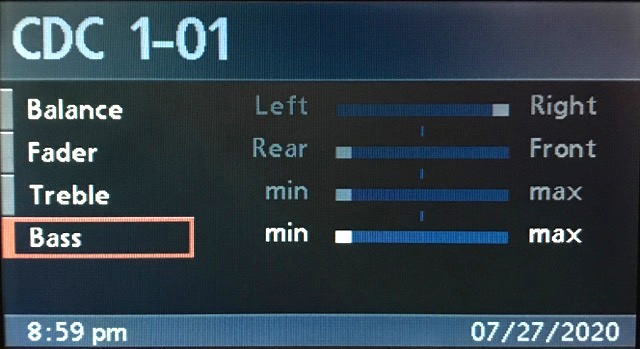
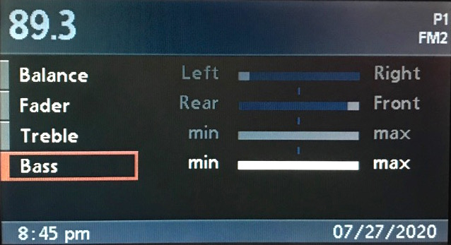
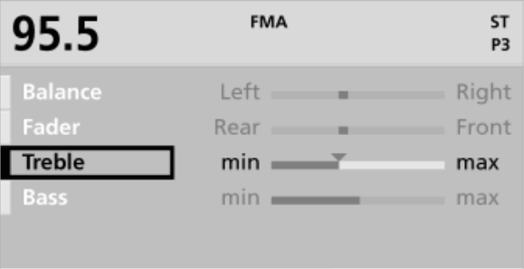

# `0x37` Radio Tone/Select

Radio `0x68` → GT `0x3b`

This command allows the radio to load the appropriate Tone (EQ) and Select (playback options) menus.

#### The BM23 sucks

The BM23 is the odd one out of the radio modules. It works quite differently than BM24, BM53 and BM54.
Differences are:
- Select and Tone UIs must be navigated using the Select/Tone and Prev/Next buttons.
- Select in tuner mode only has `a` instead of `I` and `II`
- It does not write the header fields itself, they are hardcoded into the GT and the radio controls them using the `0x23` command.
- The select menu source parameter is not used, the GT uses the layout from the `0x23` command to determine the source.

### Related Commands

- `0x36` [Radio EQ](36.md)
- `0x46` [Request Radio UI](46.md)

### Example Frames

The common form uses one data byte. [Tone (Set)](#tone-set) uses four data bytes. An extended Tone Set form may include an optional eight-character label.

    68 04 3B 37 05 65
    68 04 3B 37 35 55
    68 04 3B 37 14 74
    68 04 3B 37 50 30
    68 04 3B 37 C0 A0
    68 04 3B 37 E0 80
    
    # Singular use case. See "Tone (Set)"
    68 07 3B 37 82 19 15 0E E3
    68 07 3B 37 82 10 10 00 E1
    68 07 3B 37 80 00 00 10 F3

## Parameters

Variable length. The first byte is always a bitfield.

Most uses have one data byte. Tone Set uses at least four.

    Byte 1
    ROW_ACTIVE     = 0b0000_0001  # Not used with BM23
    SOURCE         = 0b0000_1100  # Not used with BM23
    ROW_INDEX      = 0b0011_0000
    FUNCTION       = 0b1100_0000

Following bytes are only used if function is set to FUNCTION_TONE_SET:

    Byte 2
    VALUE_BASS     = 0b0001_1111

    Byte 3
    VALUE_TREBLE   = 0b0001_1111

    Byte 4
    VALUE_FADER    = 0b0001_1111

    Byte 5
    VALUE_BALANCE  = 0b0001_1111

There is also an extended form that can contain an 8 character string.\
Use case currently not known.

    Byte 6 & 7
    RESERVED       = 0b1111_1111
 
    Byte 8
    RESERVED       = 0b1111_1110
    HAS_STRING     = 0b0000_0001

    Byte 9 - 16
    CHARACTER      = 0b1111_1110

### Row Active `0b0000_0001`
The GT displays the selected rows list item as pressed if this bit is set.
Not used with the BM23.

### Source `0b0000_1100`
The GT has to know which values it has to display in the list. 
Not used with the BM23.

    SOURCE_TUNER            = 0b0000_0100
    SOURCE_TAPE             = 0b0000_1000
    SOURCE_CDC              = 0b0000_1100

The New-Gen GT UI does not have a Tape Select Menu.\
It instead listens to the select button.\
If the button is pressed, the radio requests the select menu, but the GT tells the radio to close it, and then it simulates the Dolby BMBT button.\
What the hack!

### Row Index `0b0011_0000`
Both Tone and Select menus will have up to four rows.

The New-Gen GT UI flipped the order of the rows, the list is created from bottom to top.\
This was done because they changed how the dial reacts to the cursor in lists.\
As the radio controls the cursor and to be consistent with other lists in the UI, they just reversed the order.\
`ROW_A` is of course still highlighted by default, so yes, the bottom list item is always selected when opening the menus.

Rows can be omitted if for example only 3 rows are needed.
 
    ROW_A   = 0b0000_0000   # Default (top on OG-UI, bottom on NG-UI)
    ROW_B   = 0b0001_0000
    ROW_C   = 0b0010_0000
    ROW_D   = 0b0011_0000   # (bottom on OG-UI, top on NG-UI)
    
### Function `0b1100_0000`
Tells the GT the menu type, tone or select. 

    FUNCTION_SELECT       = 0b0000_0000
    FUNCTION_SELECT_BM23  = 0b0100_0000
    FUNCTION_TONE_SET     = 0b1000_0000
    FUNCTION_TONE         = 0b1100_0000

`FUNCTION_TONE_SET` is used for opening the tone menu and filling it with initial data.\n
`FUNCTION_TONE` is then used for updating the cursor position.

`FUNCTION_SELECT_BM23` tells the GT to use the `0x23` title command layout to determine the source.

### Value `0b0001_1111`

Only applicable to `FUNCTION_TONE_SET`.

See *Value* in `0x36` [Radio EQ](36.md#value-0b0001_1111)

## Use Cases

### Select (BM53)

#### Radio

| Bitwise                                                      | Value  | Symbol   | Text                  | State     |
|:-------------------------------------------------------------|:-------|:---------|:----------------------|:----------|
| `FUNCTION_SELECT_NG & ROW_D & SOURCE_RADIO & OPTS_HIGHLIGHT` | `0x34` | `I`      | Search non sensitive  | Highlight |
| `FUNCTION_SELECT_NG & ROW_D & SOURCE_RADIO & OPTS_ACTIVE`    | `0x35` | `< I >`  | Search non sensitive  | Activated |
| `FUNCTION_SELECT_NG & ROW_C & SOURCE_RADIO & OPTS_HIGHLIGHT` | `0x24` | `II`     | Search sensitive      | Highlight |
| `FUNCTION_SELECT_NG & ROW_C & SOURCE_RADIO & OPTS_ACTIVE`    | `0x25` | `< II >` | Search sensitive      | Activated |
| `FUNCTION_SELECT_NG & ROW_B & SOURCE_RADIO & OPTS_HIGHLIGHT` | `0x14` | `SCAN`   | Station sample        | Highlight |
| `FUNCTION_SELECT_NG & ROW_B & SOURCE_RADIO & OPTS_ACTIVE`    | `0x15` | `SCAN`   | Station sample        | Activated |
| `FUNCTION_SELECT_NG & ROW_A & SOURCE_RADIO & OPTS_HIGHLIGHT` | `0x04` | `m`      | Manual station choice | Highlight |
| `FUNCTION_SELECT_NG & ROW_A & SOURCE_RADIO & OPTS_ACTIVE`    | `0x05` | `< m >`  | Manual station choice | Activated |

#### CDC

| Bitwise                                                    | Value  | Symbol   | Text                 | State     |
|:-----------------------------------------------------------|:-------|:---------|:---------------------|:----------|
| `FUNCTION_SELECT_NG & ROW_D & SOURCE_CDC & OPTS_HIGHLIGHT` | `0x3c` | `< >`    | Music search         | Highlight |
| `FUNCTION_SELECT_NG & ROW_D & SOURCE_CDC & OPTS_ACTIVE `   | `0x3d` | `< >`    | Music search         | Activated |
| `FUNCTION_SELECT_NG & ROW_C & SOURCE_CDC & OPTS_HIGHLIGHT` | `0x2c` | `RANDOM` | Random generator     | Highlight |
| `FUNCTION_SELECT_NG & ROW_C & SOURCE_CDC & OPTS_ACTIVE `   | `0x2d` | `RANDOM` | Random generator     | Activated |
| `FUNCTION_SELECT_NG & ROW_B & SOURCE_CDC & OPTS_HIGHLIGHT` | `0x1c` | `SCAN`   | Track sample         | Highlight |
| `FUNCTION_SELECT_NG & ROW_B & SOURCE_CDC & OPTS_ACTIVE `   | `0x1d` | `SCAN`   | Track sample         | Activated |
| `FUNCTION_SELECT_NG & ROW_A & SOURCE_CDC & OPTS_HIGHLIGHT` | `0x0c` | `<< >>`  | Fast forward/reverse | Highlight |
| `FUNCTION_SELECT_NG & ROW_A & SOURCE_CDC & OPTS_ACTIVE `   | `0x0d` | `<< >>`  | Fast forward/reverse | Activated |

### Select (C23)

Source is inherent for the C23, so the examples below just reflect the three possible contexts: radio, CDC, and tape.

Legacy radios do not support cycling through, or selecting options via the navigation dial. Cycling options requires repeated use of the BMBT's *SELECT* button. As for "activating" a highlighted option, I've not the faintest idea, just mash the BMBT buttons and see how you go.

Note: the below is a C23 BM with MK4 (`4-1/00`) which is an unlikely pairing, but I couldn't be bothered busting out an early "MK1" video module.

#### Radio

Row four/D is omitted as there are only three options.

| Bitwise                   | Value  | Symbol | Text                    |
|:--------------------------|:-------|:-------|:------------------------|
| `FUNCTION_SELECT & ROW_C` | `0x60` | `a`    | `Automatic search`      |
| `FUNCTION_SELECT & ROW_B` | `0x50` | `SCAN` | `Station sample`        |
| `FUNCTION_SELECT & ROW_A` | `0x40` | `m`    | `Manual station choice` |

#### CDC

| Bitwise                   | Value  | Symbol   | Text                   |
|:--------------------------|:-------|:---------|:-----------------------|
| `FUNCTION_SELECT & ROW_D` | `0x70` | `< >`    | `Music Search`         |
| `FUNCTION_SELECT & ROW_C` | `0x60` | `RANDOM` | `Random generator`     |
| `FUNCTION_SELECT & ROW_B` | `0x50` | `SCAN`   | `Track sample`         |
| `FUNCTION_SELECT & ROW_A` | `0x40` | `<< >>`  | `Fast forward/reverse` |

#### Tape

Rows three (`ROW_C`) and four (`ROW_D`) are omitted as there are only two options.

| Bitwise                   | Value  | Symbol  | Text                   |
|:--------------------------|:-------|:--------|:-----------------------|
| `FUNCTION_SELECT & ROW_B` | `0x50` | `<< >>` | `Fast forward/reverse` |
| `FUNCTION_SELECT & ROW_A` | `0x40` | `< >`   | `Music Search`         |

### Tone (Set)

This is the single use case that affects the message length.

When the radio requests Tone (EQ) be displayed, it simultaneously sets the [value of each property](36.md#property-0b1110_0000).

    
    # Tone (Set): Neutral values
    # FUNCTION_TONE_SET & 0x10 => 0x90
    68 07 3B 37 90 10 10 00 F3

    
    # Tone (Set): Minimum values
    # FUNCTION_TONE_SET & 0x1c => 0x9c
    68 07 3B 37 9C 1C 1F 1F E3

    # Tone (Set): Maximum values
    # FUNCTION_TONE_SET & 0x0c => 0x8c
    68 07 3B 37 8C 0C 0F 0F E3

### Tone

| Bitwise                 | Value  | Text    | State     |
|:------------------------|:-------|:--------|:----------|
| `FUNCTION_TONE & ROW_D` | `0xf0` | Balance | Highlight |
| `FUNCTION_TONE & ROW_C` | `0xe0` | Fader   | Highlight |
| `FUNCTION_TONE & ROW_B` | `0xd0` | Treble  | Highlight |
| `FUNCTION_TONE & ROW_A` | `0xc0` | Bass    | Highlight |