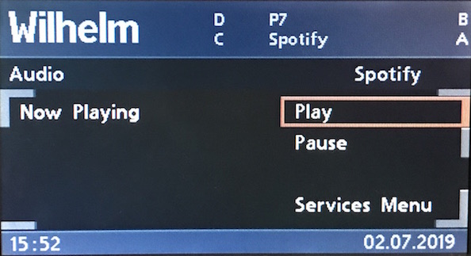

# `0x21` Menu Text: Radio

Radio `0x68` → GT `0x3b`  
Radio `0x68` → MID `0xc0`

*Only widescreen BMBT/NG radio usage is discussed!*

  
*Pictured: GT with radio station selection menu.*

The original purpose of this command was to populate the dynamic, function specific buttons on the MID.

As a testimony to this, early C23 BM radios still behave as if a MID is present! The radio will both try and write the MID buttons, and will respond to an emulated MID button press even if the GT does not utilise menus.

  
*Pictured: The MID's function specific button labels.*

As is seemingly the case with a number of bus functions, BMW initially gently coerced the command to work with the GT, and progressively bludgeoned it to support more features.

### Related

- `0x21` [Menu Text: Telephone](../telephone/21.md)
- `0x21` Menu Text: Cluster
- `0x23` [Title Text: Radio](23.md)
- `0x23` [Title Text: Telephone](../telephone/23.md)
- `0x24` [Property Text: Telephone](24.md)
- `0x31` Menu Button: Radio
- `0x31` Menu Button: Telephone
- `0xa5` [Body Text: Telephone](../telephone/a5.md)

### Example Frames

**TODO: I'll only have 60 and 62 from BM53**

    #

## Parameters

Length will vary with *String*.

Property|Index|Length|Type
:-------|:----|:-----|:---
Layout|`0`|`1`|Bitfield
Function|`1`|`1`|Bitfield
Options|`2`|`1`|Bitfield
String|`3`|`-1`|String

---

### Layout

NG radios forego source specific flags, instead defaulting to digital radio for all sources. (See `0x23` [Title Text: Radio](23.md) for the comprehensive overview of the source flags.)

The source specific flags are still supported by the GT, however the split screen feature only functions when the source is set to digital radio, hence why the NG radios use this by default.

    LAYOUT_MENU         = 0x60 # Presets, Stations, Info (RDS)
    LAYOUT_MENU_TP_TMC  = 0x61 # TMC, TP
    LAYOUT_HEADER       = 0x62
    LAYOUT_MP3          = 0x63 # ID3 metadata (MP3, WMA)

---

### Function

Based on my BM53, this parameter is redundant. However, it *may* play a role in configuring RDS features on BM54s etc.

    # BM53
    # Function default value of 0x00
    68 14 3B 21 60 00 60 50 37 20 20 20 20 20 20 20 20 20 20 20 2A 0B
    68 12 3B 21 60 00 41 50 69 65 72 73 27 73 20 69 50 61 64 54
    68 0F 3B 21 60 00 49 4D 61 69 6E 20 4D 65 6E 75 6C
    68 14 3B 21 61 00 40 53 65 74 75 70 20 44 69 73 70 6C 61 79 06 7C
    68 11 3B 21 61 00 41 53 65 74 75 70 20 4B 65 79 73 06 06
    68 12 3B 21 61 00 42 53 65 74 75 70 20 43 6C 6F 63 6B 06 6A

---

### Options

    INDEX       = 0b0001_1111   # Index of field to write to
    CLEAR       = 0b0010_0000   # Clear layout
    BUFFER      = 0b0100_0000   # Buffer the write
    HIGHLIGHT   = 0b1000_0000   # Highlight given field

#### Index `0b0001_1111`

Each layout has a given number of fields, each of which is represented by a known index.

This might also be thought of as a cursor position from which to start writing. The control character `0x06` will move the cursor to the next index.

#### Clear `0b0010_0000`

Setting this bit will clear the given layout, including the buffer. As such, it's only set on the *first* message.

Careful omission of this bit allows the updating the rendered display. However, the factory implementation seemingly always writes the display in it's entirity, thus always clearing the display when commencing writing.

#### Buffer `0b0100_0000`

As populating a display requires multiple messages, the GT `0x3b` will buffer preliminary messages until the entire display is ready to be rendered.

All but the last message will have this bit set. The absense of the bit in the final messages is what triggers the GT `0x3b` to render the buffer.

#### Highlight `0b1000_0000`

The field with the given index will be highlighted.

I've not seen this used in the factory implementation. If omitted, the first, or last selected field (for the given layout) will be highlighted.

---

### String

Code Point|Name|Description
:--|:--|:--
`0x00`|NUL|Null-terminated string
`0x06`|LF|Line Feed
    
## Use Cases

### Presets

  
*Pictured: Radio FM (analogue with RDS).*

### Stations

  
*Pictured: Radio FMD (digital).*

### Info (RDS)

  
*Pictured: Radio Info/RDS menu.*

### TMC/TP

  
*Pictured: RDS TP configuration.*
    
    INDEX_HEADER_LEFT   = 0x09     # "TMC= SKYRADIO"
    INDEX_HEADER_RIGHT  = 0x0a     # "TP-PROG= LOCAL-W"

There might be some padding going on in the factory implementation as my implementation uses none and the alignment of the right column header looks a little odd.

### CDC disc selection

> ...

### CDC with ID3 Metadata (MP3, WMA)

  
*Pictured: CDC with ID3 display*

While writing to this layout can be done with this command, `0xa5` is recommended. (See `0xa5` [Body Text: Telephone](../telephone/a5.md) for usage.)

    INDEX_LINE_1 = 0x01
    INDEX_LINE_2 = 0x02
    INDEX_LINE_3 = 0x03

    # Not used in factory impl?
    INDEX_LINE_4 = 0x04
    INDEX_LINE_5 = 0x05