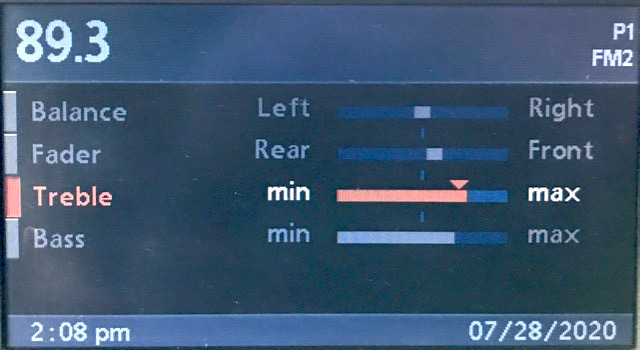
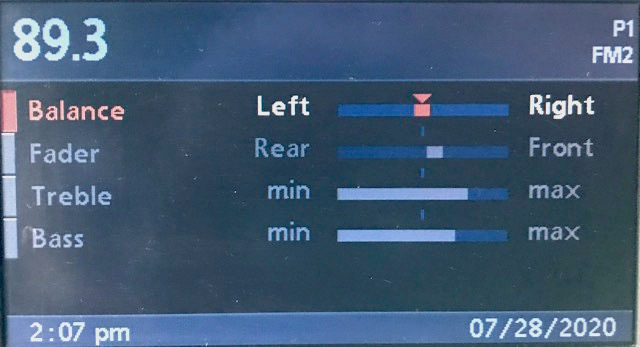
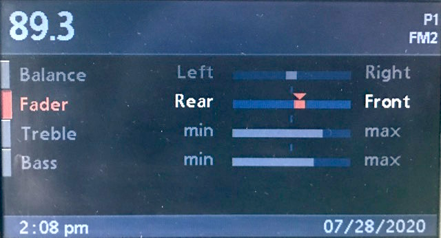
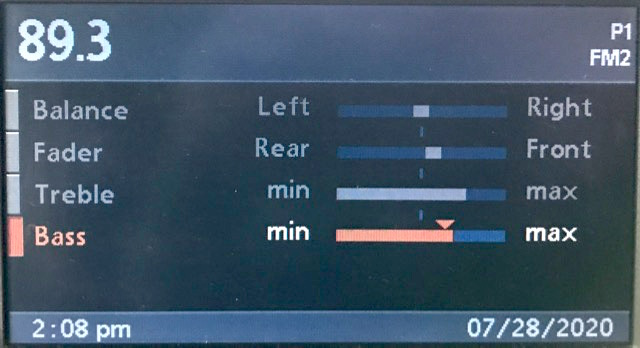

# `0x36` Radio EQ

Radio `0x68` → GT `0x3b`  
<!--Radio `0x68` → DSP `0x6a` (DSP only)-->
<!--Radio `0x68` → Broadcast`0xff` (DSP only)-->

*BMBT only.*

The radio uses this command to update the **Tone** (EQ) display as the properties are adjusted.

### Related Commands

- `0x37` [Radio Tone/Select](37.md)
- `0x46` Radio UI

### Example Frames

    68 04 3B 36 40 21
    68 04 3B 36 44 25
    68 04 3B 36 54 35
    68 04 3B 36 55 34
    68 04 3B 36 6A 0B
    68 04 3B 36 72 13
    68 04 3B 36 78 19
    68 04 3B 36 85 E4
    68 04 3B 36 98 F9
    68 04 3B 36 C2 A3

## Parameters

Fixed length. One byte bitfield.

    PROPERTY    = 0b1110_0000
    VALUE       = 0b0001_1111

### Property `0b1110_0000`

    PROPERTY_BALANCE    = 0b0100_0000   # 0x40
    PROPERTY_BASS       = 0b0110_0000   # 0x60
    PROPERTY_FADER      = 0b1000_0000   # 0x80
    PROPERTY_TREBLE     = 0b1100_0000   # 0xc0
    
### Value `0b0001_1111`

The property value is encoded with [signed magnitude representation](https://en.wikipedia.org/wiki/Signed_number_representations#Signed_magnitude_representation).
    
    # 5-bit signed magnitude encoding
    SIGN        = 0b0001_0000   # Sign   
    MAGNITUDE   = 0b0000_1111   # Magnitude (absolute value)

Each property has a fixed number of intervals. *Treble* and *Bass* have 13 intervals (±6), while *Fader* and *Balance* have 21 intervals (±10).

A *magnitude* of zero `0b0000` represents "neutral" (as denoted by the visual indicator), with *sign* representing the change relative to neutral. 

    SIGN_POSITIVE = 0b0_0000     # "Max", "Front", "Left"
    SIGN_NEGATIVE = 0b1_0000     # "Min", "Rear", "Right"

The step number will not necessarily equal the encoded number. i.e. the sixth step is not encoded as `0b0110 # 0x6`. The respective encoded intervals are summarised below:

Property|Step (encoded) [neutral to upper limit]
:-------|:-----------------------------
Bass / Treble|`0 2 4 6 8 a c`
Fader / Balance|`0 1 2 3 4 5 8 a c e f`

Just to *really* fuck with you; while adjusting *Fader*, *Treble*, or *Bass* to the left (visually) is "negative", *Balance* is "positive".

Up is down, and down is up. (Did you know that Willy Wonka & the Chocolate Factory was filmed in Munich? Seems apt...)

As a respite from German humour, here is a table of the encoded intervals, laid out as they appear visually.

         |    |                               |`▼`   |                               |     
:--------|----|------------------------------:|:----:|-------------------------------|-----
*Balance*|Left|`0f 0e 0c 0a 08 05 04 03 02 01`|`00`|`11 12 13 14 15 18 1a 1c 1e 1f`|Right
*Fader*  |Rear|`1f 1e 1c 1a 18 15 14 13 12 11`|`10`|`01 02 03 04 05 08 0a 0c 0e 0f`|Front
*Treble* |min |`1c 1a 18 16 14 12`|`10`|`02 04 06 08 0a 0c`|max
*Bass*   |min |`1c 1a 18 16 14 12`|`10`|`02 04 06 08 0a 0c`|max

*For an additional layer of mind fuckery, the encoding is not consistent with DSP. A number of steps have a different binary value, including neutral (zero), which may switch between negative and positive.*

*I mean, of course it would.*

## Use Cases

### Tone

#### Balance

    
    # BALANCE
    68 04 3B 36 4F 2E   # +10 LEFT
    68 04 3B 36 4E 2F   # +9
    68 04 3B 36 4C 2D   # +8
    68 04 3B 36 4A 2B   # +7
    68 04 3B 36 48 29   # +6
    68 04 3B 36 45 24   # +5
    68 04 3B 36 44 25   # +4
    68 04 3B 36 43 22   # +3
    68 04 3B 36 42 23   # +2
    68 04 3B 36 41 20   # +1
    68 04 3B 36 40 21   # +0
    68 04 3B 36 51 30   # -1
    68 04 3B 36 52 33   # -2
    68 04 3B 36 53 32   # -3
    68 04 3B 36 54 35   # -4
    68 04 3B 36 55 34   # -5
    68 04 3B 36 58 39   # -6
    68 04 3B 36 5A 3B   # -7
    68 04 3B 36 5C 3D   # -8
    68 04 3B 36 5E 3F   # -9
    68 04 3B 36 5F 3E   # -10 RIGHT

#### Fader

    
    # FADER
    68 04 3B 36 9F FE   # -10 REAR
    68 04 3B 36 9E FF   # -9
    68 04 3B 36 9C FD   # -8
    68 04 3B 36 9A FB   # -7
    68 04 3B 36 98 F9   # -6
    68 04 3B 36 95 F4   # -5
    68 04 3B 36 94 F5   # -4
    68 04 3B 36 93 F2   # -3
    68 04 3B 36 92 F3   # -2
    68 04 3B 36 91 F0   # -1
    68 04 3B 36 90 F1   # +0
    68 04 3B 36 81 E0   # +1
    68 04 3B 36 82 E3   # +2
    68 04 3B 36 83 E2   # +3
    68 04 3B 36 84 E5   # +4
    68 04 3B 36 85 E4   # +5
    68 04 3B 36 88 E9   # +6
    68 04 3B 36 8A EB   # +7
    68 04 3B 36 8C ED   # +8
    68 04 3B 36 8E EF   # +9
    68 04 3B 36 8F EE   # +10 FRONT
    
#### Treble

    
    # TREBLE    
    68 04 3B 36 DC BD   # -6 MIN
    68 04 3B 36 DA BB   # -5
    68 04 3B 36 D8 B9   # -4
    68 04 3B 36 D6 B7   # -3
    68 04 3B 36 D4 B5   # -2
    68 04 3B 36 D2 B3   # -1
    68 04 3B 36 D0 B1   # -0
    68 04 3B 36 C2 A3   # +1
    68 04 3B 36 C4 A5   # +2
    68 04 3B 36 C6 A7   # +3
    68 04 3B 36 C8 A9   # +4
    68 04 3B 36 CA AB   # +5
    68 04 3B 36 CC AD   # +6 MAX

#### Bass

    
    # Bass: Min to Max
    68 04 3B 36 7C 1D   # -6 MIN
    68 04 3B 36 7A 1B   # -5
    68 04 3B 36 78 19   # -4
    68 04 3B 36 76 17   # -3
    68 04 3B 36 74 15   # -2
    68 04 3B 36 72 13   # -1
    68 04 3B 36 70 11   # -0
    68 04 3B 36 62 03   # +1
    68 04 3B 36 64 05   # +2
    68 04 3B 36 66 07   # +3
    68 04 3B 36 68 09   # +4
    68 04 3B 36 6A 0B   # +5
    68 04 3B 36 6C 0D   # +6 MAX