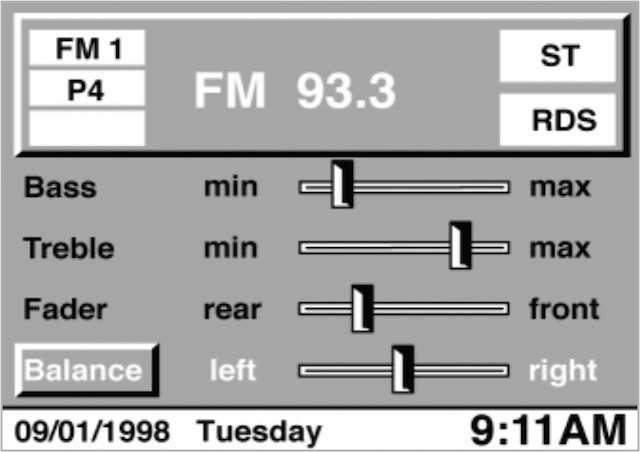
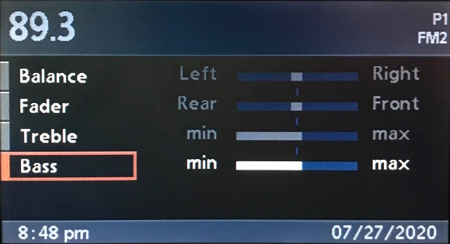
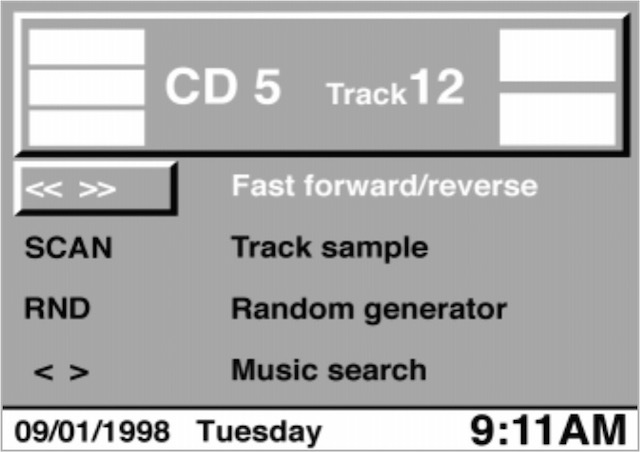
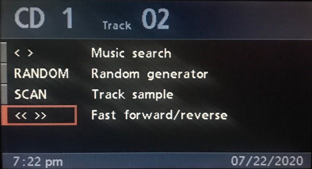

# `0x46` Request Radio UI

Radio `0x68` → GT `0x3b`

The radio has limited control of the display in order to manage it's own interface.

However, the radio is ultimately subserveant to the GT and it's UI state will always be overridden by `0x45`.

### Related

- `0x37` [Radio Tone/Select](37.md)
- `0x45` [Set Radio UI](../gt/45.md)

### Examples

    68 04 3B 46 01 10
    68 04 3B 46 02 13
    68 04 3B 46 04 15
    68 04 3B 46 08 19
    68 04 3B 46 0C 1D
    68 04 3B 46 0E 1F

## Parameters

Fixed length. One byte bitfield.

    PRIORITY      = 0b0000_0001
    HIDE_HEADER   = 0b0000_0010
    HIDE_BODY     = 0b0000_1100

### Priority `0b0000_0001`
    
    PRIORITY_RAD  = 0
    PRIORITY_GT   = 1

When set to `1`, the radio is relinquishing the display.

When set to `0`, the radio is managing it's own display functions (outlined in Use Cases).

Note: the radio won't ever set `0` of it's own accord. When the radio is turned on, it will just assume control of the display and begin writing to it, at which point the GT is inherently aware of the radio being in the foreground.

### Hide Header `0b0000_0010`

    HIDE_HEADER         = 0b0000_0010

### Hide Body `0b0000_1100`

    HIDE_BODY_SELECT    = 0b0000_0100
    HIDE_BODY_TONE      = 0b0000_1000
    HIDE_BODY_MENU      = 0b0000_1100

## Use Cases

### Hide Tone

#### C23 BM

    F0 04 68 48 04 D0           # TONE button: Press 
    F0 04 68 48 84 50           # TONE button: Release
    68 07 3B 37 80 00 00 10 F3  # Show Tone (and set parameters)
    # Timeout...
    68 04 3B 46 08 19           # Hide Tone

#### BM53

    F0 04 68 48 04 D0           # TONE button: Press 
    F0 04 68 48 84 50           # TONE button: Release
    68 07 3B 37 90 10 01 01 E3  # Show Tone (and set parameters)
    # Timeout...
    68 04 3B 46 08 19           # Hide Tone
    68 04 3B 46 0C 1D           # Hide Menu

### Hide Select

#### C23 BM

    F0 04 68 48 20 F4   # SELECT button: Press 
    F0 04 68 48 A0 74   # SELECT button: Release
    68 04 3B 37 40 20   # Show Select
    # Timeout...
    68 04 3B 46 04 15   # Hide Select

#### BM53

    F0 05 FF 47 00 0F 42 # SELECT button: Press 
    68 04 3B 37 04 64 # Show Select
    F0 05 FF 47 00 8F C2 # SELECT button: Release
    # Timeout...
    68 04 3B 46 04 15 # Hide Select
    68 04 3B 46 0C 1D # Hide Menu

### Main Menu

A MENU press does not get sent to radio, but is broadcast, and instead handled by the GT `0x3b`, which will in turn, message the radio `0x68`, requesting it relegate itself to the background.

If the radio is on, but in the background, it will still write to the display for certain events (e.g. changing radio station, CD track etc), but will automatically return to the background after an ~8 second timeout.

GT will only send `0x45` if radio is on.

#### C23 BM
    
    F0 04 FF 48 34 77   # MENU button: press
    3B 04 68 45 01 13   # GT (legacy) requesting radio relinquish display
    68 04 3B 46 01 10   # Radio relinquishing display
    
    # Note the additional 0x45 bit set if Audio OBC enabled:
    F0 04 FF 48 34 77
    3B 04 68 45 03 11
    68 04 3B 46 01 10

#### BM53

Similar to the C23 BM, however with one quirk- the BM53 sends `0x46` twice. (I suspect this is something to do with the updated UI.)

    F0 04 FF 48 34 77   # MENU button press
    3B 04 68 45 91 83   # GT (4-1/00) requesting radio relinquish foreground
    68 04 3B 46 01 10   # Radio relinquishing foreground
    68 04 3B 46 01 10   # Note: BM53 sends this command TWICE

### Hide Overlay

When pressing the OVERLAY button, the radio relinquishes the display. The radio will still write titles, but automatically hide overlay again after ~8 seconds

Unlike a MENU button press, the OVERLAY button press is sent directly to the radio.

#### BM C23
    
    F0 04 68 48 30 E4   # BMBT Overlay button press
    68 04 3B 46 0E 1F   # Radio exits overlay mode

The radio will still write titles, but relinquish the display again after the timeout:

    # Radio writes to display: "FM ☐101.1☐   "
    68 12 3B 23 40 20 46 4D 20 03 31 30 31 2E 31 04 20 20 20 21
    
    # 8 seconds pass...
    
    # Radio automatically hides overlay
    68 04 3B 46 0E 1F

#### BM53

Similar to C23 BM, but `0x46` is sent twice.

    # BMBT Overlay button press
    F0 04 68 48 30 E4

    # Radio hides overlay
    68 04 3B 46 02 13
    68 04 3B 46 0C 1D
    
The BM53 will still write titles, but relinquish the display after a timeout.

    # "☐ 89.3☐      "
    68 .. 3b 23 62 10 "☐ 89.3☐      " ..
    
    # 8 seconds pass...
    
    # Radio hides overlay
    68 04 3B 46 02 13
    68 04 3B 46 0C 1D

### Radio Off

#### C23 BM

    # radio in foreground at power off
    f0	68	48 06 [Power]        	Press 
    68	f0	RAD-LED 00 ((LED) Off)
    68	3b	46 0e Hide: Menu, Hide Header: [ON])
    f0	68	TAPE  05 (No Tape!)
    f0	68	48 86 [Power]        	Release

    # radio NOT in foreground at power off
    bmbt	rad	BMBT-RAD* 	0x06 (0000 0110) :bmbt_power     	[Power]        	Press 
    rad	bmbt	RAD-LED   	led: 00 ((LED) Off)
    bmbt	rad	TAPE      	control: 0x05 (No Tape!)
    bmbt	rad	BMBT-RAD* 	0x86 (1000 0110) :bmbt_power     	[Power]        	Release

#### BM53
    
    f0 .. 68 48 06 ..  # Power button: press
    68 .. f0 4a 00 ..  # BMBT radio led: off
    68 .. 3b 46 0e ..  # Radio hide overlay
    f0 .. 68 4b 05 ..  # Tape: none