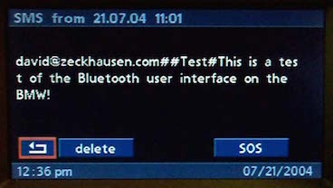
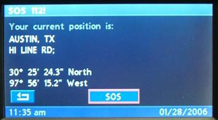

# `0xa5` Body Text: Telephone

Telephone `0xc8` → GT `0x3b`

### Related

- `0x21` [Menu Text: Telephone](21.md)
- `0x23` [Title Text: Telephone](23.md)
- `0x24` [Property Text: Telephone](24.md)

### Example Frames
    
    C8 1F 3B A5 F1 05 60 59 6F 75 72 20 63 75 72 72 65 6E 74 20 70 6F 73 69 74 69 6F 6E 20 69 73 3A 9C
    C8 14 3B A5 F1 05 41 4D 45 4C 42 4F 55 52 4E 45 2C 20 56 49 43 E2
    C8 11 3B A5 F1 05 42 43 4F 4C 4C 49 4E 53 20 53 54 3B B5
    C8 19 3B A5 F1 05 44 33 37 B0 20 34 38 27 20 35 31 2E 36 22 20 53 6F 75 74 68 2B
    C8 19 3B A5 F1 05 45 31 34 34 B0 20 35 38 27 20 31 34 2E 35 22 20 45 61 73 74 6A

## Telephone Values

Common format: `0xa5` [Body Text](../common/a5.md).

### Layout
    
    LIST      = 0xf0    # SMS: Index, Bluetooth Pairing
    DETAIL    = 0xf1    # SMS: Message, SOS/Emergency

---

## Use Cases

Given that several commands are associated with each use case, they're discussed in their own respective documentation.

### SMS: Message

[Telephone: SMS Message](detail.md)

### SOS/Emergency

[Telephone: Emergency](detail.md)

