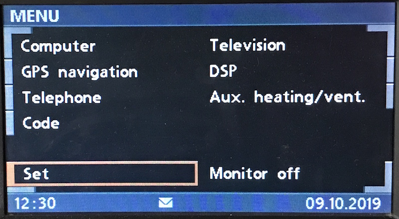

# `0xa6` SMS Icon

Telephone `0xc8` → Multicast: Displays `0xe7`

This icon is displayed when an SMS has been received and not yet read.

### Example Frames

    # Show icon
    C8 05 E7 A6 00 01 8D

    # Hide icon
    C8 05 E7 A6 00 00 8D

## Parameters

Fixed length. Two bytes.

| Property | Index | Length | Type     |
|:---------|:------|:-------|:---------|
| Control  | `0`   | `1`    | Byte     |
| Status   | `1`   | `1`    | Bitfield |

### Control

Observed messages use `0x00`.

### Status

    UNREAD = 0b0000_0001

    HIDE = 0b0000_0000
    SHOW = 0b0000_0001

Other bits do not affect the SMS icon.
