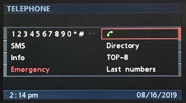
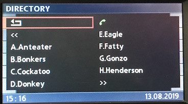
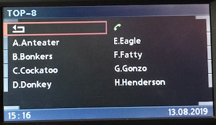
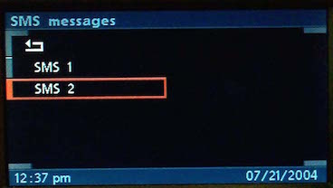

# `0x21` Menus: Telephone

BMBT only.

### Related

- `0x21` Menus: Radio
- `0x21` Menus: Cluster
- `0x31` Menu Button

### Examples

    ...
    ...
    ...

## Parameters

Length will vary with *String*.

Property|Index|Length|Type
:-------|:----|:-----|:---
Layout|`0`|`1`|Bitfield
Function|`1`|`1`|Bitfield
Options|`2`|`1`|Bitfield
String|`3`|`-1`|String

---

### Layout
    
    DIAL      = 0x42
    DIRECTORY = 0x43
    TOP_8     = 0x80
    LIST      = 0xf0    # SMS Inbox, "Bluetooth Pairing"
    DETAIL    = 0xf1    # SMS Message, SOS/Emergency 

---

### Function
    
    NULL            = 0x00
    CONTACT         = 0x01
    DIGIT           = 0x02
    SOS             = 0x05
    NAVIGATION      = 0x07
    INFO            = 0x08

---

### Options

    INDEX       = 0b0001_1111   # Index of field to write to
    CLEAR       = 0b0010_0000   # Clear layout
    BUFFER      = 0b0100_0000   # Buffer the write
    HIGHLIGHT   = 0b1000_0000   # Highlight given field

#### Index `0b0001_1111`

Each layout has a given number of fields, each of which is represented by a known index.

The factory implementary will write to all fields in sequence.

#### Clear `0b0010_0000`

Setting this bit will clear the given layout, including the buffer. As such, it's only set on the *first* message.

Careful omission of this bit allows the updating the rendered display. However, the factory implementation seemingly always writes the display in it's entirity, thus always clearing the display when commencing writing.

#### Buffer `0b0100_0000`

As populating a display requires multiple messages, the GT `0x3b` will buffer preliminary messages until the entire display is ready to be rendered.

All but the last message will have this bit set. The absense of the bit in the final messages is what triggers the GT `0x3b` to render the buffer.

#### Highlight `0b1000_0000`

The field with the given index will be highlighted.

I've not seen this used in the factory implementation. If omitted, the first, or last selected field will be highlighted.

---

### String

Special characters: `0x00, 0x06`.

<!--Layout|ID|Example
:--|:--|:--
Dial|`0x42`|
Directory|`0x43`|
Top 8|`0x80`|
List|`0xf0`|
Detail|`0xf1`|-->
    
## Use Cases

### Directory

### Top 8

### SMS: Index

### Bluetooth Pairing

### SMS: Message

### SOS/Emergency

