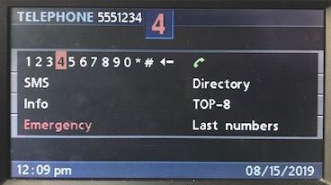
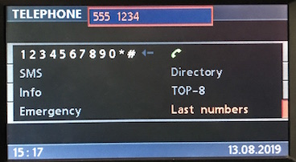
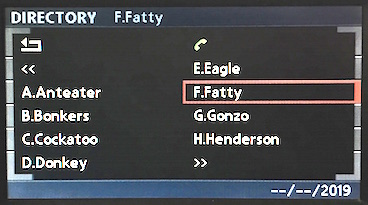
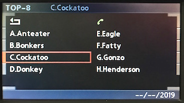
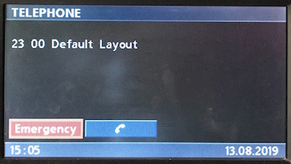
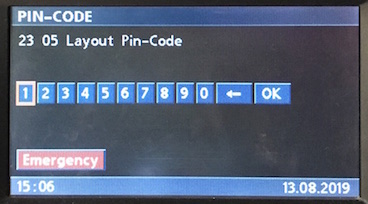

# `0x23` Title Text: Telephone

Telephone `0xc8` → GT `0x3b`  
~~Telephone `0xc8` → MID `0xc0`~~  
Telephone `0xc8` → IKE `0x80`  
Telephone `0xc8` → Multicast: Displays `0xe7`

*BMBT only! Updated UI only! `3-1/30+`, `4-1/100`*

### Related

- ~~`0x1b` [HUD Status](#)~~
- `0x21` [Menu Text: Telephone](21.md)
- `0x24` [OBC Text: Telephone](24.md)

### Example Frames

    ...

## Parameters

Length will vary with *String*.

Property|Index|Length|Type
:-------|:----|:-----|:---
Layout|`0`|`1`|Bitfield
Options|`1`|`1`|Bitfield
String|`2`|`-1`|String

---

### Layout
    
    # GT
    PIN_DIGITS          = 0x05
    
    DIR_NAME            = 0x52      # "Jerry"
    DIR_NUMBER          = 0x53      # "5551234"
    
    DIAL_CLEAR          = 0x61
    DIAL_NUMBER         = 0x63
    
    TOP_8_CLEAR         = 0x80
    TOP_8_NAME          = 0x81
    TOP_8_NUMBER        = 0x82
    
    # IKE
    IKE_CLEAR           = 0x40
    IKE_CLEAR_RT        = 0x41
    IKE_NAME            = 0x42      # "TEL1-Jerry"
    IKE_NUMBER          = 0x43      # "TEL1-5551234"
                                    # "TEL    5551234"

    # ANZV
    ON_CALL             = 0x01      # [0xc6, 0xc7]
    ON_CALL_HFS         = 0x02      # [0xc6]

---

### Options
    
    UPDATE  = 0x20
    SET     = 0x30

---

### String

Code Point|Name|Description
:--|:--|:--
`0xc6`|?|Handsfree Icon
`0xc7`|?|On Call Left Icon
`0xc8`|?|On Call Right Icon

## Use Cases

### Call Status Indicators

#### Call

    C8 07 E7 23 01 00 "C7 C8" 05    # Start Call
    C8 07 E7 23 01 00 "20 20" 0A    # End Call

#### Handsfree

    C8 07 E7 23 02 00 "C6" 05   # HFS On
    C8 06 E7 23 02 00 "20" 28   # HFS Off

---

### Quick Contacts

#### Directory

    `0x42`|`"TEL1-Jerry"`|Quick Name
    `0x43`|`"TEL1-5551234"`|Quick Number

#### Dial
    
    `0x40`|`""`|Clear: End Call
    `0x43`|`"TEL     5551234"`|Dial Contact

#### Exit

    `0x41`|`""`|Clear: R/T Radio Mode

---

*Given that several commands are associated with each use case, they're discussed in their own respective documentation.*

### Dial

[Telephone: Dial](dial.md)

### Last Numbers

[Telephone: Last Numbers](last_numbers.md)

### Directory

[Telephone: Directory](directory.md)

### Top 8

[Telephone: Top 8](top_8.md)

### Default

[Telephone: Default](default.md)

### PIN

[Telephone: PIN](pin.md)

