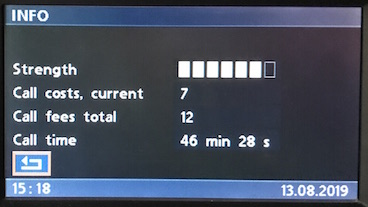

# `0x24` Property Text: Telephone

Telephone `0xc8` → GT `0x3b`  
Telephone `0xc8` → MID `0xc0`  

*Only BMBT (GT) usage is discussed!*

### Related

- `0x21` [Menu Text: Telephone](21.md)
- `0x23` [Title Text: Telephone](23.md)

### Example Frames

    C8 0C 3B 24 91 00 B8 B8 B8 B8 B8 B8 B8 F2
    C8 0B 3B 24 93 00 20 20 20 20 20 30 5F
    C8 0C 3B 24 94 00 20 20 20 20 20 20 30 7F
    C8 08 3B 24 96 00 20 20 30 79
    C8 07 3B 24 97 00 20 30 57

## Parameters

Length will vary with *String*.

Property|Index|Length|Type
:-------|:----|:-----|:---
Layout|`0`|`1`|Bitfield
Options|`1`|`1`|Default `0x00`
String|`2`|`-1`|String

### Layout
    
    INFO_SIGNAL_STRENGTH    = 0x91
    
    INFO_CALL_COST          = 0x92  # guess...
    INFO_CALL_COST_CURRENT  = 0x93
    INFO_CALL_COST_TOTAL    = 0x94
    
    INFO_CALL_TIME          = 0x95  # MID only
    INFO_CALL_TIME_MINUTES  = 0x96
    INFO_CALL_TIME_SECONDS  = 0x97

### Options

Default value of `0x00` for both BMBT and MID.

### String

Special characters for signal...

## Use Cases

Given that several commands are associated with each use case, they're discussed in their own respective documentation.

### Info

[Telephone: Info](info.md)

