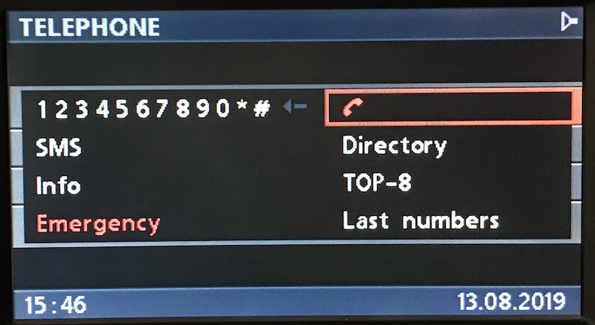
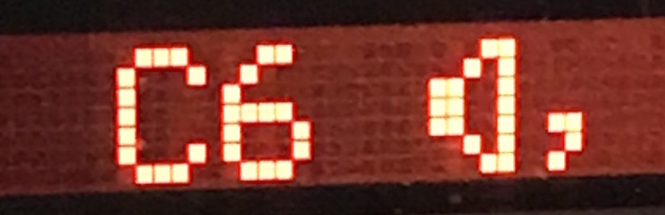
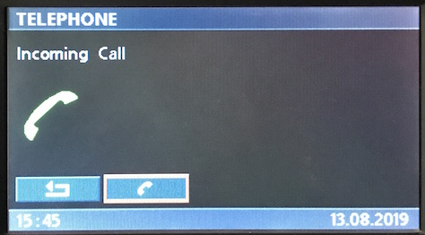
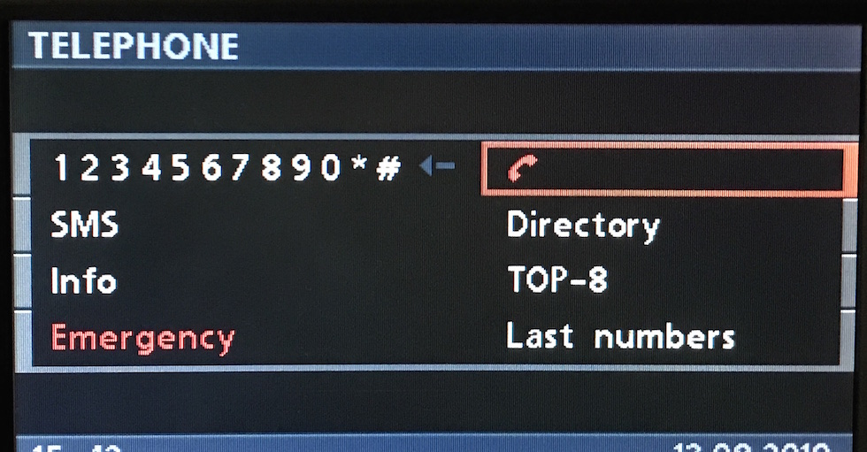
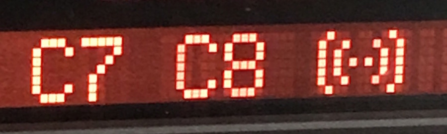

# `0x2c` Telephone Status

The telephone reports it's status to ANZV `0xe7` via command `0x2c`.

## Examples

    C8 04 E7 2C 00 07
    C8 04 E7 2C 12 15
    C8 04 E7 2C 10 17 

## Properties

Fixed length bitfield of one byte.

    # Bitmasks
    HANDSFREE           = 0b0000_0001
    UNKNOWN             = 0b0000_0010
    ESTABLISHING_CALL   = 0b0000_0100
    
    POWER               = 0b0001_0000
    ON_CALL             = 0b0010_0000

## Handsfree `0b0000_0001`

Denotes whether the call is taking place via handset, or via handsfree (speaker phone). This flag has several effects discussed below.

    HANDSET     = 0b0000_0000
    HANDSFREE   = 0b0000_0001

### Handsfree Icon (BMBT)
When handsfree is active the BMBT displays the speaker phone icon.

### Handsfree Icon (MID)

I've noticed that switching between handset/handsfree also causes the following to be sent:

    # Handsfree On
    C8 07 E7 23 02 00 "C6" 05

    # Handsfree Off
    C8 06 E7 23 02 00 "20" 28

This is likely for **MID**, as `0xc6` is the character code for the speaker icon.

### Volume Control

When handsfree is active, the BMBT and MFL will send volume control commands to telephone instead of radio.

    # Handsfree: volume control sent to telephone
    F0 04 C8 32 21 2F   # BMBT
    50 04 C8 32 11 BF   # MFL
    
    # Handset: volume conrol sent to radio
    F0 04 68 32 21 8F   # BMBT
    50 04 68 32 11 1F   # MFL
    
This is due to the telephone having an audio output that- unlike most audio sources,  is not routed via the radio, thus requiring independent volume control.

## Unknown `0b0000_0010`

I've not been able to discern what this represents. It might be related to an action on the handset.

    NFI_OFF = 0b0000_0000
    NFI_ON  = 0b0000_0001

## Establishing Call `0b0000_0100`

This denotes an incoming, or outgoing call.
    
    # INACTIVE      = 0b0000_0000
    # ESTABLISHING  = 0b0000_0100

When set, the following screen is displayed:

### Caller ID

The layout will have no text, but this can be added via:

    C8 <LEN> E7 23 80 20 "Incoming Call" <CS>
    C8 <LEN> E7 23 81 20 "Incoming Call" <CS>
    C8 <LEN> E7 23 82 20 "Incoming Call" <CS>

## Power `0b0001_0000`

    # TELEPHONE_OFF = 0b0000_0000
    # TELEPHONE_ON  = 0b0001_0000

_Note: If bit is not set, GT will default to Main Menu. For example, if active bit is set for a call, upon setting to 0, GT will close Telephone and return to Main Menu._

## On Call `0b0010_0000`

Denotes if the a call is active.

     # NO_CALL  = 0b0000_0000
     # ON_CALL  = 0b0010_0000

### On Call Icon (BMBT)
When on a call the telephone icon on the BMBT will change to red, denoting "end call".

### On Call Icon (MID)
Like Handsfree, there's an additional message sent to ANZV, which may be for the **MID**.

    # Start Call
    C8 07 E7 23 01 00 "C7 C8" 05

    # End Call
    C8 07 E7 23 01 00 "20 20" 0A

