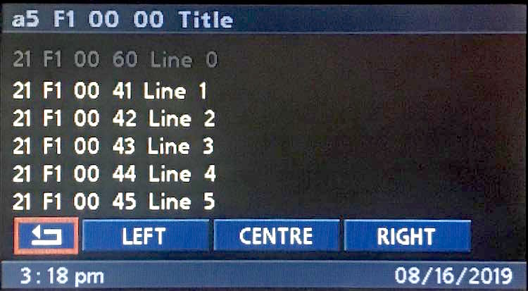

# `0x31` Input (Telephone)

*Applicable to both MID and BMBT, but only BMBT is discussed!*

This command is essentially just button. However, rather than being a physical control, it's the programable soft buttons created by writing to the MID/BMBT with `0x21`.

As the buttons are programmable, this command has to provide the context in which the controls were created in order for other modules to understand the intended action.

The command data is identical to `0x21`, but without the string.

### Related

- `0x21` Menu Text: [Telephone](21.md)
- [Telephone: Default](default.md)
- [Telephone: Pin-Code](pin.md)
- [Telephone: Dial](dial.md)
- [Telephone: Last Numbers](last_numbers.md)
- [Telephone: Directory](directory.md)
- [Telephone: Top 8](top_8.md)
- [Telephone: Info](info.md)
- [SMS Overview](sms.md)
- [Telephone: SMS Index](list.md)
- [Telephone: SMS Message & Emergency](detail.md)

### Example Frames

    # Note: may be a few duds in here from my testing

    3B 06 C8 31 00 00 0C C8
    3B 06 C8 31 00 00 4C 88
    3B 06 C8 31 00 00 0D C9
    3B 06 C8 31 1F 08 0A D9
    3B 06 C8 31 1F 08 4A 99
    3B 06 C8 31 20 05 08 E9
    3B 06 C8 31 20 07 1E FD
    3B 06 C8 31 20 07 5E BD
    3B 06 C8 31 42 02 01 85
    3B 06 C8 31 42 02 07 83
    3B 06 C8 31 42 02 41 C5
    3B 06 C8 31 42 02 46 C2
    3B 06 C8 31 42 05 08 8B
    3B 06 C8 31 42 05 48 CB
    3B 06 C8 31 42 07 1F 9E
    3B 06 C8 31 42 07 5D DC
    3B 06 C8 31 42 08 0A 84
    3B 06 C8 31 42 08 4A C4
    3B 06 C8 31 43 01 10 96
    3B 06 C8 31 43 07 1E 9E
    3B 06 C8 31 43 08 0A 85
    3B 06 C8 31 80 01 00 45
    3B 06 C8 31 80 01 12 57
    3B 06 C8 31 80 01 20 65
    3B 06 C8 31 80 01 40 05
    3B 06 C8 31 80 01 52 17
    3B 06 C8 31 80 07 1E 5D
    3B 06 C8 31 80 07 1F 5C
    3B 06 C8 31 80 07 3E 7D
    3B 06 C8 31 80 07 5E 1D
    3B 06 C8 31 80 08 0A 46

## Parameters

Fixed length.

Property|Index|Length|Type
:-------|:----|:-----|:---
Layout  |`0`|`1`|Bitfield
Function|`1`|`1`|Bitfield
Button  |`2`|`1`|Bitfield

### Layout

    0x00: --
    0x05: Pin-Code
    0x20: Info
    0x42: Dial
    0x43: Directory
    0x80: Top 8
    0xf0: SMS Index
    0xf1: SMS Message/Emergency

### Function

Function is set by telephone via `0x21` when writing to a given index. It can be set arbitrarily, which is useful for distinguishing custom features.
    
    0x00: --
    0x01: Contact
    0x02: Digit
    0x05: Emergency
    0x07: Navigate
    0x08: Info

### Button

    BUTTON_STATE = 0b0110_0000
    BUTTON_INDEX = 0b0001_1111

#### Button State `0b0110_0000`

    BUTTON_STATE_PRESS   = 0b00
    BUTTON_STATE_HOLD    = 0b01
    BUTTON_STATE_RELEASE = 0b10
    
#### Button Index `0b0001_1111`

    # Quick Reference
    
    # Dial
    0x00: 0
    0x01: 1
    0x02: 2
    0x03: 3
    0x04: 4
    0x05: 5
    0x06: 6
    0x07: 7
    0x08: 8
    0x09: 9
    0x1a: *
    0x1b: #
    0x0a: <- OR Open Info (Distinguished via FUNCTION)

    # Directory/Top-8
    0x0c: <<
    0x0d: >>
    
    # SMS Index
    0x13: Button Outlier
    
    # SMS Message/Emergency
    0x10: Back
    0x11: Button Left
    0x12: Button Right
    0x13: Button Centre
    
    # FUNCTION = Navigate
    0x1d: Open SMS
    0x1e: Open Dial
    0x1f: Open Directory

## Use Cases

    COMMAND > LAYOUT > FUNCTION > BUTTON

### Default/Error

    Input > Default > Emergency > Emergency     3B 06 C8 31 00 05 08 <CS>

### Dial

    # Button State: Press 
    
    Input > Dial > Digit > 0             3B 06 C8 31 42 02 00 <CS>
    Input > Dial > Digit > 1             3B 06 C8 31 42 02 01 <CS>
    Input > Dial > Digit > 2             3B 06 C8 31 42 02 02 <CS>
    Input > Dial > Digit > 3             3B 06 C8 31 42 02 03 <CS>
    Input > Dial > Digit > 4             3B 06 C8 31 42 02 04 <CS>
    Input > Dial > Digit > 5             3B 06 C8 31 42 02 05 <CS>
    Input > Dial > Digit > 6             3B 06 C8 31 42 02 06 <CS>
    Input > Dial > Digit > 7             3B 06 C8 31 42 02 07 <CS>
    Input > Dial > Digit > 8             3B 06 C8 31 42 02 08 <CS>
    Input > Dial > Digit > 9             3B 06 C8 31 42 02 09 <CS>
    Input > Dial > Digit > <-            3B 06 C8 31 42 02 0a <CS>
    Input > Dial > Digit > *             3B 06 C8 31 42 02 1a <CS>
    Input > Dial > Digit > #             3B 06 C8 31 42 02 1b <CS>

### Directory

    # Button State: Press
    
    # Contacts
    Input > Directory > Contact > 1       3B 06 C8 31 43 01 00 <CS>
    Input > Directory > Contact > 2       3B 06 C8 31 43 01 02 <CS>
    Input > Directory > Contact > 3       3B 06 C8 31 43 01 04 <CS>
    Input > Directory > Contact > 4       3B 06 C8 31 43 01 06 <CS>
    
    Input > Directory > Contact > 5       3B 06 C8 31 43 01 10 <CS>
    Input > Directory > Contact > 6       3B 06 C8 31 43 01 12 <CS>
    Input > Directory > Contact > 7       3B 06 C8 31 43 01 14 <CS>
    Input > Directory > Contact > 8       3B 06 C8 31 43 01 16 <CS>
    
    # Previous/Next
    Input > Directory > Default > <<      3B 06 C8 31 43 00 0c <CS>
    Input > Directory > Default > >>      3B 06 C8 31 43 00 0d <CS>
    
    # Back
    Input > Directory > Open    > Dial    3B 06 C8 31 43 07 1e <CS>

### Top 8

Identical to Directory- just expect 0x80 in place of 0x43.

    # Button State: Press
    
    Input > Top 8 > Contact > 1             31 80 01 00
    Input > Top 8 > Contact > 2             31 80 01 02
    Input > Top 8 > Contact > 3             31 80 01 04
    Input > Top 8 > Contact > 4             31 80 01 06
    
    Input > Top 8 > Contact > 5             31 80 01 10
    Input > Top 8 > Contact > 6             31 80 01 12
    Input > Top 8 > Contact > 7             31 80 01 14
    Input > Top 8 > Contact > 8             31 80 01 16

    Input > Top 8 > Open    > Dial          31 80 07 1e

### SMS Index

    # Button State: Press
    
    # Note: I'm unsure of FUNCTION value as this is a reverse engineer guess job
    
    # Column 1 
    Input > SMS Index > FUNC > 'SMS 1'    3B <LEN> C8 31 F0 <FU> 00 <CS>
    Input > SMS Index > FUNC > 'SMS 2'    3B <LEN> C8 31 F0 <FU> 01 <CS>
    Input > SMS Index > FUNC > 'SMS 3'    3B <LEN> C8 31 F0 <FU> 02 <CS>
    Input > SMS Index > FUNC > 'SMS 4'    3B <LEN> C8 31 F0 <FU> 03 <CS>
    Input > SMS Index > FUNC > 'SMS 5'    3B <LEN> C8 31 F0 <FU> 04 <CS>
    
    # Column 2
    Input > SMS Index > FUNC > 'SMS 6'    3B <LEN> C8 31 F0 <FU> 05 <CS>
    Input > SMS Index > FUNC > 'SMS 7'    3B <LEN> C8 31 F0 <FU> 06 <CS>
    Input > SMS Index > FUNC > 'SMS 8'    3B <LEN> C8 31 F0 <FU> 07 <CS>
    Input > SMS Index > FUNC > 'SMS 9'    3B <LEN> C8 31 F0 <FU> 08 <CS>
    Input > SMS Index > FUNC > 'SMS 10'   3B <LEN> C8 31 F0 <FU> 09 <CS>
    Input > SMS Index > FUNC > 'SMS 12'   3B <LEN> C8 31 F0 <FU> 13 <CS> # Top Right
    
    # Back
    Input > SMS Index > FUNC > Back     3B <LEN> C8 31 F0 00 10 <CS> # Back Button

### SMS Message/Emergency

    # Button State: Press
    
    # Note: I'm unsure of FUNCTION value as this is a reverse engineer guess job

	# Back
	Input > SMS Msg. > FUNC > Back            3B 06 C8 31 f1 <FU> 10 <CS>

	# Buttons
	Input > SMS Msg. > FUNC > Left            3B 06 C8 31 f1 <FU> 11 <CS>
	Input > SMS Msg. > FUNC > Right           3B 06 C8 31 f1 <FU> 12 <CS>
	Input > SMS Msg. > FUNC > Middle          3B 06 C8 31 f1 <FU> 13 <CS>

### Function: Navigate `0x07`

Not tied to a given layout.

    0x1d: Open SMS
    0x1e: Open Dial
    0x1f: Open Directory

    # Button State: Press

    Input > Info > Navigate > Dial          3B 06 C8 31 20 07 1E FD

    Input > Info > Navigate > SMS           3B 06 C8 31 42 07 1D 9C
    Input > Info > Navigate > Directory     3B 06 C8 31 42 07 1F 9E

    Input > Info > Navigate > Dial          3B 06 C8 31 43 07 1E 9E

    Input > Info > Navigate > Dial          3B 06 C8 31 80 07 1E 5D
    Input > Info > Navigate > Directory     3B 06 C8 31 80 07 1F 5C

### Function: Info `0x08`

Not tied to a given layout.

    Input > Dial > Info > Info          3B 06 C8 31 42 08 0A 84
    
    # I think these are older UI
    3B 06 C8 31 1F 08 0A D9
    3B 06 C8 31 43 08 0A 85
    3B 06 C8 31 80 08 0A 46