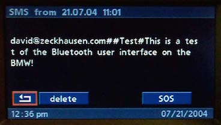

# `0xA5` Body Text: Telephone

Telephone `0xc8` → GT `0x3b`

This command was seemingly introduced to support the telematics display (in addition to Radio's MP3 display). These displays meant the maximum character count for a given index could not be written without exceeding a soft frame size limit, which if exceeded, can cause a GT buffer overflow.

The command allows specifying a cursor offset for a given index (line), thus allowing  multiple writes to said line, the cursor position being advanced for each successive write.

The usage is otherwise identical to `0x21`.

### Related

- `0x21` Menu Text: Radio
- `0x21` Menu Text: Cluster
- `0xa5` Body Text: Radio

### Example Frames
    
    ...
    ...
    ...

## Parameters

Length will vary with *String*.

Property|Index|Length|Type
:-------|:----|:-----|:---
Layout|`0`|`1`|Bitfield
Offset|`1`|`1`|Bitfield
Options|`2`|`1`|Bitfield
String|`3`|`-1`|String

---

### Layout
    
    DETAIL    = 0xf1    # SMS: Message, SOS/Emergency

---

### Offset

    # 5 LSBs in first argument represent offset
    
    C8 <LEN> 3B A5 01 00 <CHARS> <CS> # Offset 0
    C8 <LEN> 3B A5 02 00 <CHARS> <CS> # Offset 1
    C8 <LEN> 3B A5 03 00 <CHARS> <CS> # Offset 2
    C8 <LEN> 3B A5 04 00 <CHARS> <CS> # Offset 3
    C8 <LEN> 3B A5 05 00 <CHARS> <CS> # Offset 4
    C8 <LEN> 3B A5 06 00 <CHARS> <CS> # Offset 5

---

### Options

    INDEX       = 0b0001_1111   # Index of field to write to
    CLEAR       = 0b0010_0000   # Clear layout
    BUFFER      = 0b0100_0000   # Buffer the write
    HIGHLIGHT   = 0b1000_0000   # Highlight given field

*See `0x21` for usage.*

---

### String

Code Point|Name|Description
:--|:--|:--
`0x00`|NUL|Null-terminated string
`0x06`|LF|Line Feed
    
## Use Cases

Given that several commands are associated with each use case, they're discussed in their own respective documentation.

### SMS: Message

[Telephone: SMS Message](detail.md)

### SOS/Emergency

[Telephone: Emergency](detail.md)

