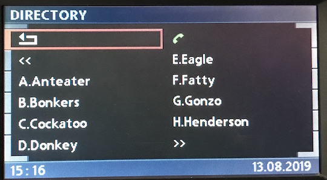
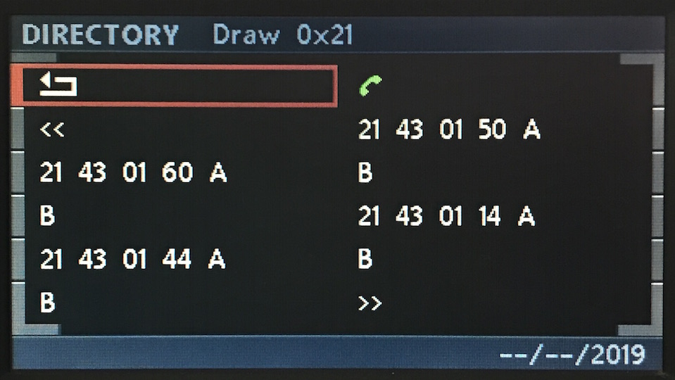
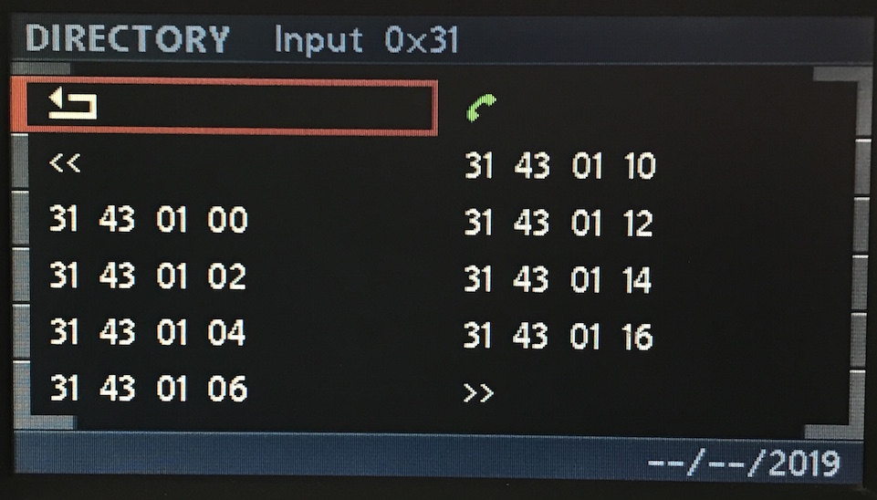
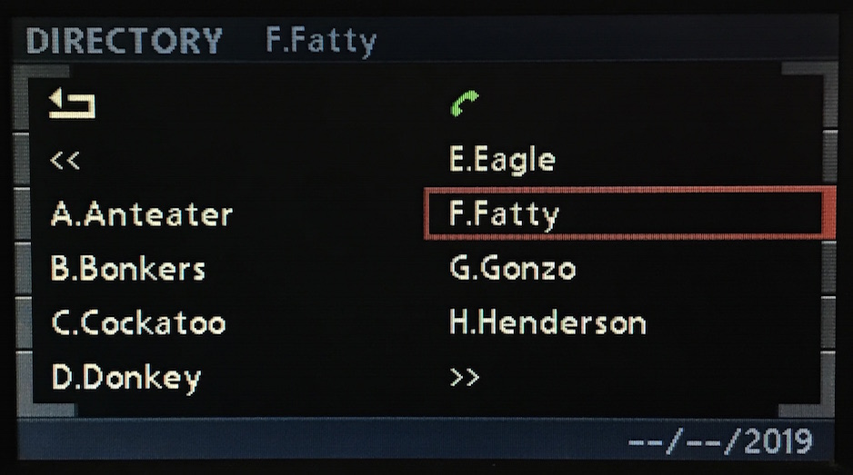
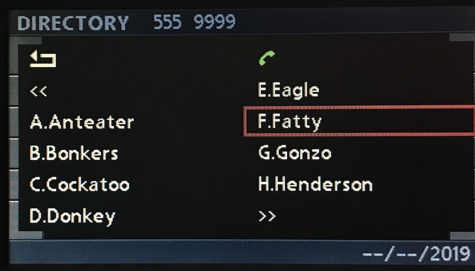

# Directory

## Create

- Unlike Radio menus it's not possible to specify the index of the target field.
- Each individual field must be prefixed with the delimiter character `0x06`.

    C8 <LEN> 3B 21 43 01 60 06 "A" 06 "B" <CS>
    C8 <LEN> 3B 21 43 01 44 06 "A" 06 "B" <CS>
    C8 <LEN> 3B 21 43 01 50 06 "A" 06 "B" <CS>
    C8 <LEN> 3B 21 43 01 14 06 "A" 06 "B" <CS>

I believe the seemingly ignored index value is for use by the MID. It's possible to omit it entirely and still have the directory render correctly on the BMBT- although, I'm not quite sure
what effect this has on the MID!

    C8 <LEN> 3B 21 43 01 60 06 "A" 06 "B" <CS>
    C8 <LEN> 3B 21 43 01 40 06 "A" 06 "B" <CS>
    C8 <LEN> 3B 21 43 01 40 06 "A" 06 "B" <CS>
    C8 <LEN> 3B 21 43 01 00 06 "A" 06 "B" <CS>
    #                    ^
    # the 3 MSBs are still required for clearing/buffering!

If the MID isn't on the radar, there's no need to write contacts in pairs.

    C8 <LEN> 3B 21 43 01 20 06 "A" 06 "B" 06 "C" 06 "D" <CS>

Just be mindful that the GT will crash long before the frame size limit of 257 bytes is reached. Writing more than about 40 characters isn't recommended. Although this shouldn't be an issue as there's (allowing for the variable width type face) only 11 characters or so per field.

## Inputs

Much like Radio menus, GT `0x3B` will send `0x31` to TEL `0xC8`.

    # Press Events
	
    # Contacts
    Directory > Contact > 1             3B 06 C8 31 43 01 00 <CS>
    Directory > Contact > 2             3B 06 C8 31 43 01 02 <CS>
    Directory > Contact > 3             3B 06 C8 31 43 01 04 <CS>
    Directory > Contact > 4             3B 06 C8 31 43 01 06 <CS>

    Directory > Contact > 5             3B 06 C8 31 43 01 10 <CS>
    Directory > Contact > 6             3B 06 C8 31 43 01 12 <CS>
    Directory > Contact > 7             3B 06 C8 31 43 01 14 <CS>
    Directory > Contact > 8             3B 06 C8 31 43 01 16 <CS>

    # Previous/Next
    Directory > Default > <<            3B 06 C8 31 43 00 0c <CS>
    Directory > Default > >>            3B 06 C8 31 43 00 0d <CS>

    # Back
    Directory > Open    > Dial          3B 06 C8 31 43 07 1e <CS>

## Updates

### Menu

- Attempting to update a single menu item will cause the entire menu to be cleared.
- Unlike Radio menus, whereby calling `0xA5` can recall a display, the Directory isn't cached, meaning, if for any reason the screen is closed (i.e. returning to Main Menu), the menu must be drawn again.

### Contact Selection

#### Directory Contact Name

    # Contact Name
    C8 <LEN> 3B 23 52 00 "F.Fatty" <CS>

#### Directory Contact Number

    # Contact Number
    C8 <LEN> 3B 23 53 00 "555 999" <CS>
