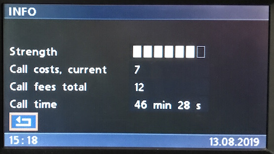
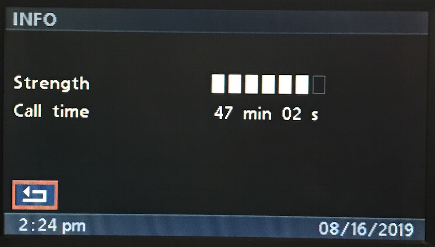
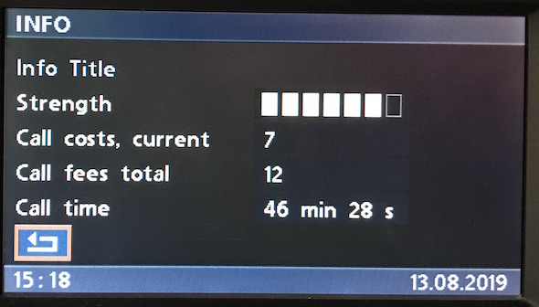

# Info

## Create

    # Strength 0 bars: (0 through 7 bars)
    C8 <LEN> 3B 24 91 b8 5a 5a 5a 5a 5a 5a <CS>
    C8 <LEN> 3B 24 91 5f 5a 5a 5a 5a 5a 5a <CS>
    C8 <LEN> 3B 24 91 b7 5a 5a 5a 5a 5a 5a <CS>
    C8 <LEN> 3B 24 91 b6 5a 5a 5a 5a 5a 5a <CS>
    C8 <LEN> 3B 24 91 b5 5a 5a 5a 5a 5a 5a <CS>
    C8 <LEN> 3B 24 91 b4 5a 5a 5a 5a 5a 5a <CS>
    C8 <LEN> 3B 24 91 b3 5a 5a 5a 5a 5a 5a <CS>
    C8 <LEN> 3B 24 91 b2 5a 5a 5a 5a 5a 5a <CS>

    # Call cost current   C8 <LEN> 3B 24 93 <chars[7]> <CS>
    # Call cost total     C8 <LEN> 3B 24 94 <chars[7]> <CS>

    # Call time minutes   C8 <LEN> 3B 24 96 <chars[3]> <CS>
    # Call time seconds   C8 <LEN> 3B 24 97 <chars[2]> <CS>

### Subset of fields

- only the fields which are written will be displayed
- to exclude costs for example, simply omit fields `0x93` and `0x94`
- once a field is set, it's not possible to hide it.
	- _TODO: try null-terminated string!_

    # Subset of Info fields
    C8 11 3B 24 91 b3 5a 5a 5a 5a 5a 5a <CS> # Strength
    C8 06 3B 24 96 "47" <CS> # call minutes
    C8 06 3B 24 97 "02" <CS> # call seconds

### Usage?
I'm not entirely sure if this is displayed automatically upon accepting a call, but if so, presumably the text might be the caller name/number.

    # Info Title
    C8 <LEN> 3B 24 91 00 "Info Title" <CS>

## Inputs

    # Back
    Info > Open > Dial          3B 06 C8 31 90 07 1e <CS> # Press

## Updates

Each field can be written any given number of times as to update it.

    # Info call timer
    C8 05 3B 24 96 "0"  <CS> # 0:--
    C8 05 3B 24 97 "00" <CS> # 0:00
    C8 05 3B 24 97 "01" <CS> # 0:01
    # ...
    C8 05 3B 24 97 "58" <CS> # 0:58
    C8 05 3B 24 97 "59" <CS> # 0:59
    C8 05 3B 24 96 "1" <CS>  # 1:59
    C8 05 3B 24 97 "00" <CS> # 1:00
    C8 05 3B 24 97 "01" <CS> # 1:01
