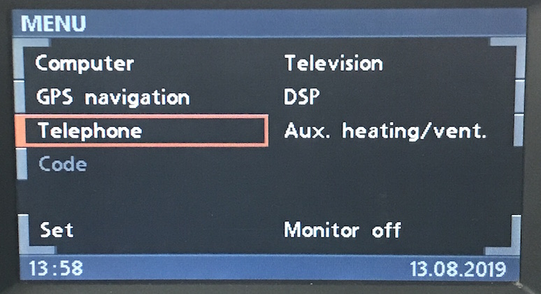
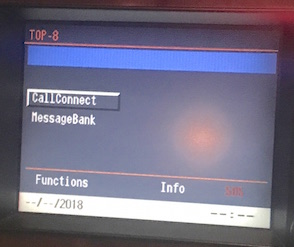
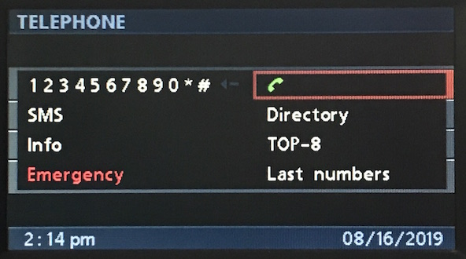
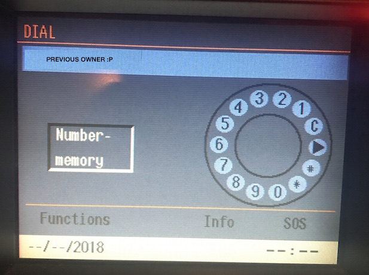

# `0x20` Menu > Telephone

When Telephone is selected from the main menu, the graphics stage (GT) `0x3b` sends to broadcast high `0xff` the command:

    # Select Telephone from Main Menu
    3B 05 FF 20 02 0C EF

I'd hazard a guess that the MID would send the same- perhaps even with button states, i.e. press, hold, release, as I believe there's a dedicated button.

#### Version 18 UI Update (MK3 3-1/40+, and MK4)

It's important to note that the same command is sent when **Top 8** is selected from within the Telephone submenu.

This isn't an issue on the MID and MK1, MK2, and MK3 <= 3-1/31, as **Top 8** is the default Telephone home screen. Whether you select Telephone from the main menu, or Top 8 from the Telephone submenu, the result is the same. Everyone is happy.

However, following the UI update, the MK3 (<= 3-1/40) and MK4 would open the **Dial** interface which was redesigned to double as Telephone home screen. Bye bye stateless commands...

The telephone emulation will just need to maintain a session state as to be able to differentiate between opening Telephone from the main menu, vs. opening **Top 8** from the Telephone submenu. Not the end of the world, but required if emulating existing behaviour.
