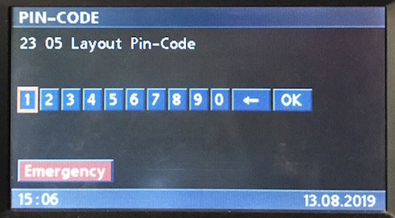

# Telephone: Pin-Code

This may have only been pertinent to the earlier factory built in phones, but it's useful for other purposes.

## Create

- single line
- does not support carriage return/line break
- similar to other uses of `0x23` in sending to broadcast `0xff` or `0xbf` will also write to IKE character display

	# Pin-code
	C8 <LEN> 3B 23 05 00 "23 05 Layout Pin-Code" <CS>

	# Pin-code GT and IKE
	C8 <LEN> BF 23 05 20 "Pin IKE" <CS>
	C8 <LEN> BF 23 05 30 "Pin IKE Update" <CS>

### Flashing Text

    # Prefix string with control character 0x01
    C8 <LEN> 3B 23 05 00 "Here is some..." 01 "flashing text!" <CS>

## Inputs

    # Press
    Pin-Code >  Digit >   0             3B 06 C8 31 05 02 00 <CS>
    Pin-Code >  Digit >   1             3B 06 C8 31 05 02 01 <CS>
    Pin-Code >  Digit >   2             3B 06 C8 31 05 02 02 <CS>
    Pin-Code >  Digit >   3             3B 06 C8 31 05 02 03 <CS>
    Pin-Code >  Digit >   4             3B 06 C8 31 05 02 04 <CS>
    Pin-Code >  Digit >   5             3B 06 C8 31 05 02 05 <CS>
    Pin-Code >  Digit >   6             3B 06 C8 31 05 02 06 <CS>
    Pin-Code >  Digit >   7             3B 06 C8 31 05 02 07 <CS>
    Pin-Code >  Digit >   8             3B 06 C8 31 05 02 08 <CS>
    Pin-Code >  Digit >   9             3B 06 C8 31 05 02 09 <CS>
    Pin-Code >  Digit >   <-            3B 06 C8 31 05 02 0a <CS>
    Pin-Code >  Digit >   OK            3B 06 C8 31 05 02 1b <CS>

    Pin-Code >  SOS   >   SOS           3B 06 C8 31 05 05 08 <CS>

    # Hold/Release
    # Add 0x20, and 0x40 to final byte for hold and release respectively.

## Updates

    # Set Pin
    # Note: factory implementation will use mask, i.e. "****"
    C8 <LEN> 3B 23 05 00 "1234" <CS>
