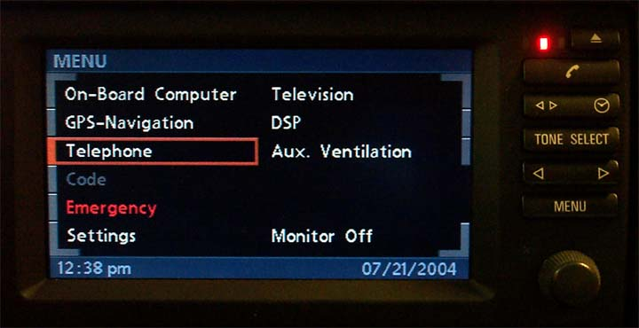
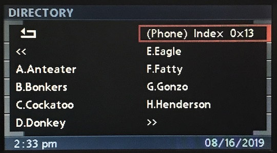

# SMS Overview

When I installed the MK4, the Telephone menu had a new option **SMS** which sparked my interest.

SMS readily pops up in TIS in reference to ULF, Everest etc, but there was no clues as to usage.

As for the web, there was unusually little mentioned of it (with respect to I/K-Bus vehicles). There was anecdotal suggestions that it was not available in NA (CDMA/GSM compatibility perhaps?), but the introduction being relatively late in the lifecycle of E38/E39/E46 might also come into play.

Nonetheless, I did find one [useful thread from 2004](https://www.bimmerfest.com/forums/showthread.php?t=69485), and dug up the thread attachments from Google cached results and found the following:

**Hurrah!**

The implementation does feel like a bit of an afterthought considering most functionality via the BMBT has custom layouts (DSP, Aux. Heat/Vent, OBC, Settings etc), but given MOST was already in production vehicles, and the 68k, OS-9 based VDO/Dayton platform was already long in the tooth, I'm not entirely surprised.

The functionality itself isn't particularly useful- particularly without a factory phone. However the layouts introduce more options for custom UIs.

## SMS Index `0xf0`

The **SMS index** layout is seemingly a repurposed **Directory/Top 8**, which I say because the top right cell (where the phone icon usually is) is addressed with an out of order index.

**Simulated *Directory* with `0xf0`**

**Standard *Directory* `0x42`**

## SMS View/Emergency `0xf0`

The **SMS view** layout appears to just a repurposed **SOS/Emergency** layout.

