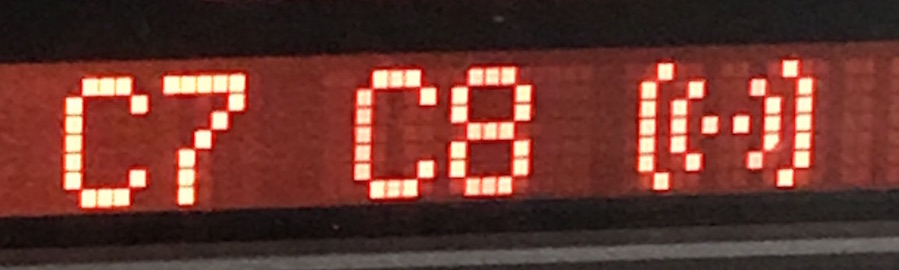

# `0x2c` Telephone Status

The telephone sends it's status to ANZV `0xe7` via command `0x2c`. Similar to IKE sending updates to ANZV, the data is simply a bit field.

The data is a fixed length of one byte.

    # Telephone status
    C8 04 E7 2C 00 07

Bit|7|6|5|4|3|2|1|0
:---|:---|:---|:----|:----|:---|:---|:---|:---
**Use**|-|-|Active|Power|-|Incoming|Unknown|Handsfree

    # Bitmasks
    
    HANDSFREE   = 0b0000_0001
    UNKNOWN     = 0b0000_0010
    INCOMING    = 0b0000_0100
    
    POWER       = 0b0001_0000
    ACTIVE      = 0b0010_0000

## Handsfree `0b0000_0001`
Switching between handset and speakerphone.

    # 0 = Handset
    # 1 = Handsfree

### Handsfree Icon
When set to `1`, the BMBT displays the speaker icon in the top right.

I've noticed that switching between handset/handsfree also causes the following to be sent:

    # Handsfree On
    C8 07 E7 23 02 00 "C6" 05

    # Handsfree Off
    C8 06 E7 23 02 00 "20" 28

This may be for **MID**, as when sent to the IKE character display, `0xC6` is a familiar speaker icon.

### Tape/Radio
BMBT also sends `0x4B` to Radio which from my tinkering looks to be about controlling radio audio sources, so this is possibly related to mute. I've not been able to confirm this without being able to make a call- or a radio, tape, CDC... etc.

    # Start call
    F0 <LEN> 68 4B 06 E2 <CS>

    # End call
    F0 <LEN> 68 4B 06 E1 <CS>

### BMBT and MLF Volume Control

The handsfree bit will have the BMBT and MFL send volume commands in TEL in place of RAD.

## Unknown `0b0000_0010`

I've not been able to discern what this represents.

It's initially `0`, and after some tinkering with the handset it is set to `1`, at which point is seems to remain as `1`.

I reviewed the logs from when the telephone was still installed, and I couldn't see an obvious trigger, so it's perhaps related to the handset?

## Incoming `0b0000_0100`
Based on the display that appeared when set to `1`, if I were to hazard a guess- this bit denotes if a call is incoming.

    # 0 = No friends
    # 1 = Phone is ringing!

One thing to note is: I've noticed that if the BMBT is already displaying any telephone function (Dial, Directory etc), this layout doesn't appear. I assume there's alternative behaviour in this case- TBC.

The layout has no text by default, so I generated commands to see if text can be added and found the following options:

    C8 <LEN> E7 23 80 20 "Incoming Call" <CS>
    C8 <LEN> E7 23 81 20 "Incoming Call" <CS>
    C8 <LEN> E7 23 82 20 "Incoming Call" <CS>

The layout does seem a tad sparse, but I haven't been able to find _any_ documentation or images to provide further insight. It's possible there's more.

## Power `0b0001_0000`

Relatively straight forward- `0` when the telephone is off, `1` when the telephone is on.

    # 0 = Telephone Off
    # 1 = Telephone On

<strike>I've not been able to discern what effect this has. Even if set to `0`, the other functions behave as expected.</strike>

_If bit is not set, `GT` will default to Main Menu. For example, if active bit is set for a call, upon setting to 0, GT will close Telephone and return to Main Menu._

## Active `0b0010_0000`

Denotes if the telephone is currently on a call.

     # 0 = No call
     # 1 = Call in progress

When set to `1`, the telephone icon on the BMBT will change to red, suggesting it is to end a call.

Like Handsfree, there's an additional message sent to ANZV, which may be for the **MID**.

    # Start Call
    C8 07 E7 23 01 00 "C7 C8" 05

    # End Call
    C8 07 E7 23 01 00 "20 20" 0A

