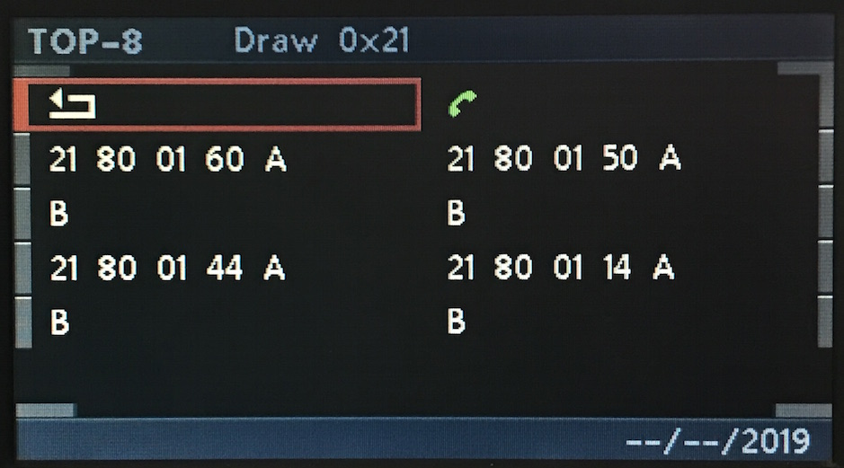
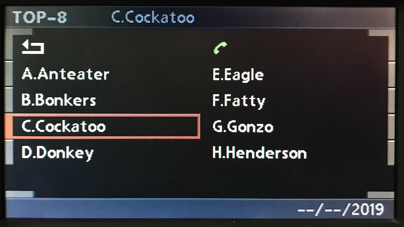
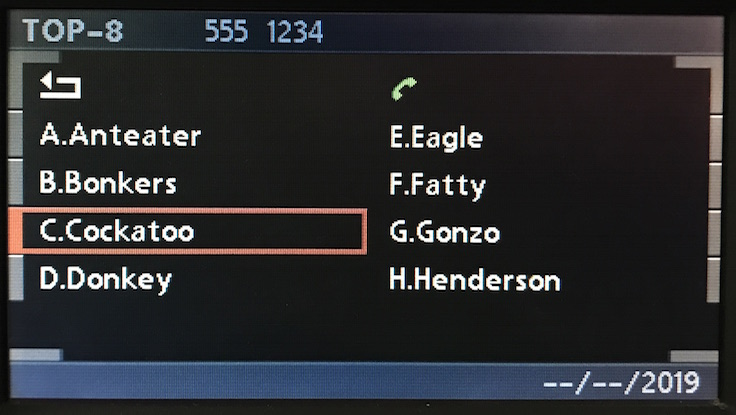

# Telephone: Top 8

Top 8 is essentially identical to Directory, with only the absence of "<<" and ">>" inputs. It still has a limit of 8 contacts.

## Create

	
	# Identical to Directory- just replace 0x43 with 0x80
	C8 <LEN> 3B 21 43 01 60 06 "A" 06 "B" <CS> # Directory
	C8 <LEN> 3B 21 80 01 60 06 "A" 06 "B" <CS> # Top 8

## Inputs

	 # Identical to Directory- just expect 0x80 in place of 0x43.
	 # Note: Press event only!
    Input > Top 8 > Contact > 1             31 80 01 00
    Input > Top 8 > Contact > 2             31 80 01 02
    Input > Top 8 > Contact > 3             31 80 01 04
    Input > Top 8 > Contact > 4             31 80 01 06
    Input > Top 8 > Contact > 5             31 80 01 10
    Input > Top 8 > Contact > 6             31 80 01 12
    Input > Top 8 > Contact > 7             31 80 01 14
    Input > Top 8 > Contact > 8             31 80 01 16

    Input > Top 8 > Open    > Dial          31 80 07 1e

## Updates

### Contact Selection
#### Top 8 Contact Name

    # Contact Name
    C8 <LEN> 3B 23 81 00 "C.Cockatoo" <CS>

##### Top 8 Contact Number

    # Contact Number
    C8 <LEN> 3B 23 82 00 "555 1234" <CS>
